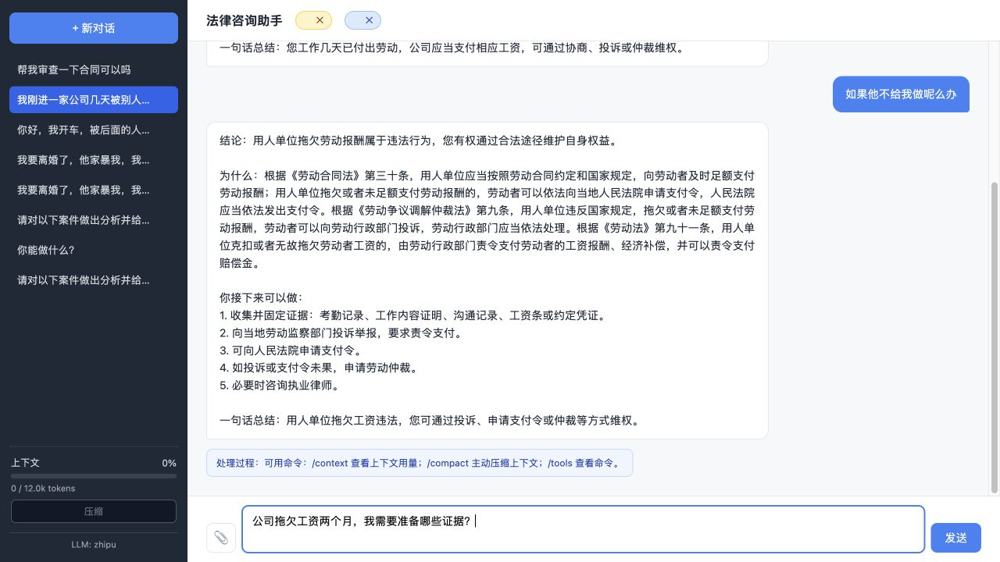
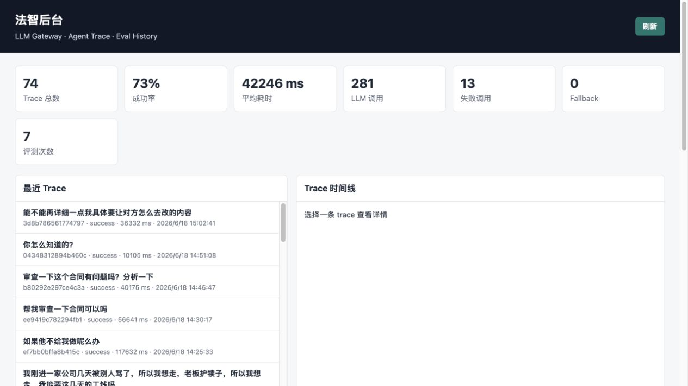
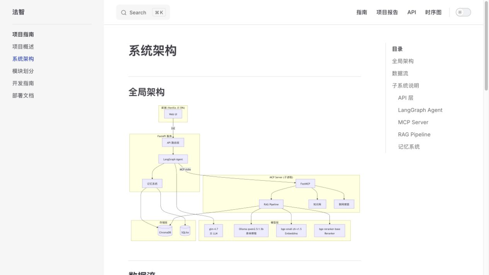

# 法智 Legal Agent

面向中国法律咨询场景的 AI Agent 应用。项目把 FastAPI、LangGraph、MCP、Hybrid RAG、长期记忆、合同审查、可观测后台和评测闭环组合在一起，用本地法律法规库辅助回答、审查合同、生成诉讼/仲裁相关建议。

[](https://github.com/2249619829/Legal/actions/workflows/ci.yml)
[](https://github.com/2249619829/Legal/actions/workflows/docs.yml)

- 在线文档：<https://2249619829.github.io/Legal/>
- 技术文档入口：[docs/index.md](docs/index.md)
- 项目完整档案：[PROJECT_INFO.md](PROJECT_INFO.md)
- 验证报告：[docs/report/test-results.md](docs/report/test-results.md)

## 截图

### 法律咨询对话



### 可观测后台



### 架构文档



## 核心能力

- **法律问答**：基于 70 部中国法律法规文本进行检索增强回答，并校验明确法条引用。
- **Hybrid RAG**：语义检索、BM25 关键词检索、RRF 融合与 Reranker 精排组合。
- **ReAct 工具智能体**：本地 DOC 法条检索、得理法规与类案检索、法律对比、风险评估、合同审查、诉讼时效、管辖判断、文书起草；证据不足时明确停止检索。
- **合同审查**：支持上传合同，输出结构化 Markdown 审查报告。
- **上下文与记忆**：短期窗口、增量摘要、长期语义记忆、用户画像和 OpenViking-style context layer。
- **工程治理**：LLM Gateway、fallback provider、模型路由、trace、LLM 调用日志、Prometheus 指标、响应缓存、每日配额、Admin dashboard。
- **评测闭环**：retrieval、context A/B、OpenViking A/B 等评测脚本与历史结果。

## 技术栈

| 层级 | 技术 |
| --- | --- |
| Web/API | FastAPI、SSE、Vanilla JS SPA |
| Agent 编排 | LangGraph StateGraph |
| 工具协议 | MCP / FastMCP |
| 检索 | ChromaDB、BM25、RRF、bge-small-zh-v1.5、bge-reranker-base |
| LLM 接入 | OpenAI-compatible provider abstraction：Zhipu、DeepSeek、Qwen、Ollama |
| 存储 | SQLite、ChromaDB |
| 文档 | VitePress、Mermaid |
| 测试 | pytest |

## 快速开始

### 1. 安装依赖

```bash
git clone https://github.com/2249619829/Legal.git
cd Legal

python -m venv .venv
source .venv/bin/activate
pip install -r requirements.txt
pip install -r requirements-dev.txt
```

### 2. 配置环境变量

```bash
cp .env.example .env
```

至少需要配置一个主模型 provider。默认 provider 是 `deepseek`：

```env
LLM_PROVIDER=deepseek
DEEPSEEK_API_KEY=sk-xxx
```

也可以切换到 `zhipu`、`qwen` 或 `ollama`。更多配置见 [开发指南](docs/guide/development.md)。

### 3. 构建法条索引

```bash
python -m services.indexer.builder
```

索引会写入 `data/chroma_db/`。该目录是运行产物，不进入 Git。

### 4. 启动服务

```bash
uvicorn main:app --host 0.0.0.0 --port 8000 --reload \
  --loop services.checkpoint:selector_event_loop_factory \
  --reload-exclude 'data/*' \
  --reload-exclude 'data/**' \
  --reload-exclude 'models/*' \
  --reload-exclude 'models/**' \
  --reload-exclude '*.sqlite' \
  --reload-exclude '*.sqlite-*'
```

自定义 loop 在 Windows 上确保 PostgreSQL checkpointer 使用 psycopg 支持的
`SelectorEventLoop`，其他平台也可以沿用同一条命令。

访问：

- 对话界面：<http://localhost:8000/>
- 后台看板：<http://localhost:8000/admin>
- 健康检查：<http://localhost:8000/api/health>

## 测试与验证

```bash
.venv/bin/python -m pytest -q
cd docs && npm run build
```

最近一次本地验证结果记录在 [验证报告](docs/report/test-results.md)。

## 目录结构

```text
Legal/
├── main.py                  # FastAPI 入口
├── run_mcp.py               # MCP Server 入口
├── api/                     # HTTP API：chat/upload/threads/admin/reports/evidence
├── agent/                   # LangGraph 节点、状态、提示词、工具代理、内置 skills
├── mcp_server/              # FastMCP 工具服务和法律工具实现
├── services/                # LLM、RAG、记忆、观测、配额、合同审查等核心服务
├── data/laws/               # 法律法规文本语料
├── static/                  # 对话页和后台看板前端
├── docs/                    # VitePress 技术文档
├── eval/                    # 检索与上下文评测脚本/结果
├── scripts/                 # 索引、训练、OpenViking 等运维脚本
└── tests/                   # pytest 测试
```

## GitHub 展示状态

- 根目录 README：已补齐项目简介、截图、运行方式、测试方式和目录说明。
- Pages：文档站使用 GitHub Actions 部署到 `https://2249619829.github.io/Legal/`。
- 截图：保存在 `docs/public/screenshots/`，README 和文档站可直接引用。
- 运行数据：`data/chroma_db/`、SQLite checkpoint、上传文件、模型权重等均通过 `.gitignore` 排除。
- 密钥：仓库只保留 `.env.example` 占位配置，不提交 `.env`。
