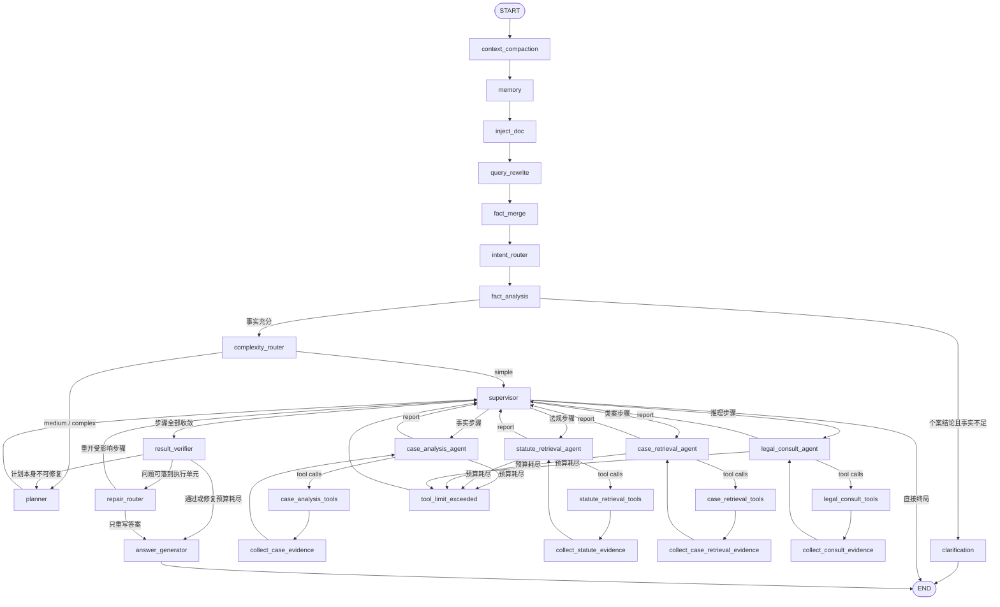
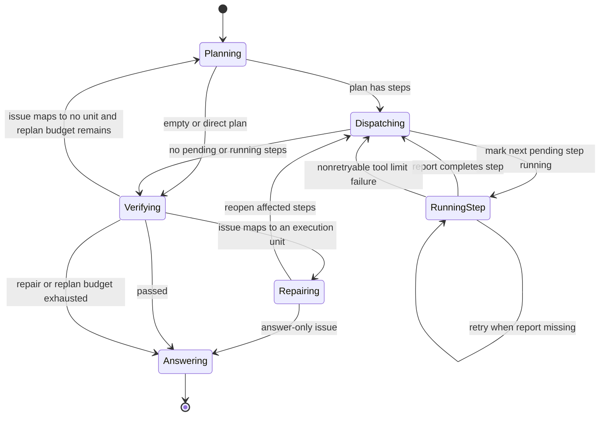
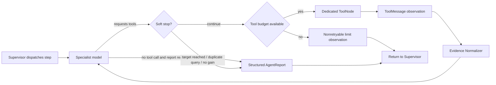

# Agent 工作流

主图是“确定性编排 + 专业 Agent”：改写、路由、澄清、证据归一化、引用核验与答案生成都是
普通节点，LLM 只出现在真正需要判断的位置。宏观是 Plan-and-Execute，微观是每个专业 Agent
内部有界的 ReAct Loop。三条取舍贯穿全图：简单问题跳过 Planner、检索证据在进入模型前先
归一化、核验失败优先局部修复而不是整体重排。

## LangGraph Graph

图由 `agent/graph.py` 声明：27 个业务节点、19 条静态边、9 组条件边。所有节点经
`observed_node` 或 `observed_tool_node` 包装，因此节点延迟、成功状态、工具调用次数、证据
增量与核验结论都能关联到同一个请求 Trace，详见[可观测性](./observability.md)。

### 条件边

| 条件函数 | 出口 |
| --- | --- |
| `should_after_fact_analysis` | `clarification`、`complexity_router` |
| `should_after_complexity` | `planner`、`supervisor` |
| `should_execute_next` | 四个专业 Agent、`result_verifier`、`END` |
| `should_continue`（每个专业 Agent 各一组） | 对应 ToolNode、`tool_limit_exceeded`、`supervisor` |
| `should_after_verifier` | `answer_generator`、`repair_router`、`planner` |
| `should_after_repair` | `supervisor`、`answer_generator` |

## 事实闸门与澄清

Fact Analysis Agent 只负责事实：输出 `legal_relationship`、`facts`、`legal_issues`、
`missing_facts`、`facts_sufficient`、`needs_clarification`、`clarification_questions`，
不检索法规、不凭记忆写法条。

只有“个案法律结论 + 事实不足”才阻断工作流：`needs_clarification` 与
`clarification_blocking` 同时为真时进入 Clarification 节点，本轮以澄清问题结束。通用法律
说明属于“先答再问”，继续正常流程，缺失事实由 Answer Generator 在答案里提示。

用户补充事实后按同一 `thread_id` 续跑：新一轮从 `query_rewrite` 进入 `fact_merge`，
合并后的事实先经过 Intent Router 与 Fact Analysis 重新做充分性判断，再决定是否进入
Complexity Router——补充信息不会被当成新问题，也不会跳过闸门直连 Planner。Fact Merge
只补空缺，不用空值覆盖已确认事实。

## Complexity Router

Complexity Router 是普通节点（`agent/nodes/complexity.py`），把请求分成三档并写入
`complexity_level`、`execution_mode`、`needs_case_retrieval`：

| 档位 | 执行方式 |
| --- | --- |
| `simple` | 直接写入固定的两步计划（法规检索 → 法律推理）交给 Supervisor，跳过 Planner |
| `medium` / `complex` | 进入 Planner，按 Plan-and-Execute 展开 |

简单路径的固定计划不含类案检索。`needs_case_retrieval` 是类案检索的唯一开关：用户明确要
判例、问司法实践、规则本身有歧义或争议确实复杂时才为真。Planner 生成的类案步骤在
`needs_case_retrieval` 为假时会被代码删掉并重排 `step_id`，而不是靠 Prompt 约束模型。

## Plan-and-Execute

### 计划契约

Planner 最多生成 6 个 `PlanStep`。每个步骤包含：

| 字段 | 含义 |
| --- | --- |
| `step_id` | 本轮计划内的稳定标识 |
| `task_type` | `case_analysis`、`statute_retrieval`、`case_retrieval` 或 `legal_consultation` |
| `description` | 给专业 Agent 的可执行任务；修复时追加修复指令 |
| `assigned_agent` | 负责执行的专业 Agent |
| `status` | `pending`、`running`、`completed`、`failed` 或 `skipped` |
| `required` | 是否为完整回答所必需 |
| `result` | 专业 Agent 的结构化报告或失败原因 |

Supervisor 是纯调度器，不调用模型：一次只启动一个步骤，专业 Agent 返回带 `task_id` 的
`AgentReport` 后完成当前步骤并启动下一个 pending 步骤。缺少报告时最多按 `MAX_STEP_RETRIES`
重试；工具预算耗尽属于不可重试失败，直接标记步骤失败并继续调度或进入核验。

Planner 的模型不可用时仍然产出可执行的兜底计划（事实分析 → 法规检索 → 法律推理），但降级
必须看得见：State 上写 `planner_degraded = true`，Trace 上记 `planner_degraded`
（`reason = planner_llm_unavailable`）与 `agent_fallback` 事件，`plan_created` 事件同样带
降级标记。模型正常返回时该标记显式置为 `false`，一次抖动不会污染后续轮次。

## ReAct Loop

`admit_tool_calls`（`agent/tool_loop.py`）是唯一入口，先判软停止再判硬预算：

| 停止原因 | 触发条件 |
| --- | --- |
| `evidence_target_reached` | 法规证据已达 `EVIDENCE_LAW_TARGET`（5）或案例达 `EVIDENCE_CASE_TARGET`（3） |
| `duplicate_query` | `query_signature` 与本轮已记录的签名重复 |
| `no_evidence_gain` | 上一次工具调用的 `evidence_gain` 不大于 `EVIDENCE_GAIN_STOP_THRESHOLD`（0） |
| `request_budget_exhausted` | 本次请求累计放行的工具调用已达 `MAX_TOOL_CALLS_PER_REQUEST`（默认 3） |

软停止不算失败：本轮不再放行工具，Agent 直接用已有证据提交报告。硬预算是
`MAX_TOOL_CALLS_PER_AGENT`（默认 2，可用环境变量覆盖）；超出时生成不可重试的
`tool_loop_failure` 观察并经 `tool_limit_exceeded` 回到 Supervisor。Repair Router 重开步骤
时会置 `tool_refresh_allowed`，豁免“证据已达标”和“重复查询”两条，但不豁免“无证据增量”。

单任务预算管不住整轮成本：`tool_call_count` 会在 Supervisor 分派计划步骤、Repair Router
局部修复和 Verifier 整体重排时归零，因此另有一个按请求存活的累计值 `tool_call_total`，
上限为 `MAX_TOOL_CALLS_PER_REQUEST`（默认 3）。它排在所有软停止条件之前判断，
`tool_refresh_allowed` 不能豁免；耗尽后按软停止处理（不判步骤失败），并且 Repair Router
不再发起需要重新检索的修复——重开步骤也拿不到新证据，只会白花一轮 Specialist 与 Verifier。

`query_signature = sha256(tool_name + 归一化关键词 + 归一化过滤条件)`，只有摘要进入 State
与 Trace，检索原文不落库。工具执行异常被转换成 `ToolMessage`，让模型看到可重试观察，而不是
令整张图崩溃。

### 专业 Agent 与工具

| 图内节点 | 规范职责名 | 任务 | 工具 |
| --- | --- | --- | --- |
| `case_analysis_agent` | `fact_analysis_agent` | 法律关系、事实、争点与缺失事实 | `search_case_tool`、`search_law_tool`、`retrieve_local_law_tool` |
| `statute_retrieval_agent` | `law_retrieval_agent` | 法规检索、时效性与相关性判断 | `search_law_tool`、`retrieve_local_law_tool` |
| `case_retrieval_agent` | `case_retrieval_agent` | 按需检索类案，只提交可核验的案号 | `search_case_tool` |
| `legal_consult_agent` | `legal_reasoning_agent` | 法律推理与行动建议，只引用通过核验的证据 | `search_law_tool`、`retrieve_local_law_tool` |

规范职责名与图内节点名通过 `agent/agent_names.py` 的单一注册表互相解析（`agent_node`、
`same_agent`）。计划、Repair Router 和 Supervisor 两种写法都认，旧 checkpoint 因此仍可恢复；
图内节点名保持不变，是为了不破坏既有 Trace、报告和前端事件的兼容性。

类案检索是独立执行单元，只在 Planner 生成类案步骤或 Repair Router 判定类案证据不足时才运行。
它不整理事实、不检索法规、不给法律结论：模型凭记忆写出的案号会被代码按本轮 `retrieved_cases`
过滤掉，检索不到时显式报告 `evidence_insufficient`，交给核验与修复处理。

## Evidence Normalizer

四个证据收集节点共用 `normalize_evidence`（`agent/nodes/evidence_normalizer.py`），按固定顺序
执行：清洗 → 规范化 → 去重 → 有效性过滤 → 相关性过滤 → TopK → 写回 State。

- 规范化产出 `canonical_law_id` 与 `evidence_id = hash(source_id + article_no)`，
  “劳动合同法 第八十五条”与“中华人民共和国劳动合同法(2012修正) 第八十五条”落到同一条证据。
- 只扫描未处理过的 ToolMessage（按 `normalized_tool_message_ids` 记录），重复归一化不会重复计数。
- `validity == "invalid"` 的法规直接丢弃；相关性低于 `EVIDENCE_MIN_RELEVANCE`（默认 0）丢弃。
- TopK 上界为法规 `EVIDENCE_LAW_TOP_K`（默认 8）、案例 `EVIDENCE_CASE_TOP_K`（默认 5），
  因此 `retrieved_laws` 不会随 ReAct 轮次无界增长，进入模型上下文的证据也保持在可控规模。
- `evidence_gain` 是本轮新增证据键的数量，既写 Trace（`evidence_normalized`、
  `evidence_deduplicated`）也驱动 ReAct 的 `no_evidence_gain` 软停止。

## 核验：Citation Verifier + Semantic Verifier

`result_verifier` 先跑确定性审计，再让 LLM 补充：

- **Citation Verifier（Python）**：计划完成度、报告关键结论、法规/案例来源匹配、失效法规和
  引用完整性。引用按 `canonical_law_id + article_no` 与本轮证据比对，别名写法不会误判；
  比对结果写入 `verification_result` 与 `verified_evidence`，这是下游唯一的引用真相源。
- **Semantic Verifier（LLM）**：只在确定性审计之后运行，返回结构化 issue
  `{type, severity, source, step_id, agent, message}`；模型不可用时置
  `verification_degraded = true`，确定性结论照常生效，不抛 500。
- Trace 上记一条 `verification_complete` 与每个 issue 一条 `verification_issue`。

核验失败后的去向由 `should_after_verifier` 决定：`blocking` 级 issue 能落到执行单元时走
Repair Router；落不到执行单元且重排预算尚余时才回 Planner；两种预算各自最多一轮，用尽后基于
已核验证据作答。`simple` 路径不重排，只允许局部修复。`warning` 级 issue 只作风险提示。

## Repair Router

Repair Router 是普通节点（`agent/nodes/repair.py`），按固定路由表把 issue 映射到修复目标：

| issue 类型 | 修复目标 |
| --- | --- |
| `citation_invalid`、`retrieval_insufficient`、`obsolete_law` | `law_retrieval_agent` |
| `case_evidence_insufficient` | `case_retrieval_agent`（计划里没有类案步骤时补建一步） |
| `reasoning_conflict`、`overconfident` | `legal_reasoning_agent` |
| `answer_format_error` | `answer_generator`（不重跑任何 Agent） |

修复只重开受影响步骤及其下游推理步骤，修复指令追加到步骤 `description`；第一轮已核验的
证据、无关步骤的报告与 `verified_evidence` 原样保留。澄清循环处理的是**用户事实缺失**，
修复循环处理的是**Agent 执行错误**，两者互不触发。

## Answer Generator

Answer Generator 是普通节点，只从 `verified_evidence` 重新生成答案，不再“先生成再删引用”。
证据在 Agent 内部按 `law_001`、`case_001` 一类 ID 引用，答案生成时渲染为正式引用。答案不暴露
Agent 名、核验错误、重试次数、内部证据 ID 与异常文本。`answer_score` 由
`services/final_quality.py` 唯一产出并写入 `legal_analysis.answer_score`，其 `citations` 与
`legal_analysis.citations`、`verification_result` 保持一致。

## 状态与合并

`AgentState` 是图节点之间的显式契约。`messages` 使用 LangGraph `add_messages` reducer；
计划步骤按 `step_id` 合并，法规、案例、报告和引用使用稳定键去重，检索证据 reducer 按显式
分数排序并限制数量。每轮新请求会显式重置计划、报告、引用、工具计数、修复计数与核验结果。

本次重构新增的关键字段：`facts_sufficient`、`needs_clarification`、`clarification_blocking`、
`clarification_questions`、`missing_facts`、`complexity_level`、`execution_mode`、
`needs_case_retrieval`、`planner_degraded`、`evidence_gain`、`tool_query_signatures`、
`normalized_tool_message_ids`、`tool_refresh_allowed`、`verified_evidence`、
`verification_degraded`、`repair_count`。

## 代码入口

- 拓扑：`agent/graph.py`；节点名注册表：`agent/agent_names.py`
- 状态与 reducer：`agent/state.py`；证据模型：`agent/evidence.py`
- Fact Analysis 与澄清：`agent/agents/fact_analysis_agent.py`、`agent/nodes/clarification.py`
- Complexity Router：`agent/nodes/complexity.py`、`agent/complexity.py`
- Planner：`agent/nodes/planner.py`；Supervisor：`agent/nodes/supervisor.py`
- 路由条件：`agent/nodes/routing.py`
- 工具预算与软停止：`agent/tool_loop.py`
- Evidence Normalizer：`agent/nodes/evidence_normalizer.py`
- Verifier：`agent/nodes/verifier.py`、`agent/nodes/citation_verifier.py`
- Repair Router：`agent/nodes/repair.py`、`agent/repair.py`
- Answer Generator 与质量指标：`agent/nodes/answer.py`、`services/final_quality.py`
- 工作流指标：`services/workflow_metrics.py`

