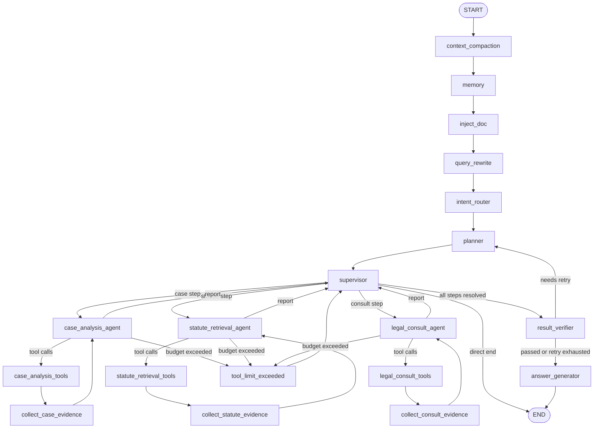
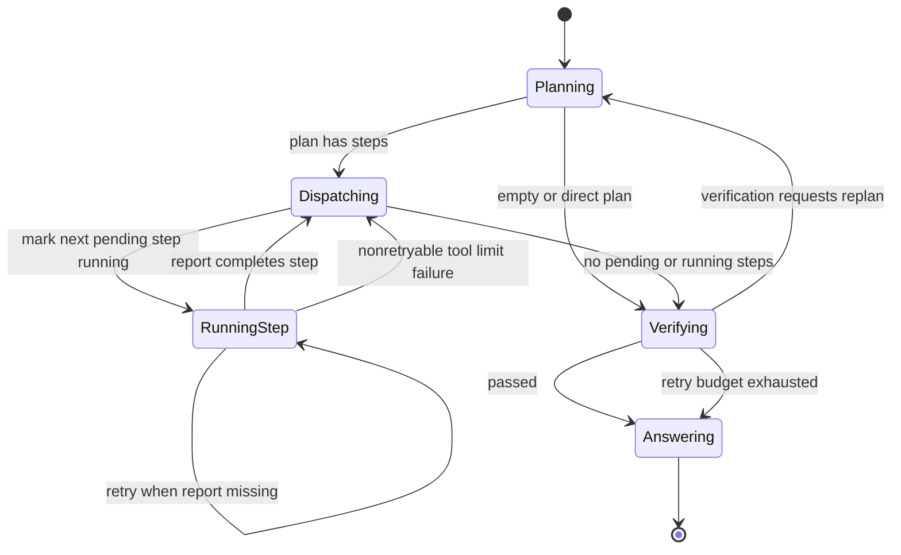
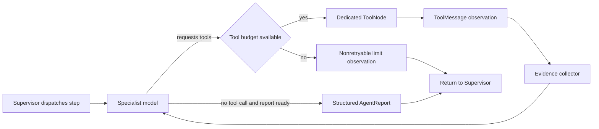

# Agent 工作流

主图采用“确定性编排 + 专业 Agent”的结构。LangGraph 负责状态合并、断点恢复和路由，
Planner 将请求拆成有限步骤，Supervisor 串行调度专业 Agent；每个专业 Agent 内部运行独立、
有界的 ReAct Loop。

## LangGraph Graph

图由 `agent/graph.py` 声明。所有节点经 `observed_node` 或 `observed_tool_node` 包装，
因此节点延迟、成功状态、重试次数和检索数量都能关联到同一个请求 Trace。

## Plan-and-Execute

### 计划契约

Planner 最多生成 6 个 `PlanStep`。每个步骤包含：

| 字段 | 含义 |
| --- | --- |
| `step_id` | 本轮计划内的稳定标识 |
| `task_type` | `case_analysis`、`statute_retrieval`、`case_retrieval` 或 `legal_consultation` |
| `description` | 给专业 Agent 的可执行任务 |
| `assigned_agent` | 负责执行的专业 Agent |
| `status` | `pending`、`running`、`completed`、`failed` 或 `skipped` |
| `required` | 是否为完整回答所必需 |
| `result` | 专业 Agent 的结构化报告或失败原因 |

Supervisor 一次只启动一个步骤。专业 Agent 返回带 `task_id` 的 `AgentReport` 后，Supervisor
完成当前步骤并启动下一个 pending 步骤。缺少报告时最多按 `MAX_STEP_RETRIES` 重试；工具预算
耗尽属于不可重试失败，直接标记步骤失败并进入后续调度或校验。

Verifier 先执行确定性审计，包括计划完成度、报告关键结论、法规/案例来源匹配、失效法规和
引用完整性，再允许 LLM 提供受证据约束的补充。`needs_retry` 为真且重规划预算尚未耗尽时，
流程回到 Planner；否则进入 Answer Generator。

## ReAct Loop

`apply_tool_call_budget` 对实际 tool call 逐个计数，默认最多允许 5 次；若模型一次请求多个工具，
只放行剩余预算能覆盖的调用。工具执行异常被转换成 `ToolMessage`，让模型看到可重试观察，
而不是令整张图崩溃。证据收集节点从原始 observation 提取法规和案例，去重并保留 Top-N，
随后专业 Agent 决定继续检索还是提交报告。

### 专业 Agent 与工具

| Agent | 任务 | 工具 |
| --- | --- | --- |
| `case_analysis_agent` | 案情、争点、类案与适用规则分析 | 类案搜索、外部法规搜索、本地法规 RAG |
| `statute_retrieval_agent` | 法规检索、时效性和相关性判断 | 外部法规搜索、本地法规 RAG |
| `legal_consult_agent` | 一般法律咨询与行动建议 | 外部法规搜索、本地法规 RAG |

## 状态与合并

`AgentState` 是图节点之间的显式契约。`messages` 使用 LangGraph `add_messages` reducer；
法规、案例、报告和引用使用稳定键去重。检索证据 reducer 优先按显式分数排序并限制数量，
避免多轮 ReAct 将工作状态无限放大。每轮新请求会显式重置计划、报告、引用和工具计数等字段。

## 代码入口

- 拓扑：`agent/graph.py`
- 状态与 reducer：`agent/state.py`
- Planner：`agent/nodes/planner.py`
- Router 和 Supervisor：`agent/nodes/supervisor.py`
- 路由条件：`agent/nodes/routing.py`
- Verifier：`agent/nodes/verifier.py`
- 工具预算：`agent/tool_loop.py`
