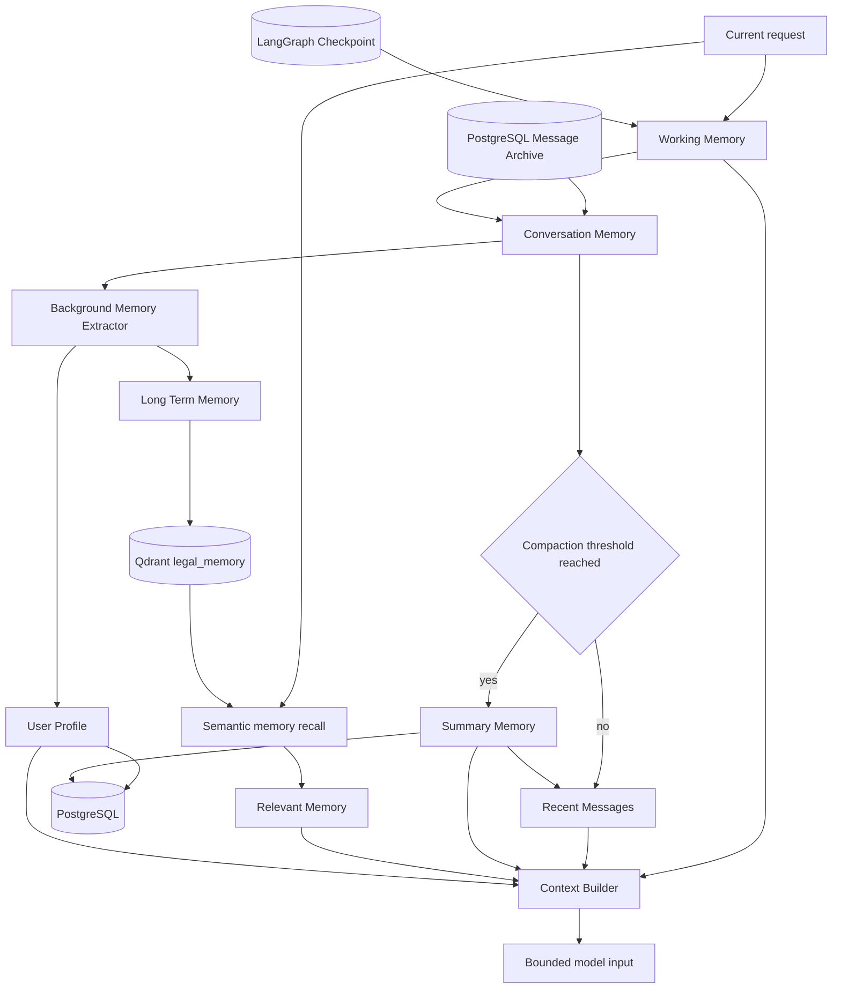
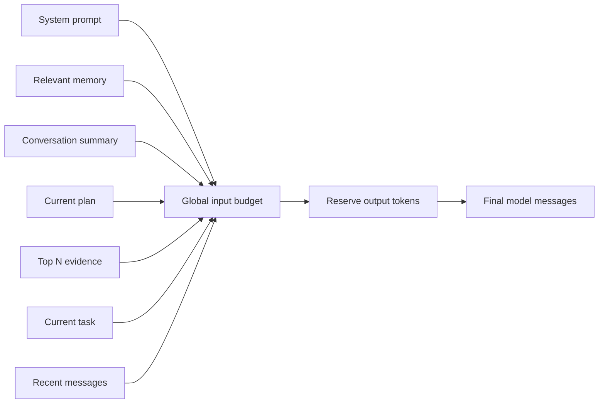

# Memory 架构

系统将“模型上下文”“会话恢复”和“长期用户记忆”分开处理。checkpoint 保存可恢复的工作流状态，
长期 Memory 只保存值得跨轮复用的信息；两者不能互相替代。

## Memory 分层

## 五层职责

| 层 | 内容 | 生命周期 | 模型读取方式 |
| --- | --- | --- | --- |
| Working Memory | 当前 `AgentState` 的计划、证据、报告和控制字段 | 当前 thread，可由 checkpoint 恢复 | 仅选择当前任务相关字段 |
| Conversation Memory | 用户、助手和工具消息 | 会话级，归档到 PostgreSQL | 最近且协议完整的有限窗口 |
| Summary Memory | 较早对话的滚动摘要与实体合并结果 | 会话级，存入 PostgreSQL | 独立 token 预算 |
| Long-term Memory | 稳定身份、偏好、持续事项和明确要求记住的信息 | 跨轮；按用户或 thread 隔离 | 语义命中的 Top-K |
| Persistent Workflow State | LangGraph checkpoint 的节点进度和完整状态 | thread 级，生产环境 PostgreSQL | 不直接整体注入模型 |

## 读取路径

图入口的 `memory_node` 加载摘要、用户画像和与当前 query 相关的长期记忆。长期记忆使用
`owner_id` 隔离：存在认证 `user_id` 时使用用户 namespace，否则退化为 `thread_id`，避免匿名会话
之间相互召回。向量检索结果结合语义相似度与时间新鲜度排序。

OpenViking 上下文是可选的外部上下文层。启用时，其 resource、memory 和 skill 命中经过领域过滤、
去重和预算裁剪后写入 `viking_context`；不可用时返回空上下文，不阻断主图。

## 压缩路径

`context_compaction` 位于图的第一个节点。只有消息数或估算 token 超过阈值时才压缩：

1. 保留最近消息和上传文档协议所需消息。
2. 将可压缩的旧消息与已有摘要交给压缩模型。
3. 成功后更新 summary、profile/entities，并用 `RemoveMessage` 从 checkpoint 状态删除已压缩消息。
4. 失败时保留原消息，不执行破坏性删除，并在状态中记录错误。

`msg_count` 表示消息归档中的摘要偏移，不是 checkpoint 删除次数。PostgreSQL 消息归档仍保留完整
业务历史，压缩只控制模型工作集和 checkpoint 中的近期上下文。

## 上下文构建

`build_model_context` 是专业 Agent 模型输入的统一入口。预算按本轮需要分档（`standard` 32K /
`complex` 64K / `long` 128K，见
[Context Engineering 与 Memory](./context-engineering-memory.md#上下文档位)），各层有独立软预算，
整体受该档位 `输入预算 - 输出预留` 的硬上限约束，并被 `CONTEXT_MODEL_MAX_TOKENS` 夹住。当前 task
与近期消息具有保底空间，防止大型上传文档或记忆片段挤掉正在执行的任务。

大型 Tool observation 会先转换为确定性的结构化摘要；原始 observation 仍留在图状态中供
collector 提取证据。法规和案例只注入按分数稳定排序后的 Top-N，条数随档位放大。构建结果写入
`context_build_status`，包含档位、各层估算 token、注入消息数和证据数量。

## 写入路径

SSE 正常结束后，FastAPI BackgroundTasks 调用 `extract_and_save_memory`，避免增加首 token 延迟。
提取器只处理尚未归档的新消息，并通过专用记忆模型识别画像更新与长期记忆候选。长期记忆写入
独立的 Qdrant `legal_memory` collection；相同内容使用稳定 ID upsert，避免重试产生重复数据。

## 隐私与删除边界

- 长期记忆必须携带用户或 thread namespace，查询不得跨 namespace。
- 不因某条消息存在于 checkpoint 就自动判定其值得长期保存。
- 上传材料正文作为 evidence 按预算使用，不自动写入长期用户记忆。
- 删除会话时应同时处理业务归档、checkpoint、摘要/画像、长期记忆和 Redis 会话元数据；各后端
  的清理职责需保持显式，不能依赖 TTL 推断已经删除。

## 代码入口

- 图节点：`agent/nodes/memory.py`
- 摘要与画像：`services/memory.py`
- 长期存储：`services/memory_store.py`
- 后台提取：`services/memory_extractor.py`
- 上下文构建：`services/context_builder.py`
- 运行时压缩：`services/context_compaction.py`
- OpenViking：`services/openviking_context.py`
