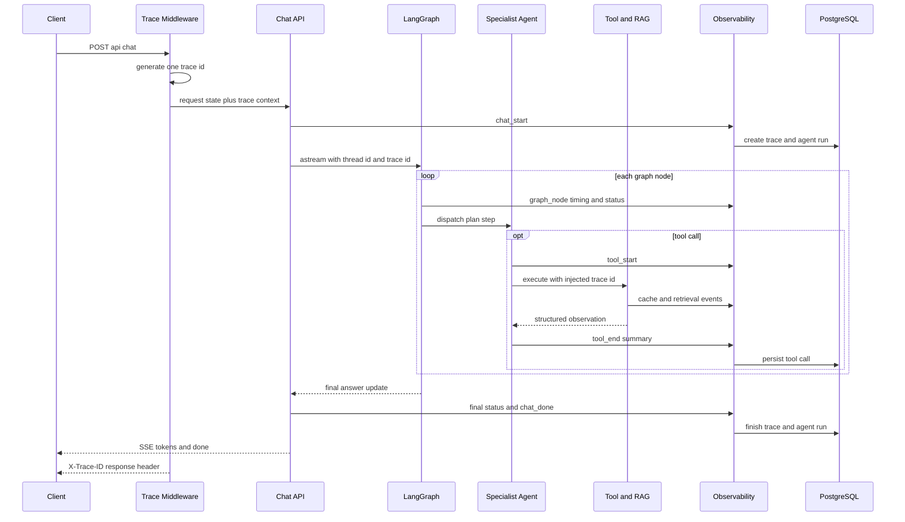

# Observability 架构

可观测性以请求级 `trace_id` 为关联键，覆盖 HTTP、LangGraph 节点、模型、工具、RAG、缓存和最终
响应。系统同时提供结构化事件、PostgreSQL 运行记录、Prometheus 文本指标和后台时间线。

## Request Trace



中间件为每个 HTTP 请求只生成一次 16 字符 Trace ID，并通过 `ContextVar` 传播。Chat API 将同一个
值放入 LangGraph `configurable`、metadata 和 `AgentState`；模型、节点、Agent Tool 与 RAG 从上下文
或 injected state 读取它，禁止各层重新生成互不关联的 ID。

## 事件模型

事件统一包含下列公共维度：

| 字段 | 含义 |
| --- | --- |
| `trace_id` | 请求级关联键 |
| `thread_id` | 会话维度 |
| `node_name` | LangGraph 节点或请求阶段 |
| `agent_name` | Supervisor 或专业 Agent |
| `tool_name` | 工具事件使用的名称 |
| `latency_ms` | 当前操作耗时 |
| `success` / `error` | 结果状态和脱敏错误摘要 |
| `retry_count` | 节点或计划重试次数 |
| `retrieval_count` | 当前输出中的检索结果数量 |
| `cache_hit` | 缓存事件的命中状态 |

主要事件包括：

- 请求：`chat_start`、`chat_done`、`final_answer`。
- 图：`graph_node`、`supervisor_route`、`agent_report`、`citation_guard`。
- 工具：`agent_tool_request`、`tool_start`、`tool_end`。
- RAG：`vector_hits`、`bm25_hits`、`fused_hits`、`reranker_hits`、`rag_retrieval`。
- 模型：`model_route`、`llm_call`、`llm_fallback`、`llm_error`。
- 缓存：`cache_hit`、`cache_miss` 和 Redis 降级指标。

`observed_node` 在节点入口建立包含 node/agent 的 trace context，在 `finally` 语义下记录延迟与结果；
即使节点抛错，也能产生失败事件。ToolNode 由 `observed_tool_node` 包装，API 额外将实际调用写入
PostgreSQL `tool_calls`，但对自身已打点的工具避免重复记录事件。

## 数据出口

```mermaid
flowchart LR
    Runtime[Runtime signals] --> Events[Structured events]
    Runtime --> Metrics[In process metrics]
    Runtime --> Logs[Redacted logs]
    Events --> History[(PostgreSQL trace history)]
    Events --> Runs[(PostgreSQL runs and tool calls)]
    Metrics --> Prom[/metrics Prometheus text]
    History --> Admin[Admin dashboard and timeline]
    Logs --> Stdout[Process log collector]
```

PostgreSQL 的 `agent_traces`、`agent_events` 和 `llm_call_logs` 支持后台页面与时间线；
`agent_runs` 和 `tool_calls` 保存运行状态与工具调用的权威业务记录。

`/metrics` 输出 Prometheus 文本，包含请求量、延迟、缓存命中、Redis 降级等指标。工作流层面的
指标统一由 `services/workflow_metrics.py` 产出（前缀 `legal_workflow_`）：节点耗时与成败、
Complexity Router 定档、澄清结果、Planner 降级、工具调用量与软停止原因、证据归一化保留 / 丢弃 /
增量、核验结论与 `verification_degraded`、引用状态、局部修复与 replan、答案生成、整轮耗时。
完整清单见 `PROJECT_INFO.md` 的「Prometheus 指标」小节。`/admin` 和
相关 API 从观测镜像生成成功率、平均延迟、最近 Trace、LLM 调用与检索时间线。

Trace 上与重构相关的新事件：`complexity_route`、`clarification_required`、`clarification_resumed`、
`planner_degraded`、`tool_loop_stopped`、`evidence_normalized`、`evidence_deduplicated`、
`verification_complete`、`verification_issue`、`repair_started`、`repair_skipped`、`replan_skipped`。
`verification_degraded` 与 `planner_degraded`
只出现在 Trace 与指标里，不进入用户可见的 SSE 事件。

## SSE 可见事件

浏览器接收的是面向用户的有限事件集合：`thought`、`context_status`、`tool_start`、`tool_end`、
`token`、`error` 和 `done`。`thought` 只描述处理阶段，不暴露模型内部推理。服务端 Trace 的事件
更细，但也只保存必要摘要。

## 隐私与基数控制

- HTTP 日志只记录 trace、method、path、status 和 latency，不记录请求体。
- `RedactingFormatter` 和 `infrastructure.sanitize` 对密钥、授权头、DSN 与常见敏感字段统一脱敏。
- 上传正文、完整 prompt、完整工具输出和最终敏感材料不进入普通日志；事件保存数量和短摘要。
- Prometheus label 不使用 query、thread_id、trace_id 或错误消息等高基数字段。
- 对外错误响应与内部异常详情分离；Trace 中保留错误类型和可操作的安全摘要。

## 排障路径

1. 从响应头或客户端错误信息取得 `X-Trace-ID`。
2. 在后台 Trace 时间线定位最后一个失败节点或工具事件。
3. 对照 PostgreSQL agent run、tool call 状态确认是否为业务记录失败。
4. 查看 `/metrics` 判断是单请求异常还是 Redis、模型、检索后端的系统性退化。
5. 仅在需要时查脱敏进程日志，避免通过扩大日志内容来补偿事件设计不足。

## 代码入口

- HTTP Trace：`main.py`
- Chat 事件与 SSE：`api/chat.py`
- 节点包装：`agent/graph_runtime.py`
- Trace 与后台数据：`services/observability.py`
- 指标：`services/metrics.py`
- 运行记录：`services/persistence.py`
- 脱敏：`infrastructure/sanitize.py`
