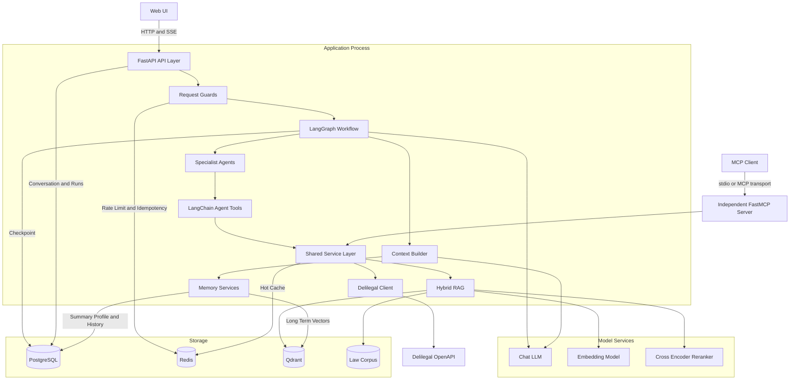

# 系统架构总览

本文是法智最终架构的入口。系统以 FastAPI 提供 HTTP 与 SSE 接口，以 LangGraph
编排法律任务，通过专业 Agent、混合 RAG、分层记忆和可恢复持久化完成一次法律问答。

## 系统架构

图中的应用主链不会通过 MCP 子进程访问 RAG。LangGraph 的工具直接调用共享
Service Layer；`run_mcp.py` 启动的 FastMCP Server 是面向外部 MCP Client 的独立暴露层，
复用同一批服务能力。

## 核心请求路径

1. HTTP 中间件生成唯一 `trace_id`，写入请求状态和 `X-Trace-ID` 响应头。
2. `/api/chat` 执行限流、每日配额和可选幂等校验，并确保会话存在。
3. API 从 checkpoint 或 PostgreSQL 消息归档恢复上下文，然后流式执行 LangGraph。
4. 图完成上下文压缩、记忆加载、查询规范化和事实分析；个案结论所需事实不足时中断补问，
   否则由 Complexity Router 决定简单路径直达 Supervisor 还是进入 Planner。
5. 专业 Agent 在有界 ReAct 循环中调用法规、类案或本地 RAG 工具，检索结果经 Evidence Normalizer 归一化、去重、限量。
6. Verifier 先做确定性引用核验再由 LLM 补充；失败时优先由 Repair Router 局部修复，只有问题落不到执行单元时才按预算重排；通过后只从已核验证据生成答案。
7. API 通过 SSE 发送过程状态和最终 token，随后异步提取长期记忆。

## 分层职责

| 层 | 主要模块 | 职责 |
| --- | --- | --- |
| 接入层 | `main.py`、`api/` | 生命周期、认证/配额、REST、SSE、上传与管理接口 |
| 编排层 | `agent/graph.py`、`agent/nodes/` | 图拓扑、计划执行、路由、校验和答案生成 |
| Agent 层 | `agent/agents/`、`agent/tool_loop.py` | 专业推理、工具选择、工具预算与结构化报告 |
| 服务层 | `services/` | 检索、模型、记忆、缓存、持久化、法律业务规则 |
| 基础设施层 | `infrastructure/` | PostgreSQL、Redis、Repository、迁移和日志脱敏 |
| 能力暴露层 | `mcp_server/` | 将共享法律能力注册为 FastMCP 工具 |

## 关键设计约束

- Router、Planner、Supervisor、Verifier 和格式化步骤保持确定性边界；模型只补充需要语义判断的部分。
- 每个专业 Agent 只绑定完成其职责所需的工具，单个计划步骤最多执行 2 次工具调用（`MAX_TOOL_CALLS_PER_AGENT`），一次请求累计最多 3 次（`MAX_TOOL_CALLS_PER_REQUEST`，跨步骤与修复轮不重置），证据到量、重复检索、零增益或全请求预算耗尽时提前软停止。
- 简单问题走固定两步计划，不进 Planner、不查类案；类案检索只在明确需要时按需运行。
- 模型上下文不是 checkpoint 的完整转储，而是由 Context Builder 按层预算构造。
- PostgreSQL 或迁移不完整时应用拒绝启动；Redis 始终 fail-open，不阻断 Agent 主链。
- 原始提示词、上传文档正文和敏感字段不进入普通请求日志；日志格式化器统一脱敏。

## 文档索引

- [Agent 工作流](./agent-workflow.md)：LangGraph、Plan-and-Execute、ReAct Loop。
- [RAG](./rag.md)：混合检索、融合、精排与降级。
- [Memory](./memory.md)：五层记忆和上下文预算。
- [Tools](./tools.md)：Agent Tools、Service Layer 与 FastMCP。
- [Persistence](./persistence.md)：PostgreSQL、Redis 和 Qdrant。
- [Observability](./observability.md)：Trace、事件、指标和隐私边界。

## 代码入口

- 应用生命周期：`main.py`
- 图注册：`agent/graph.py`
- 图状态：`agent/state.py`
- 对话流：`api/chat.py`
- 共享服务：`services/`
- 基础设施：`infrastructure/`
