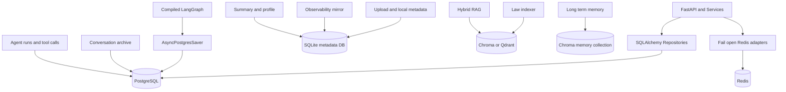
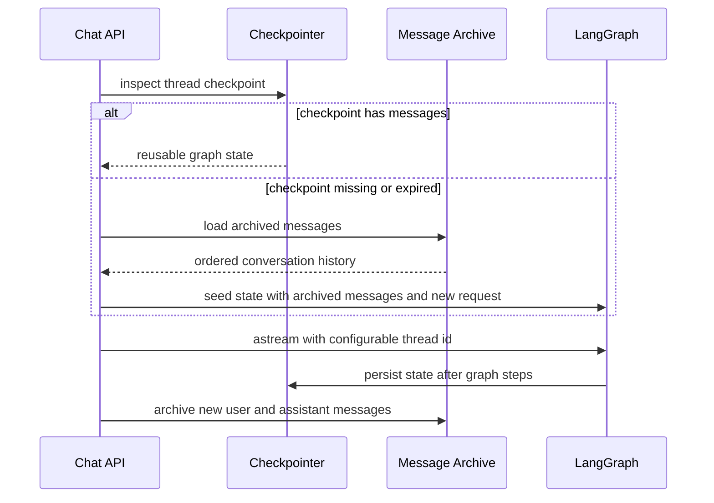

# Persistence 架构

持久化按数据职责拆分。PostgreSQL 保存业务权威记录和生产 LangGraph checkpoint；Redis 只保存
可丢失的热数据；SQLite 保存单机辅助元数据与可观测性镜像；向量数据库保存法律索引和长期记忆。

## 存储拓扑



## 数据归属

| 数据 | 权威存储 | 说明 |
| --- | --- | --- |
| 用户、会话、消息 | PostgreSQL | Repository 管理的业务归档，可在 checkpoint 缺失时恢复对话 |
| Agent run、tool call | PostgreSQL | 运行状态、计划、工具摘要、耗时和错误 |
| LangGraph state | PostgreSQL checkpoint | `thread_id` 隔离的图状态和节点进度；测试可使用 MemorySaver |
| 限流、幂等、session 热元数据 | Redis | 有 TTL、可丢失、故障时 fail-open |
| 检索与外部 API 缓存 | Redis | 由参数指纹隔离版本；不作为业务事实来源 |
| 最终回答缓存 | SQLite | 本机优化，命中与否不影响正确性 |
| 上传文档元数据与文本 | SQLite | 通过 `doc_id` 读取，正文不写普通日志 |
| 摘要、画像、观测镜像 | SQLite | 本地辅助数据；Agent run 的权威记录仍在 PostgreSQL |
| 法律向量索引 | Chroma 或 Qdrant | 通过 `VectorStore` 抽象切换 |
| 长期记忆 | Chroma `memory` collection | 与法律 collection 逻辑隔离，并按 owner namespace 查询 |

## PostgreSQL

`infrastructure/database.py` 管理异步 SQLAlchemy Engine 和 Session。Alembic 初始 schema 包含
`users`、`conversations`、`messages`、`agent_runs` 和 `tool_calls`；Repository 封装查询与写入，
API 不直接拼接 SQL。

生产 checkpoint 由 `AsyncPostgresSaver` 承担，其连接生命周期覆盖 compiled graph 的完整生命周期。
`CHECKPOINT_BACKEND=postgres` 时使用独立 checkpoint DSN 或数据库 DSN；开发和单元测试可设置
`CHECKPOINT_BACKEND=memory`。Windows 下 PostgreSQL checkpointer 必须使用 SelectorEventLoop，启动
配置不满足时会明确失败，而不是静默退回内存导致状态丢失。

## 会话恢复



业务消息归档与 checkpoint 是双轨：前者用于产品历史和恢复兜底，后者用于工作流连续性。不能仅删除
其中一侧并假定会话已彻底删除。

## Redis 降级模型

Redis 只承担缓存、限流、幂等和 session 元数据。所有访问经统一 `execute` 或 `execute_sync` 包装：

1. 未配置 Redis 时直接返回默认值。
2. 连接或命令失败时记录降级指标并打开短期熔断器。
3. 熔断期间不再为每个请求支付连接超时。
4. 后续成功操作关闭熔断器。

因此 Redis 不参与 `/api/health` 的整体 `status` 判定。限流和幂等在 Redis 故障时自动放行，SQLite
每日配额继续兜底；这是一致性与可用性之间的有意选择。

## 生命周期与迁移

FastAPI lifespan 按顺序初始化 PostgreSQL、SQLite 元数据、Redis、观测/配额/缓存/记忆表、长期
记忆存储、RAG 和 checkpointer。应用退出时释放 Redis 与数据库连接池。

数据库 schema 变更必须通过 Alembic：

```bash
alembic upgrade head
```

法律索引不属于关系数据库迁移，使用：

```bash
python -m services.indexer.builder
```

## 备份与删除原则

- PostgreSQL 备份覆盖业务表和 LangGraph checkpoint schema，并验证时间点恢复。
- 向量索引可由法律语料重建；长期记忆 collection 不可仅依赖语料重建，应单独制定备份策略。
- Redis 不进入持久备份恢复目标，丢失后由请求重新填充。
- SQLite 文件包含上传内容和可观测性镜像，仍按敏感数据管理，不应提交 Git。
- 会话删除必须按 thread/user namespace 清理所有权威副本和衍生副本，并保留可审计的删除结果。

## 代码入口

- 数据库生命周期：`infrastructure/database.py`
- ORM 与 Repository：`infrastructure/models.py`、`infrastructure/repositories/`
- 业务持久化：`services/persistence.py`
- Checkpoint：`services/checkpoint.py`
- Redis：`infrastructure/redis.py`、`services/cache/`
- Alembic：`infrastructure/migrations/`
