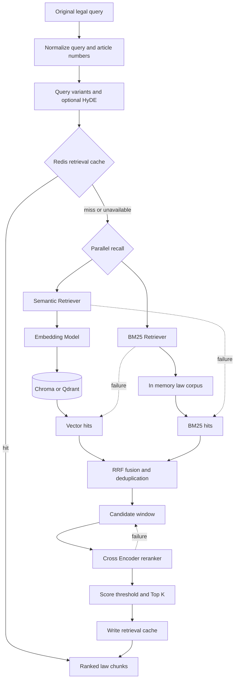
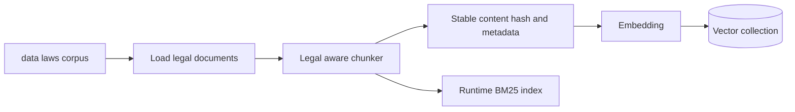

# RAG 架构

本地法规检索采用向量召回与 BM25 关键词召回并行、RRF 融合、Cross Encoder 精排的混合管线。
查询增强可生成多个检索变体；任何单一召回或精排组件失败时，管线尽量返回仍可用的结果。

## RAG 数据流

## 检索阶段

1. `normalize_query` 统一空白和法规条号表达，减少精确条款查询的表示差异。
2. 查询增强产生语义变体；启用 HyDE 时，模型先生成假设性法律文本供向量召回使用，原始 query
   仍用于最终相关性判断。
3. `SemanticRetriever` 使用 embedding 查询 `VectorStore` 抽象；后端由 `VECTOR_STORE` 选择
   `chroma` 或 `qdrant`。
4. `BM25Retriever` 在启动时加载的法律分块上执行关键词召回，补足条号、专有名词等精确匹配。
5. `reciprocal_rank_fusion_scored` 按排名融合任意数量结果并按文档 ID 去重，默认 `RRF_K=60`。
6. Reranker 使用原始 query 与候选正文进行交叉编码评分；精排结果应用阈值并截取最终 Top-K。

## 索引构建

执行 `python -m services.indexer.builder` 构建本地索引，`--rebuild` 会替换现有索引。
分块的标准负载由 `LawChunk` 定义，保留法律名称、条号、来源、时效性等法律元数据。
Chroma 默认 collection 为 `law_chunks`；Qdrant 默认 collection 为 `legal_knowledge`。

## 缓存与降级

- Redis 检索缓存 key 包含规范化 query 与检索参数指纹，Top-K、阈值或 reranker 配置变化不会误用旧结果。
- 缓存不可用时直接执行完整检索，不影响正确性。
- 向量召回失败时退化为 BM25；BM25 不可用时仍可返回向量结果。
- Reranker 失败时保留 RRF 顺序，且不会把融合分数错误解释为 reranker 分数阈值。
- 两路均无结果时返回空列表，由专业 Agent 和 Verifier 将证据不足反映到报告与最终答案。

## 与 Agent 的边界

`retrieve_local_law_tool` 是 LangGraph 专业 Agent 使用的本地 RAG 入口。工具调用 Service Layer，
返回结构化法规分块；collector 将结果写入 `AgentState.retrieved_laws`。外部法规搜索
`search_law_tool` 可与本地 RAG 互补，两者来源字段必须保留，供 Verifier 做引用核验。

FastMCP 的 `search_local_law` 和 `legal_search` 复用同一检索服务，但不位于 Web 对话主链中。

## 可观测性

一次未命中缓存的检索会记录 `vector_hits`、`bm25_hits`、`fused_hits`、`reranker_hits` 和
`rag_retrieval` 事件。事件只保存数量、配置、延迟、分数类型和错误类型等摘要，不保存完整敏感查询
或大段法律正文。

## 代码入口

- 编排：`services/rag/retriever.py`
- BM25：`services/rag/bm25.py`
- RRF：`services/rag/fusion.py`
- 精排：`services/rag/reranker.py`
- 向量抽象：`services/rag/interfaces.py`
- 后端：`services/rag/chroma_store.py`、`services/rag/qdrant_store.py`
- 启动：`services/rag/startup.py`
- 索引：`services/indexer/builder.py`
