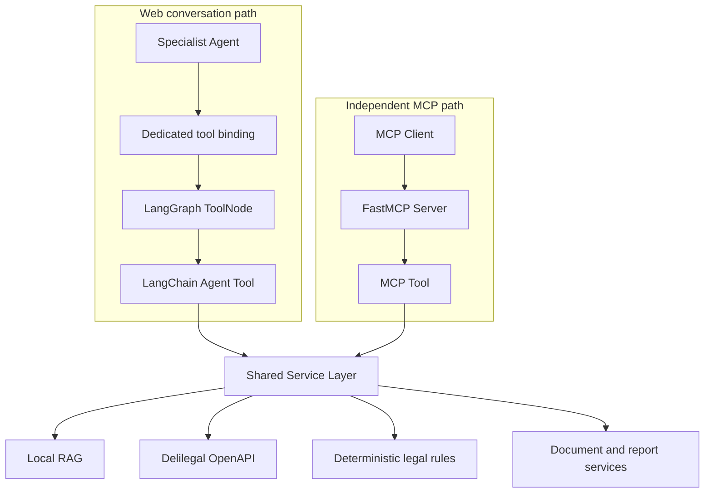
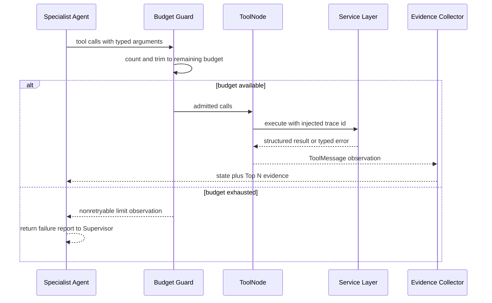

# Tools 架构

系统有两套“工具入口”，但只有一套业务实现：LangGraph 内的 LangChain Agent Tools 服务 Web
对话主链；FastMCP Tools 面向独立 MCP Client。两者都调用 `services/`，不互相套娃调用。

## 工具调用边界

## Agent Tools

| 工具 | 能力 | 主要后端 | 绑定 Agent |
| --- | --- | --- | --- |
| `search_case_tool` | 按关键词、长文本、法院、年份等检索类案 | Delilegal Service | Case Analysis |
| `search_law_tool` | 检索外部法规与时效性元数据 | Delilegal Service | 全部专业 Agent |
| `retrieve_local_law_tool` | 检索本地法律语料 | Hybrid RAG | 全部专业 Agent |

工具参数使用 Pydantic schema，`trace_id` 通过 `InjectedState` 注入而不是由模型生成。工具输出为
结构化 JSON；上游错误转成 `ToolException`，`ToolNode` 再将错误序列化为可观察、可重试的
`ToolMessage`。这保持了“工具失败是 Agent observation，而不是图级异常”的语义。

专业 Agent 的最小权限绑定如下：

- Case Analysis：类案搜索、外部法规搜索、本地法规 RAG。
- Statute Retrieval：外部法规搜索、本地法规 RAG。
- Legal Consult：外部法规搜索、本地法规 RAG。

每个计划步骤最多执行 5 个 tool call。工具节点之后必须经过 evidence collector，将可信来源写入
`retrieved_laws` 或 `retrieved_cases`，再回到专业 Agent。最终答案不能只依赖模型自由文本中的
“引用”，Verifier 会将报告来源与已检索证据交叉核对。

## FastMCP Tools

`python run_mcp.py` 启动独立 FastMCP Server，当前注册以下能力：

| 类别 | 工具 |
| --- | --- |
| 检索 | `search_law`、`search_case`、`search_local_law`、`legal_search` |
| 分析 | `law_compare`、`risk_assess`、`contract_review` |
| 规则 | `statute_of_limitations`、`jurisdiction_route` |
| 生成 | `legal_document_draft` |

FastMCP 是标准化能力出口，可由外部 Agent 或调试客户端调用。Web 对话图当前不创建 MCP Client，
也不通过 stdio 往返；因此 FastMCP 停止不会影响 FastAPI 中的 Agent Tools。

## 工具生命周期

## 安全与可观测性

- 工具 schema 限制参数类型和最大范围，Service Layer 再执行规范化与业务校验。
- Trace 只记录工具名、输入字段名、输出摘要、耗时、成功状态和错误类型；敏感值统一脱敏。
- Agent Tool 和 MCP Tool 复用相同缓存及重试策略，避免同一后端出现两套不同语义。
- 外部数据源结果保留 `source_type`、`source_id`、标题、条号和时效性，供引用校验。

## 代码入口

- 工具绑定：`agent/tools/__init__.py`
- 工具实现：`agent/tools/case_search.py`、`law_search.py`、`rag_search.py`
- 循环保护：`agent/tool_loop.py`
- FastMCP 注册：`mcp_server/server.py`
- FastMCP 工具：`mcp_server/tools/`
- 独立入口：`run_mcp.py`
