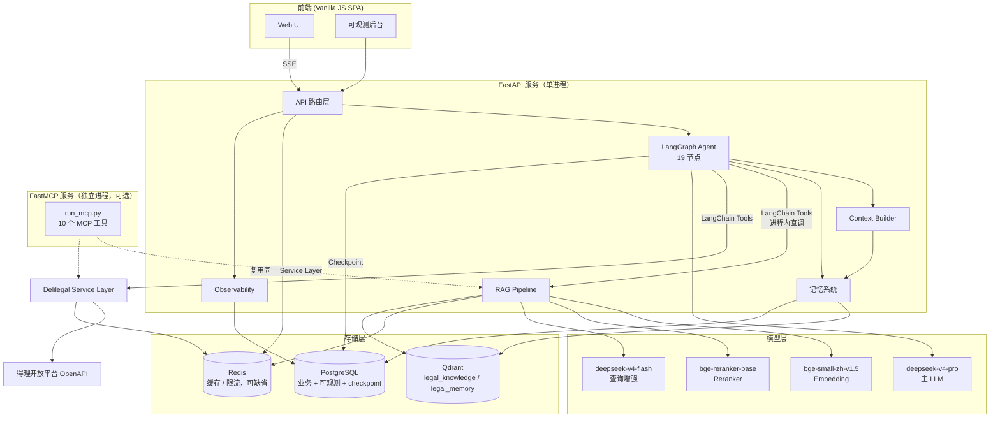
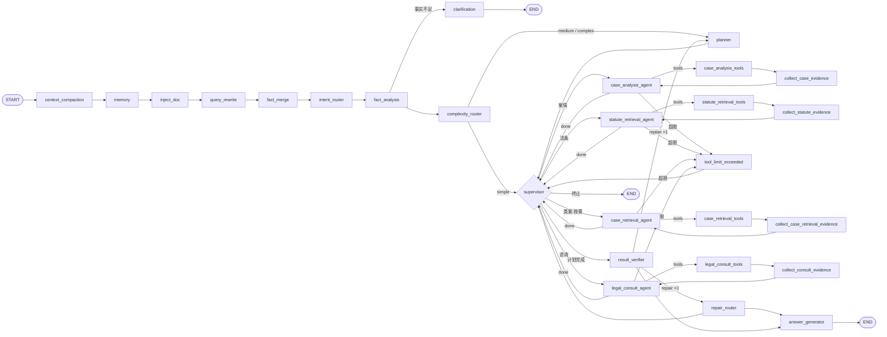
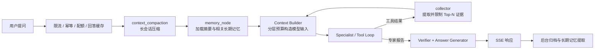

# 系统架构

## 全局架构

FastMCP 用虚线连接，因为它是与 Web 链路平行的对外暴露层：`main.py` 的 lifespan 从不拉起 MCP
进程，Web 请求也从不经过 MCP。两者共享 `services/` 下同一套实现。

## 图拓扑

## 数据流

## 子系统说明

### API 层

FastAPI 提供 RESTful 接口，核心是 `/api/chat` 端点通过 SSE（Server-Sent Events）实现流式响应。
另有文件上传、会话管理、合同审查报告、视频证据提取与可观测后台。完整清单见 [API 总览](/api/)。

### LangGraph Agent

27 个业务节点的 StateGraph，采用 Plan-and-Execute 而非单层 ReAct：

- `intent_router` 判定意图，`fact_analysis` 整理事实与缺口；个案结论所需事实不足时经
  `clarification` 中断补问，用户补充后由 `fact_merge` 合并再重新分析；
- `complexity_router` 定档：simple 直接写入两步固定计划交给 `supervisor`，跳过 Planner；
- `planner` 生成最多 `MAX_PLAN_STEPS`（6）步计划，模型不可用时兜底并标记 `planner_degraded`；
- `supervisor` 逐步分派给四个 Specialist（事实分析、法规检索、按需类案检索、法律推理）；
- 每个 Specialist 自成一个有界 ReAct 小环，单个 Agent 任务最多 `MAX_TOOL_CALLS_PER_AGENT`（2）次
  工具调用，超限走 `tool_limit_exceeded` 写入观察后回到 `supervisor`；证据到量、重复检索签名、
  上一轮零增益属于软停止，Agent 直接用已有证据出报告；一次请求累计还受
  `MAX_TOOL_CALLS_PER_REQUEST`（3）约束，跨步骤与修复轮不重置，耗尽后同样按软停止处理；
  检索结果经 Evidence Normalizer 归一化、去重并限量；
- `result_verifier` 先做 Python 确定性引用核验，再由 LLM 补充语义 issue；失败时优先
  `repair_router` 局部修复（最多一轮），落不到执行单元时才 replan（最多一次）；
- `answer_generator` 只从已核验证据生成最终回答。

Router、Planner、Verifier 与格式化步骤都是确定性节点，不额外套一层 Agent。

### FastMCP 服务

与 Web 链路平行的对外暴露层，`python run_mcp.py` 单独启动（默认 stdio，`MCP_TRANSPORT=sse`
可改为 SSE）。它自行调用 `initialize_rag()`，注册 10 个工具，实现全部薄封装 `services/`。
Agent 侧的三个工具直接调用同一批 Service，不经过 MCP Client——因此 MCP 是否运行都不影响 Web 问答。

### RAG Pipeline

三路检索策略：

- **语义检索**：HyDE 假设文档 + 原始 query + 重写 query → bge-small-zh-v1.5 embedding → Qdrant ANN
- **关键词检索**：原始 query + 重写 query → BM25 精确匹配
- **精排**：原始 query → bge-reranker-base cross-encoder

通过 RRF（Reciprocal Rank Fusion，`RRF_K=60`）融合语义和关键词结果，再经 Reranker 精排 +
分数阈值过滤。整条管线外包一层 Redis 缓存；Qdrant 或 Reranker 不可用时逐级降级而不是报错。
详见 [RAG 检索流程](/sequences/rag-flow)。

### 存储层

| 存储 | 角色 | 缺失后果 |
|------|------|----------|
| PostgreSQL | 业务、可观测、配额与 checkpoint 的权威记录 | 应用拒绝启动 |
| Qdrant | `legal_knowledge` 法条索引 + `legal_memory` 长期记忆 | 检索退化为纯 BM25，长期记忆不可用 |
| Redis | 缓存、限流、会话热层、幂等 | 全部 fail-open 降级，接口照常可用 |

### 记忆系统

记忆和持久化明确分为五层：

1. Working Memory：当前 `AgentState`；
2. Conversation Memory：`messages`，模型只读取有界近期窗口；
3. Summary Memory：长会话滚动摘要（`conversation_summaries`）；
4. Long-term Memory：用户相关、值得跨轮保存的信息，使用独立且隔离的向量存储（`legal_memory`）；
5. Persistent Workflow State：PostgreSQL checkpoint，只负责工作流恢复，不等同于长期 Memory。

每次模型调用均由 Context Builder 按 system、relevant memory、conversation summary、current plan、
retrieved evidence、current task 和 recent messages 分配 token。
详见 [Context Engineering 与 Memory](/architecture/context-engineering-memory)。
