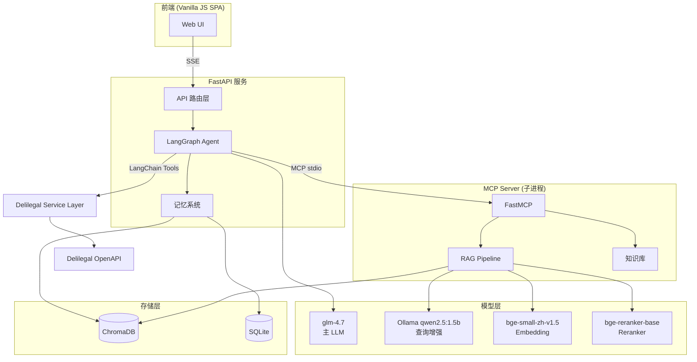
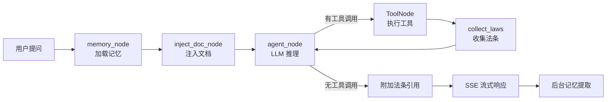

# 系统架构

## 全局架构

## 数据流

## 子系统说明

### API 层

FastAPI 提供 RESTful 接口，核心是 `/api/chat` 端点通过 SSE（Server-Sent Events）实现流式响应。支持文件上传和会话管理。

### LangGraph Agent

基于 StateGraph 构建的 ReAct 循环智能体。每轮循环：LLM 决策 → 工具调用 → 结果收集 → 再次决策。最多 6 轮迭代。

### MCP Server

独立子进程，通过 stdio 与主进程通信。拥有 RAG 检索管线和所有工具实现。这种架构将检索逻辑与 Agent 逻辑解耦，便于独立扩展和测试。

### RAG Pipeline

三路检索策略：
- **语义检索**：HyDE 假设文档 → bge-small-zh-v1.5 embedding → ChromaDB ANN
- **关键词检索**：问题重写 → BM25 精确匹配
- **精排**：原始 query → bge-reranker-base cross-encoder

通过 RRF（Reciprocal Rank Fusion）融合语义和关键词结果，再经 Reranker 精排 + 分数阈值过滤。

### 记忆系统

4 层架构实现跨会话上下文理解：
1. 滑动窗口（8 条）— 短期工作记忆
2. 增量摘要 — 历史压缩
3. 长期语义记忆 — ChromaDB 向量检索
4. 用户画像 — 实体级别的用户理解
