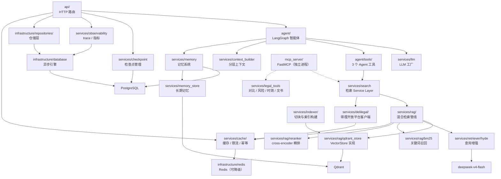

# 模块划分

## 模块依赖图

虚线表示 FastMCP 是独立进程的对外暴露层，与 Web 请求链路平行，只复用 `services/` 实现。

## 模块职责

| 模块 | 关键文件 | 职责 | 外部依赖 |
|------|----------|------|----------|
| `api/` | chat.py, upload.py, threads.py, reports.py, evidence.py, admin.py | HTTP 接口、SSE 流式、文件上传、报告与后台 | FastAPI, sse-starlette |
| `agent/` | graph.py, graph_runtime.py, state.py, nodes/, agents/ | 19 节点拓扑、Plan-and-Execute、有界 ReAct、证据收集 | LangGraph, langchain-openai |
| `agent/tools/` | rag_search.py, law_search.py, case_search.py | 3 个 Agent 工具，直接调用进程内 Service Layer | langchain-core |
| `agent/skills/` | legal-pleading-drafter, pdf-processor, video-screenshot, wage-dispute-workflow | 可复用技能包 | — |
| `mcp_server/` | server.py, startup.py | FastMCP 实例与 RAG 初始化 | mcp, FastMCP |
| `mcp_server/tools/` | search.py, compare.py, risk.py, review.py, limitations.py, jurisdiction.py, draft.py | 10 个 MCP 工具，薄封装 `services/` | — |
| `services/llm.py` | — | 多 Provider LLM 工厂 + fallback | langchain-openai |
| `services/search.py` | — | 检索 Service Layer 统一入口，返回结构化质量标记 | pydantic |
| `services/legal_tools.py` | — | 法律对比、风险、时效、文书模板实现 | — |
| `services/context_builder.py` | — | 分层预算构造模型输入 | — |
| `services/context_compaction.py` | — | 长会话压缩与 `context_status` | — |
| `services/memory.py` | — | PostgreSQL 摘要与画像 | SQLAlchemy/psycopg |
| `services/memory_extractor.py` | — | 后台异步记忆提取 | — |
| `services/memory_store.py` | — | Qdrant `legal_memory` 长期记忆 | qdrant-client |
| `services/indexer/` | builder.py, chunker.py | 法条文本分块 + 索引构建 | — |
| `services/rag/` | retriever.py, qdrant_store.py, bm25.py, fusion.py, reranker.py, interfaces.py, startup.py | 混合检索管线与 VectorStore 抽象 | sentence-transformers, rank-bm25, qdrant-client |
| `services/retriever/hyde.py` | — | HyDE 与问题重写 | langchain-openai / transformers |
| `services/delilegal/` | client.py, config.py, normalizers.py, processors.py, schemas.py | 得理开放平台客户端与响应归一 | httpx |
| `services/contract_agent/` | workflow.py, classifier.py, checklists/, scoring.py | 合同审查确定性工作流 | — |
| `services/checkpoint.py` | — | LangGraph PostgreSQL checkpoint 生命周期 + Memory fallback | langgraph-checkpoint-postgres |
| `services/doc_parser.py` | — | PDF/DOCX/TXT 文档解析 | pypdf, python-docx |
| `services/observability.py` | — | trace、事件、LLM 调用日志与 Prometheus 指标 | prometheus-client |
| `services/cache/` | retrieval.py, delilegal.py, response.py, rate_limit.py, session.py, idempotency.py | 检索/得理/回答缓存、突发限流、会话元数据、幂等标记 | redis |
| `infrastructure/` | database.py, models/, repositories/, migrations/ | 异步引擎、14 张表 ORM、仓储与 Alembic 迁移 | SQLAlchemy, asyncpg, alembic |
| `infrastructure/redis.py` | — | Redis 连接、熔断与统一降级入口 | redis |

## 设计原则

- **Service Layer 单一实现**：检索与法律工具的逻辑只写在 `services/`，Agent 工具与 FastMCP 都是薄封装。
  Web 链路不经过 MCP，所以 MCP 是否运行不影响问答可用性。
- **Protocol 抽象**：检索器和向量存储通过 Python Protocol 定义接口，便于替换实现
- **依赖注入**：HybridRetriever 通过构造函数注入各组件，不硬编码
- **确定性优先**：Router、Planner、Verifier 与格式化步骤保持确定性节点，不无故转成 Agent
- **有界执行**：计划步数、单任务工具调用次数、局部修复轮次、replan 次数、上下文 token 都有显式预算
- **缓存可降级**：Redis 只放可丢弃的热数据，所有访问经统一降级入口，挂掉时主链照常运行
- **权威记录在 PostgreSQL**：配额、trace、消息归档以关系库为准，Redis 与 checkpoint 都不是唯一副本
- **环境变量驱动**：所有可配置项通过 `.env` 管理，支持不同部署环境
