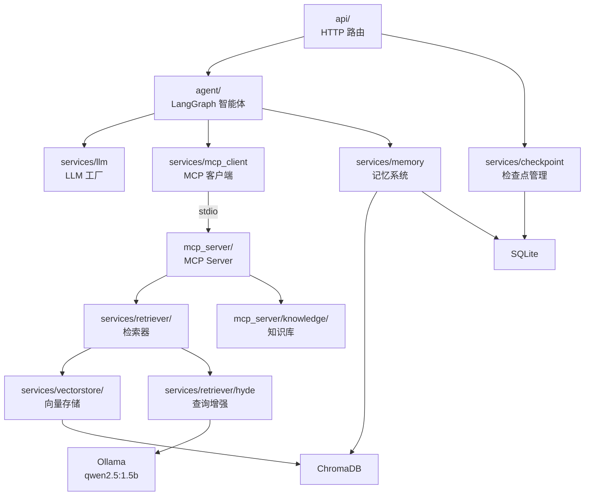

# 模块划分

## 模块依赖图

## 模块职责

| 模块 | 关键文件 | 职责 | 外部依赖 |
|------|----------|------|----------|
| `api/` | chat.py, upload.py, threads.py | HTTP 接口、SSE 流式、文件上传 | FastAPI, sse-starlette |
| `agent/` | graph.py, nodes.py, state.py | ReAct 循环、记忆注入、法条收集 | LangGraph, langchain-openai |
| `agent/tools/` | search.py, compare.py, ... | Agent 工具定义（MCP 代理） | langchain-core |
| `mcp_server/` | server.py, startup.py | MCP 工具注册、RAG 初始化 | mcp, FastMCP |
| `mcp_server/tools/` | search.py, compare.py, ... | 7 个工具的具体实现 | — |
| `mcp_server/knowledge/` | limitations_table.py, templates/ | 诉讼时效规则、文书模板 | — |
| `services/llm.py` | — | 多 Provider LLM 工厂 | langchain-openai |
| `services/mcp_client.py` | — | MCP stdio 客户端生命周期 | mcp |
| `services/memory.py` | — | SQLite 记忆表（摘要、画像、归档） | sqlite3 |
| `services/memory_extractor.py` | — | 后台异步记忆提取 | — |
| `services/memory_store.py` | — | ChromaDB 长期记忆向量存储 | chromadb |
| `services/indexer/` | builder.py, chunker.py | 法条文本分块 + 索引构建 | — |
| `services/retriever/` | hybrid.py, semantic.py, keyword.py, hyde.py, reranker.py | 混合检索管线 | sentence-transformers, rank-bm25 |
| `services/vectorstore/` | chroma_store.py, milvus_store.py | 向量存储抽象层 | chromadb, pymilvus |
| `services/checkpoint.py` | — | LangGraph MemorySaver + 线程元数据 | langgraph |
| `services/doc_parser.py` | — | PDF/DOCX/TXT 文档解析 | pypdf, python-docx |

## 设计原则

- **MCP 解耦**：所有工具通过 MCP 协议调用，Agent 不直接依赖 RAG 实现
- **Protocol 抽象**：检索器和向量存储通过 Python Protocol 定义接口，便于替换实现
- **依赖注入**：HybridRetriever 通过构造函数注入各组件，不硬编码
- **环境变量驱动**：所有可配置项通过 `.env` 管理，支持不同部署环境
