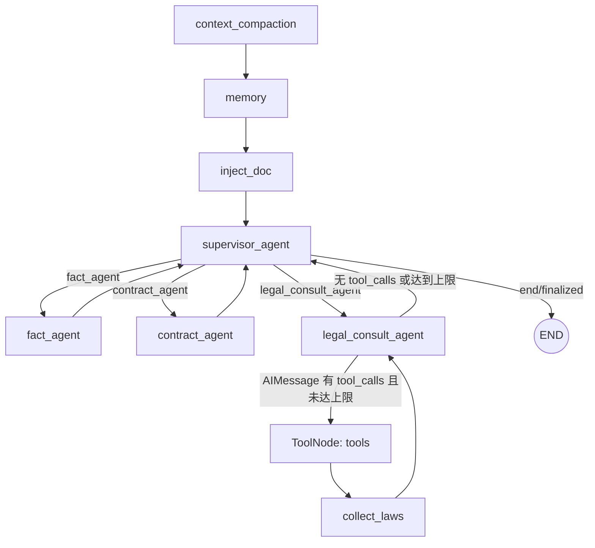

# Legal Agent 当前架构分析

::: warning 这是 2026-08-31 的重构前基线快照，不代表当前架构
本文记录的是重构启动时的状态，其中列出的缺口（无独立 Planner / Result Verifier / Answer
Generator 节点、无 Statute Retrieval 与 Case Analysis Agent、PostgreSQL / Redis / Qdrant /
得理 API 未接入、FastMCP 位于主工具链上）**此后已全部关闭**。文件按原样保留，用于回溯"改之前
长什么样"，请不要按它配置或部署。

当前架构请看 [最终架构总览](../architecture/overview.md)、[项目介绍报告](../report/project-report.md)
与 [最终能力差距分析](./final-gap-analysis.md)（2026-09-03 验收：37 项能力 34 项已实现）。
:::

> 分析日期：2026-08-31  
> 分析范围：当前工作区代码，不包含未来目标设计的假设。  
> 本阶段约束：不修改业务代码，仅记录现状并运行现有测试。

## 0. 结论摘要

当前项目已经是一个可运行的 FastAPI + LangGraph 法律助手，并已具备：SSE 聊天、会话上下文、分层记忆、LLM 路由、一个带 ReAct 工具循环的法律咨询专家、合同审查、事实追问、混合 RAG、引用约束、Trace/指标、FastMCP 工具服务和较完整的单元测试。

但它还不是目标架构中所描述的完整 Legal Agent Backend。当前没有独立的 Planner、Result/Citation Verifier Node、Answer Generator Node、Statute Retrieval Agent 或 Case Analysis Agent；Query Rewrite 只存在于 RAG 检索器内部；PostgreSQL、Redis、Qdrant 和得理法律数据库 API 尚未接入；FastMCP 当前位于主 Agent 工具调用链上，而不是仅作为扩展 Tool Server。

严格按“能基于模型反馈自主选择工具并形成循环”的技术标准，当前真正的 ReAct Agent 只有 `legal_consult_agent`。`supervisor_agent` 是一个承担 Agent 角色的 LLM 编排节点；`fact_agent` 和 `contract_agent` 是以 Agent 命名的专用工作流节点，但没有自主工具循环。

## 1. 仓库结构与启动过程

### 1.1 主要目录职责

| 路径 | 当前职责 |
| --- | --- |
| `main.py` | FastAPI 应用、lifespan、路由注册、静态页面、健康检查和 Prometheus 指标入口 |
| `agent/graph.py` | 定义并编译唯一主 LangGraph `StateGraph` |
| `agent/state.py` | 定义图状态 `AgentState` 及消息/报告合并 reducer |
| `agent/nodes.py` | 主图全部节点、Supervisor、事实/合同/法律咨询逻辑、ReAct 条件边和引用保护 |
| `agent/prompts.py` | Supervisor 最终回答/直接回答提示词、法律咨询提示词、记忆注入模板 |
| `agent/tools/` | LangChain `@tool` 包装层；所有实现都转发给 MCP Client |
| `api/` | Chat SSE、上传、线程、Admin、报告和视频证据 API |
| `services/` | LLM Gateway、RAG、记忆、checkpoint、可观测性、合同工作流、缓存、配额等业务服务 |
| `services/retriever/` | 查询增强、语义召回、BM25、RRF、Cross-Encoder rerank |
| `services/vectorstore/` | Chroma 法条向量库及未完成的 Milvus 适配骨架 |
| `services/indexer/` | 本地法律文本切块、embedding、向量索引构建 |
| `mcp_server/` | FastMCP 服务和八个工具的服务端实现 |
| `tests/` | 45 个测试文件，覆盖主图、路由、RAG、记忆、MCP、可观测性、合同和辅助能力 |

仓库中不存在 `services/rag/` 目录，RAG 实现实际分布在 `services/indexer/`、`services/retriever/`、`services/vectorstore/` 和 `mcp_server/tools/search.py`。仓库中也不存在 `services/memory/` 包，Memory 实际由 `services/memory.py`、`services/memory_store.py`、`services/memory_extractor.py`、`services/context_compaction.py` 和 OpenViking 相关模块组成。

### 1.2 FastAPI lifespan

`main.py` 的 lifespan 依次执行：

1. `init_meta_db()`：打开默认 `data/docs.sqlite`，初始化 `threads`、`docs`。
2. `init_checkpointer()`：创建 LangGraph 进程内 `MemorySaver`。
3. 初始化 observability、quota、cache 对应的 SQLite 表。
4. 初始化消息归档、摘要、用户画像 SQLite 表。
5. 初始化 Chroma `memory` collection。
6. 启动 MCP Client，并通过 stdio 拉起 `run_mcp.py` 子进程。
7. 使用 checkpointer 编译主 LangGraph，存到 `app.state.graph`。
8. 应用关闭时停止 MCP Client 和 MCP 子进程。

主进程没有直接初始化法律 RAG。法律索引和混合检索器是在 MCP 子进程导入 `run_mcp.py` 时由 `initialize_rag()` 初始化的。这一点与 `main.py` 顶部“检索系统初始化”的概括性注释不同，应以实际调用链为准。

## 2. 当前 LangGraph 完整执行流程

### 2.1 Chat API 进入图之前

`POST /api/chat` 的实际前置流程如下：

1. 校验 `message` 和 `thread_id`。
2. 以 `thread_id` 为 subject 扣减每日请求配额。
3. 在 SQLite `threads` 表创建或更新会话。
4. 创建 `trace_id`，写入 `agent_traces` 和 `chat_start` 事件。
5. 若带 `doc_id`，从 SQLite `docs` 表加载已解析文档；若带 `evidence_id`，加载视频证据摘要。
6. 若当前进程内 LangGraph checkpoint 没有该线程消息，则从 SQLite `messages_archive` 恢复历史，再追加本轮 `HumanMessage`。
7. 查询 SQLite response cache。缓存命中时直接流式输出，不执行 LangGraph。
8. 缓存未命中时，以 `stream_mode="updates"` 执行主图，并把节点、工具和上下文状态转换为 SSE 事件。

因此，响应缓存是主图前的短路分支；它不会重新执行 Memory、Supervisor、RAG 或 Verifier。

### 2.2 主图拓扑



完整节点顺序和职责：

1. `context_compaction`
   - 估算 messages、上传文档和既有记忆的 token。
   - 达到消息数或 token 比例阈值时，调用 LLM 把较早消息压缩为摘要、实体、案件画像、待追问项和法律焦点。
   - 用 `RemoveMessage` 从 LangGraph state 移除旧消息，同时把摘要和画像写入 SQLite。
2. `memory`
   - 从 SQLite 加载用户画像和滚动摘要。
   - 从 Chroma `memory` collection 做长期记忆语义检索。
   - 优先访问真实 OpenViking HTTP 服务检索 Resource/Skill；失败时回退本地确定性 `viking://` 目录和案件记忆上下文。
3. `inject_doc`
   - 把上传 Word/PDF 的已解析全文以 `[USER_DOCUMENT]` SystemMessage 注入。
   - 把视频证据摘要以 `[上传视频证据]` SystemMessage 注入。
   - 通过前缀检查避免同一 checkpoint 重复注入。
4. `supervisor_agent`
   - 初次进入时用 LLM 路由，失败后回退规则路由。
   - 专家报告返回后决定继续调度法律咨询，或调用 LLM 生成最终用户回答。
5. `fact_agent`
   - 用确定性事实完整性规则判断是否追问；需要追问时再用 LLM润色 1–3 个问题。
   - 产出结构化 `agent_reports`，随后返回 Supervisor。
6. `contract_agent`
   - 无文档时生成上传提示。
   - 有文档时执行本地确定性合同审查 workflow、生成 Markdown 报告，再用 LLM 生成简短摘要。
   - 产出结构化 `agent_reports`，随后返回 Supervisor。
7. `legal_consult_agent`
   - 注入分层记忆、OpenViking Context 和内置“相似法律场景”。
   - 根据问题复杂度做模型路由。
   - 为模型动态绑定法律咨询工具。
   - 有 `tool_calls` 时进入 ToolNode；没有工具调用时解析为法律咨询专家报告，再返回 Supervisor。
8. `tools`
   - LangGraph 预构建 `ToolNode(ALL_TOOLS)` 执行模型产生的工具调用，输出 `ToolMessage`。
9. `collect_laws`
   - 扫描 state 中全部 `ToolMessage`，从 `results`、`relevant_laws` 或法条对比结果提取法条，并按“法名 + 条号”去重。
   - 更新 `retrieved_laws` 后回到 `legal_consult_agent`。

Supervisor 最终生成的 `AIMessage` 是 Chat API 唯一认定的最终用户答案。专家节点只产出内部报告，不直接向用户输出。

### 2.3 状态与 reducer

`AgentState` 的主要字段包括：

- 对话：`messages`，使用 LangGraph `add_messages` reducer。
- 上传内容：`uploaded_doc_*`、`uploaded_evidence_*`。
- 检索：`retrieved_laws`。
- 会话与观测：`thread_id`、`trace_id`。
- Supervisor：`supervisor_route`、`supervisor_reason`、`supervisor_finalized`。
- 专家协作：`agent_reports`，使用 `merge_agent_reports` 追加；输入 `[]` 时清空上一轮报告。
- Memory/Context：`memory_profile`、`memory_longterm`、`memory_summary`、`viking_context`、`viking_context_hits`、`context_status`、`context_compacted`。
- ReAct：`tool_call_count`。

每个 Chat 请求的 state input 会显式把 `retrieved_laws`、`agent_reports`、Supervisor 状态和 `tool_call_count` 重置，避免同一 thread 的上轮任务控制状态污染本轮；历史 `messages` 仍由 checkpoint reducer 保留。

## 3. 当前有哪些真正的 Agent

这里区分“代码/产品命名”和“技术行为”。

| 组件 | 代码命名 | 实际行为 | 技术归类 |
| --- | --- | --- | --- |
| `legal_consult_agent` | Agent | LLM 观察消息和工具结果，自主选择已绑定工具，经过 ToolNode 循环，最后输出专家报告 | 当前唯一完整 ReAct Specialist Agent |
| `supervisor_agent` | Agent | LLM 路由、读取专家报告、决定下一跳、生成最终答复；无工具循环、无显式计划 | LLM 驱动的编排/回答节点，承担 Supervisor Agent 角色 |
| `fact_agent` | Agent | 规则判断事实完整性，LLM 仅生成追问措辞 | 专用工作流节点，不是 ReAct Agent |
| `contract_agent` | Agent | 本地合同 workflow + 报告持久化，LLM 仅生成摘要或缺文档提示 | 专用工作流节点，不是 ReAct Agent |

当前没有目标设计中的独立 `Statute Retrieval Agent` 和 `Case Analysis Agent`：

- 法条检索是 `legal_consult_agent` 可调用的 `legal_search_tool`。
- “类案分析”只是 `services/case_retrieval.py` 中的七条内置场景模板，通过关键词打分注入 prompt；它明确不是外部真实判例检索，也不是 Agent。

## 4. 哪些只是普通 Node

以下均为普通 LangGraph Node 或条件函数：

- `context_compaction_node`：上下文压缩。
- `memory_node`：分层记忆读取和 OpenViking Context 检索。
- `inject_doc_node`：上传内容注入。
- `collect_retrieved_laws`：工具结果解析、法条汇总。
- `ToolNode(ALL_TOOLS)`：通用工具执行节点，不是 Agent。
- `should_after_supervisor`、`should_continue`：条件边函数。
- `fact_check_node`、`agent_node`：兼容旧命名的委托函数，未注册为当前主图节点。
- `should_after_fact_check`：旧图/旧测试兼容条件，当前 `build_graph()` 未使用。

目标架构中的 Query Rewrite、Intent Router、Planner、Verifier、Answer Generator 目前没有作为五个独立普通节点存在：

- Query Rewrite 在 `HybridRetriever` 内部。
- Intent Router 和 Answer Generator 合并在 `supervisor_agent_node`。
- Planner 不存在。
- Citation 校验分散在回答生成、后处理和 observability 分析中，不是独立 Verifier Node。

## 5. 当前 Supervisor 如何路由

### 5.1 首次路由

`supervisor_agent_node` 调用 `route_user_request_with_llm()`。LLM 必须返回：

- `fact_agent`
- `contract_agent`
- `legal_consult_agent`
- `final`

LLM 路由失败、JSON 解析失败、Provider 不可用或密钥缺失时，回退到 `route_user_request()` 的规则路由：

1. 已上传文档且有合同/审查意图 → `contract_agent`。
2. 合同关键词 + 审查关键词 → `contract_agent`。
3. 法律问题且缺少多项核心事实 → `fact_agent`。
4. 法律概念、流程、期限、材料等信息查询 → `legal_consult_agent`。
5. 其他法律问题 → `legal_consult_agent`。
6. 非法律表达、寒暄、情绪/通用表达 → `final`。

`should_after_supervisor()` 将有效 route 映射到固定边；未知 route 默认回退 `legal_consult_agent`。

### 5.2 专家返回后的路由

Supervisor 看到 `agent_reports` 后不再重新做意图分类：

- 最新报告来自 `fact_agent`、状态为 `facts_sufficient`，且本轮还没有法律咨询报告 → 调度 `legal_consult_agent`。
- 其他所有专家报告 → 调用 Supervisor LLM 生成最终回答并结束。

这意味着当前 Supervisor 不是一个通用 Planner/Executor：它不能生成多步计划，也不能任意组合多个专家；唯一显式的串行专家链是 `fact_agent → legal_consult_agent`。合同 Agent 返回后直接生成最终回答，不再自动进入法律咨询检索。

## 6. 当前 ReAct Loop 在哪里实现

ReAct Loop 由 `agent/nodes.py` 和 `agent/graph.py` 共同实现，而不是通过 `create_react_agent` 构建：

1. `legal_consult_agent_node()` 为 LLM `bind_tools(...)`。
2. 模型返回带 `tool_calls` 的 `AIMessage`。
3. `should_continue()` 返回 `tools`。
4. `ToolNode` 执行调用并把 `ToolMessage` 追加到 state。
5. `collect_laws` 提取法条。
6. 图返回 `legal_consult_agent`，模型观察工具结果并决定继续调用工具或产出报告。

保护策略：

- `MAX_TOOL_CALLS` 默认 4。
- 每次模型响应最多保留一个 tool call，避免单轮并发工具风暴。
- 本轮执行过 `legal_search_tool` 后，不再向模型暴露本地法条搜索；在此之前不暴露 web search。
- 本地法库 `no_relevant_result`/`low_quality` 后由 prompt 指示模型使用联网搜索兜底。

需要注意：图中 `should_continue()` 返回的 `end` 被映射到 `supervisor_agent`，不是 LangGraph 的 `END`。达到工具调用上限时会跳过待执行的工具并回 Supervisor；若此时尚无 `agent_reports`，Supervisor 会重新做首次路由。这个控制流值得后续重构时优先收敛，以免出现无报告重路由或循环边界不清。

## 7. ToolNode 使用方式

`agent/tools/__init__.py` 注册八个 LangChain tools：

1. `legal_search_tool`
2. `law_compare_tool`
3. `risk_assess_tool`
4. `contract_review_tool`
5. `statute_of_limitations_tool`
6. `jurisdiction_tool`
7. `legal_document_draft_tool`
8. `web_search_tool`

`ToolNode` 使用全部 `ALL_TOOLS` 构建，因此能够执行任何已注册工具名；但当前 `legal_consult_agent` 动态绑定的只是 `LEGAL_CONSULT_TOOLS`：法条搜索、联网搜索、诉讼时效、管辖。

每个 Agent 侧 tool 都只有轻薄包装：

```text
LangChain @tool
  → services.mcp_client.call_tool()
  → MCP ClientSession over stdio
  → run_mcp.py 子进程
  → FastMCP 对应工具实现
```

因此 `law_compare`、`risk_assess`、`contract_review` 和文书起草虽然在 ToolNode 注册，却没有被当前法律咨询模型绑定，正常主链不会自主选择它们。它们目前主要是扩展能力/直接调用能力，而不是活跃主链能力。

## 8. 当前 RAG 完整流程

### 8.1 数据准备与索引

当前主法库来源是 `data/laws/*.txt`，不是 Word/PDF 知识库，也没有得理法律数据库 API：

1. MCP 子进程启动时 `load_or_build_index()`。
2. `chunk_all_laws()` 扫描 `.txt`：
   - 按“第 X 条/条之一”切块。
   - 保存法名、条号、编/章/节层级和 `chunk_id`。
   - 无条款结构时按分项/前言兜底。
3. 使用 `SentenceTransformer`（默认本地 `models/bge-small-zh-v1.5`）生成归一化 embedding。
4. 写入 Chroma `law_chunks` collection。
5. 同一批 LawChunk 在 MCP 进程内建立 BM25 索引。

Milvus 只有接口骨架，构造即抛 `NotImplementedError`。Qdrant 尚不存在。

### 8.2 查询与混合召回

调用链：

```text
legal_consult_agent
  → legal_search_tool
  → MCP legal_search
  → HybridRetriever.retrieve_with_scores
  → query normalize / optional rewrite / optional HyDE
  → semantic recall + BM25 recall
  → RRF fuse
  → Cross-Encoder rerank
  → MCP JSON result
  → ToolMessage
  → collect_laws
  → legal_consult_agent
```

详细步骤：

1. 条号归一化：把 `第10条` 转成中文条号形式。
2. Query Enhancement：默认启用，可生成：
   - 法律检索 query rewrite。
   - HyDE 假设法律文本。
   - 明确法条/规则门槛类问题会跳过增强，避免丢失原词。
3. Semantic 多路召回：HyDE、原 query、rewrite query 去重合并，query embedding 带 BGE 检索前缀。
4. BM25 多路召回：原 query、rewrite query、HyDE 文档去重合并；中文使用 unigram + bigram 简易分词。
5. RRF：两路按 `1 / (rrf_k + rank)` 融合，默认 `rrf_k=60`。
6. Rerank：默认 `bge-reranker-base` Cross-Encoder 对候选精排。
7. MCP 工具返回前 `retrieve_with_scores()` 不直接过滤阈值，而是返回 top score、阈值和结果，并标注 `found` 或 `low_quality`；完全无候选时返回 `no_relevant_result`。
8. Agent 根据 status/score 决定是否再使用 web search。

### 8.3 其他“检索”能力

- `services/case_retrieval.py`：内置七个场景的关键词匹配，不是真实案例库。
- OpenViking Context：用于 Resource/Skill/Memory 的领域定位和流程提示，不允许作为法条引用依据。
- 上传 Word/PDF：经 `services/doc_parser.py` 解析后整段注入 SystemMessage，不进入 chunk/embedding/BM25/RRF 流程。
- Web search：Tavily（配置环境变量时）或 DuckDuckGo 兜底，当前用户工作区已修改 `mcp_server/tools/web_search.py`，本分析未触碰该既有改动。

## 9. 当前 Memory / Checkpoint 实现

### 9.1 LangGraph checkpoint

当前实际 checkpointer 是 `langgraph.checkpoint.memory.MemorySaver`：

- 只在进程内保存 LangGraph state。
- 以 `configurable.thread_id` 区分会话。
- 应用重启后 checkpoint 丢失。
- `init_checkpointer(db_path)` 的 `db_path` 参数未使用。
- `.env.example` 的 `CHECKPOINT_DB=data/checkpoints.sqlite` 当前也未被代码读取。

模块名、注释和依赖中仍保留 SQLite checkpoint 痕迹，但运行时没有使用 `SqliteSaver`。这也是 Chat API 在内存 checkpoint 为空时需要从消息归档恢复历史的原因。

### 9.2 分层记忆

当前有四类互相补充的记忆/上下文：

1. 短期运行状态：LangGraph `MemorySaver` 中的完整 state/messages。
2. SQLite 持久记忆：
   - `messages_archive`：过滤工具调用后的用户/助手/系统消息归档。
   - `summaries`：滚动历史摘要和已覆盖消息数。
   - `user_profiles`：身份、关注领域、偏好和案件画像。
3. Chroma 长期向量记忆：
   - `memory` collection。
   - LLM 从对话提取 semantic/episodic/procedural 记忆。
   - 检索排序为 0.7 语义相似度 + 0.3 指数新鲜度。
   - `memory_node` 当前未传 `thread_id` 过滤，因此默认可跨 thread 检索长期记忆。
4. OpenViking 风格 Context：
   - 优先真实 OpenViking HTTP `find` Resource/Skill。
   - 失败时使用本地 Resource/Memory/Skill 目录匹配。
   - 每轮结束还会把对话写入 `data/viking_context/memory/cases/{thread_id}` 案件工作区。

### 9.3 写入时机

Chat SSE 完成后，FastAPI `BackgroundTasks` 获取图 snapshot，异步调用 `extract_and_save_memory()`：

1. 去重后归档新增消息。
2. 写本地 OpenViking 风格案件工作区。
3. 超过 8 条消息或估算 token 超限时调用 LLM 更新摘要。
4. 调用 LLM 提取长期记忆并写 Chroma。
5. 调用 LLM 更新用户画像。

此外，图入口的 `context_compaction_node` 会在 checkpoint 过大时主动压缩旧消息，并同步更新 SQLite 摘要/画像。

## 10. 当前 Trace / Observability 实现

当前 observability 是项目自建实现，没有接入 LangSmith、OpenTelemetry 或外部 APM。

### 10.1 SQLite Trace

`services/observability.py` 使用 `data/docs.sqlite`：

- `agent_traces`：问题、最终答案、状态、法律分析、总耗时、错误。
- `agent_events`：graph node、Supervisor route、fact check、模型路由、类案场景、工具请求/结果、法条收集、最终回答、fallback、错误等事件。
- `llm_call_logs`：Provider、模型、base URL、route、状态、耗时、fallback、token usage。
- `eval_runs`：离线评测结果和趋势。

LLM 调用统一经过 `GatewayChatModel`：逐个尝试 primary/fallback provider，记录成功/失败、延迟和 token，并更新 quota 与指标。

### 10.2 SSE 过程事件

Chat API 把图更新转换为前端事件：

- `thought`
- `context_status`
- `tool_start`
- `tool_end`
- `token`
- `error`
- `done`

工具调用阶段不会把模型的自由文本/推理内容透给前端，只输出产品化状态文案。

### 10.3 Metrics 与 Admin

- `services/metrics.py` 在进程内维护 counter/histogram，并由 `GET /metrics` 输出 Prometheus 文本。
- `/api/admin/*` 提供汇总、Trace、时间线、LLM 调用、评测趋势和 quota 查询，可通过 `ADMIN_API_KEY` 环境变量启用鉴权。
- `static/admin.html`/`admin.js`/`admin.css` 提供本地观测看板。

当前 Trace 的局限：SQLite 单连接 `check_same_thread=False`、事件和业务数据共库、指标仅进程内、没有分布式 trace/span 语义，MCP 子进程内的 RAG 分阶段耗时也没有细粒度 span。

## 11. SQLite 与 ChromaDB 分别在哪里使用

### 11.1 SQLite

默认文件为 `DOCS_DB=data/docs.sqlite`，承担：

- 线程元数据：`threads`。
- 上传文档正文：`docs`。
- 消息归档、摘要、用户画像：`messages_archive`、`summaries`、`user_profiles`。
- Trace/LLM/评测：`agent_traces`、`agent_events`、`llm_call_logs`、`eval_runs`。
- 配额：`quota_usage`。
- 回答缓存：`response_cache`。

SQLite **不承担当前 LangGraph checkpoint 持久化**。`.env.example` 的 `CHECKPOINT_DB` 是遗留配置。

### 11.2 ChromaDB

默认目录为 `CHROMA_DB_PATH=data/chroma_db`，同一 PersistentClient 下有：

- `law_chunks`：本地法条 chunk + embedding + 法名/层级/条号 metadata。
- `memory`：LLM 提取的长期语义/情节/程序记忆。

工作区还存在一个未跟踪的 `services/vectorstore/chroma.sqlite3`。由于持久化路径可被环境变量覆盖，它属于当前工作区既有运行产物；本阶段不删除、不移动、不修改。

## 12. FastMCP 当前承担什么职责

FastMCP 当前不是旁路扩展，而是法律咨询 ReAct 主链的工具执行后端：

- FastAPI 启动时由 MCP Client 拉起本地 stdio 子进程。
- MCP 子进程负责初始化法条向量索引和 BM25/HybridRetriever。
- 八个法律工具在 `mcp_server/server.py` 注册。
- Agent 侧所有 `@tool` 均经 MCP Client 转发。
- `legal_search` 还通过 semaphore 默认限制为单并发，避免本地 embedding/reranker 资源争抢。

`run_mcp.py` 也支持通过 `MCP_TRANSPORT=sse` 独立以 SSE 服务运行，但 FastAPI 主应用当前固定使用 stdio 子进程，不会连接外部 MCP SSE 服务。

后续若落实“FastMCP 仅作扩展 Tool Server”，需要把核心法律检索从 Agent → MCP 的强依赖中抽出，形成进程内/服务接口可替换的 Tool Port；否则 MCP 仍是主执行链的必经点。

## 13. 适合直接复用的代码

以下模块边界清晰、测试较好，适合在渐进式重构中保留：

1. `services/indexer/chunker.py`
   - 法条级切块、层级 metadata、非标准文本兜底可直接复用。
2. `services/retriever/keyword.py`、`hybrid.py`、`reranker.py`
   - BM25 + RRF + reranker 流水线已经形成清晰抽象，可替换 semantic/vector backend 而保留融合逻辑。
3. `services/vectorstore/base.py`
   - `LawChunk` 和 Protocol 可作为迁移 Qdrant 的接口起点。
4. `agent/tools/` 的薄适配思路
   - Tool schema 与实现解耦是正确方向，未来可把 MCP/本地/HTTP 实现隐藏在统一 port 后。
5. `services/doc_parser.py`
   - Word/PDF 解析和上传限制可复用，但后续需增加知识库 ingestion，而非只做 prompt 注入。
6. `services/contract_agent/`
   - 合同分类、分条、checklist、打分、grounding、修订和格式化已是独立确定性 workflow，不需要强行改成 ReAct Agent。
7. `services/gateway.py`、`services/llm.py`
   - Provider 抽象、fallback、token/latency 观测可迁移到新节点体系。
8. `services/legal_analysis.py`
   - 意图、事实完整性、引用核验、风险、证据清单和回答评分可拆成 Router/Verifier Node 的基础函数。
9. `services/context_compaction.py` 和 Memory 提取逻辑
   - 上下文预算、滚动摘要、画像合并和异步抽取设计可保留，底层存储替换为 PostgreSQL/Redis/Qdrant。
10. `services/observability.py` 的事件模型与 Admin API
    - 表结构本身会迁移，但 trace/event/llm-call/eval 的概念可直接沿用。
11. `api/chat.py` 的 SSE 产品协议
    - `thought/tool_start/tool_end/token/done` 前端契约可保持，内部图可逐步替换。
12. 现有测试 fixtures 和 mock 模式
    - 对渐进式迁移非常有价值，可作为行为回归保护。

## 14. 后续应该重构的代码

按风险和目标契合度排序：

### 14.1 优先重构

1. 持久化边界
   - `services/checkpoint.py` 同时放 MemorySaver 和 SQLite 业务元数据，命名误导。
   - 应拆成 graph checkpoint、conversation repository、document repository；再逐步迁移 PostgreSQL/Redis。
2. `agent/nodes.py` 过于集中
   - 单文件同时包含 Supervisor、Fact、Contract、Legal ReAct、引用校验和多个兼容函数。
   - 应按普通 nodes 与 specialist agents 拆分，但保持当前图逐步可运行。
3. Supervisor 职责过多
   - Intent Router、专家调度、报告聚合、Answer Generator 全在同一节点。
   - 应先抽普通 Router/Answer Generator Node，再引入 Planner；Supervisor 只负责执行/协调计划。
4. ReAct 上限控制
   - 达上限后跳回 Supervisor 但可能没有专家报告，控制流边界不完整。
   - 应生成明确的 exhausted/error report，再交 Verifier/Answer Generator。
5. 独立 Verifier
   - 当前引用保护散落在 `_guard_law_citations`、`validate_citations`、prompt 和 trace score。
   - 应形成普通 Result/Citation Verifier Node，校验法名、条号、内容支撑、来源、重复和最终答案一致性。

### 14.2 RAG 与数据源重构

1. 当前只索引本地 `.txt` 法律，不支持目标中的本地 Word/PDF 知识库 ingestion。
2. 得理法律数据库 API 完全未接入，需要新增环境变量配置、客户端、重试/限流、数据规范化和来源 metadata，不能硬编码 appid/secret。
3. Query Rewrite/HyDE 是同步检索器内部调用，难以 trace 和独立评测；应提升为普通图节点或明确的 retrieval pipeline stage。
4. Chroma law/memory 共用路径，未来应分别迁移 Qdrant collection 并建立 namespace/tenant/thread 权限边界。
5. 当前长期记忆默认跨 thread 检索，需要明确 user identity 与 thread scope，避免不同会话/用户数据串扰。
6. 内置“类案”不是案例数据库，应避免演进时误当成 Case Analysis Agent；真实案例源应带案号、法院、日期、裁判要旨和可核验引用。

### 14.3 基础设施与运行时重构

1. FastMCP 当前是主链强依赖，应按目标降级为可选扩展 Tool Server。
2. SQLite 业务库、cache、quota 应迁移 PostgreSQL/Redis；当前单进程内 metrics/task queue/cache 不能支撑多 worker 一致性。
3. `MilvusLawStore` 是不可运行骨架；目标是 Qdrant，应新增实现而不是继续扩展死代码。
4. API lifespan 启动 MCP 时会同步初始化本地模型和索引，启动成本高且故障耦合。
5. `requirements.txt` 使用宽松下限，当前安装环境已是 LangGraph 1.2.11、LangChain Core 1.6.1、FastAPI 0.141.1、MCP 1.29.1、ChromaDB 1.5.9；后续应锁定可复现版本并验证兼容性。
6. `.env.example` 仍包含未使用的 `CHECKPOINT_DB`，配置与运行事实需统一。

### 14.4 暂时不应 Agent 化的部分

- Router、Query Rewrite、Planner、Verifier、Answer Generator 默认保持普通 LangGraph Node。
- 合同审查内部的确定性 checklist/scoring/grounding 不应为了 Multi-Agent 被拆散。
- Memory、Context Compaction、RAG fusion、引用校验属于服务/节点，不应包装成独立 Agent。

## 15. 当前测试覆盖情况

### 15.1 测试规模

静态统计：

- 45 个 `test_*.py` 文件。
- 182 个顶层 `test_*` 测试函数。
- `pytest.ini` 配置了 `pytest-asyncio` auto mode，测试根目录为 `tests/`。
- 没有 coverage.py/pytest-cov 配置、覆盖率阈值或 CI coverage 报告，因此不能给出可靠的代码行/分支覆盖百分比。

### 15.2 已覆盖能力

- 主图和 Supervisor：路由、LLM 路由 fallback、事实/合同/法律咨询图流转、同 thread 多轮 state。
- Agent guardrails：工具清单、工具调用上限、单轮调用限制、引用保护、prompt 约束。
- RAG：切块、中文 tokenization、BM25、Hybrid/RRF/Rerank 组合、查询增强开关、MCP search score 协议。
- Memory/Context：消息过滤归档、摘要/长期记忆/画像提取、自动和手动上下文压缩、历史恢复。
- OpenViking：客户端、真实/本地 context、ingest、runtime config、A/B eval 辅助。
- LLM Gateway/Observability：fallback、调用日志、trace、eval history、metrics、quota、cache。
- 合同：核心模型、workflow、grounding、报告生成和报告 API。
- API/产品：Chat SSE 过程事件、threads history、Admin、报告、视频证据和静态前端检查。
- Tool/Skill：MCP Client 并发限制、管辖工具、PDF/视频/诉状/欠薪 workflow skill 元数据。

### 15.3 主要测试缺口

- 没有可量化覆盖率基线。
- 大量测试通过 monkeypatch/fake LLM/fake retriever 验证，真实 Provider、真实 embedding/reranker、真实 FastMCP 子进程的端到端链路覆盖有限。
- 缺少 FastAPI lifespan + SSE + MCP + Chroma + 实际 LangGraph 的完整集成测试。
- 缺少多进程/多 worker 下 SQLite、MemorySaver、进程内 cache/quota/metrics 一致性测试。
- 缺少应用重启后 checkpoint 恢复的测试；当前设计本来也不会持久恢复完整 state。
- 缺少 ReAct 达到 `MAX_TOOL_CALLS` 后无报告重路由的边界测试。
- 缺少联网搜索故障、MCP 子进程崩溃/重启、模型超时和长文档压力测试。
- 尚无 PostgreSQL、Redis、Qdrant、得理 API 测试，因为这些基础设施尚未实现。
- 真实法律答案质量仍主要依赖离线 eval 数据和规则评分，不等同于人工法律专家验收。

### 15.4 本阶段 `pytest -q` 结果

测试命令和结果：

1. 直接执行 `pytest -q`：未进入测试收集，当前 PowerShell PATH 中不存在 `pytest` 可执行命令。
2. 使用项目虚拟环境执行等价命令 `.\.venv\Scripts\python.exe -m pytest -q`：
   - `176 passed`
   - `6 skipped`
   - `3 warnings`
   - 总耗时 `5.88s`

六个 skip 都位于 `tests/test_rag.py`，原因是测试进程没有初始化检索器；这组测试要求先启动服务或显式运行 retriever init。三个 warning 也是 `tests/test_rag.py` 中的 `PytestUnknownMarkWarning`，原因是使用了 `pytest.mark.slow`，但 `pytest.ini` 没有注册 `slow` marker。

没有测试失败。本阶段未为消除 skip/warning 修改任何现有功能或测试配置。

## 16. API 概览

当前 FastAPI 暴露：

- `GET /`：聊天页面。
- `GET /admin`：管理看板。
- `GET /api/health`：健康状态和当前 LLM provider。
- `GET /metrics`：Prometheus 文本指标。
- `POST /api/chat`：SSE 法律对话。
- `POST /api/upload`：Word/PDF 等文档上传解析。
- `GET /api/threads`、history/context、compact、delete：会话管理。
- `/api/admin/*`：Trace、LLM call、eval、quota。
- `/api/reports/*`、`/api/tasks/*`：合同报告和进程内异步任务。
- `/api/evidence/*`：视频证据上传、抽帧任务、报告和文件下载。

## 17. 与总体目标的差距矩阵

| 目标能力 | 当前状态 |
| --- | --- |
| FastAPI | 已实现 |
| LangGraph | 已实现单一主图 |
| Context / Memory | 已实现 MemorySaver + SQLite + Chroma + OpenViking 风格上下文 |
| Query Rewrite | 仅在 RAG 内部实现，不是图节点 |
| Intent Router | 合并在 Supervisor，LLM + 规则 fallback |
| Planner | 未实现 |
| Supervisor / Executor | 有 Supervisor 路由/聚合，但无计划执行模型 |
| Legal Consultation Agent | 已实现，当前唯一完整 ReAct Agent |
| Statute Retrieval Agent | 未实现；当前是工具 |
| Case Analysis Agent | 未实现；当前只有内置场景匹配 |
| ReAct + Tool Calling | 已实现手工 StateGraph 循环 |
| 法律知识检索 | 本地 txt + Chroma/BM25/RRF/Reranker；无得理 API/Word-PDF KB ingestion |
| Result/Citation Verifier | 有分散校验函数，无独立 Node |
| Answer Generator | 合并在 Supervisor，无独立 Node |
| PostgreSQL | 未实现 |
| Redis | 未实现 |
| Qdrant | 未实现 |
| BM25 / RRF / Reranker | 已实现 |
| FastMCP 扩展服务 | 已实现，但当前是主链必经依赖 |
| pytest | 已有较多测试，无覆盖率门槛 |

## 18. 本阶段文件变更

新增：

- `docs/refactor/current-architecture.md`：记录当前真实架构、执行链、复用点、重构点和测试现状。

未修改任何业务代码。分析开始前已存在的工作区改动：

- `mcp_server/tools/web_search.py`：已修改。
- `services/vectorstore/chroma.sqlite3`：未跟踪运行产物。

本阶段保留上述既有状态，不对其做任何处理。
