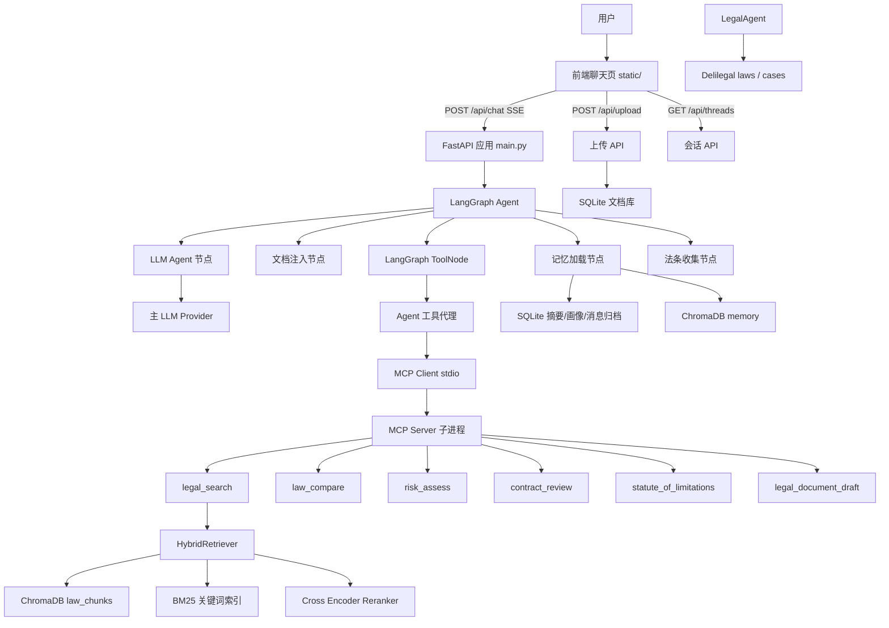
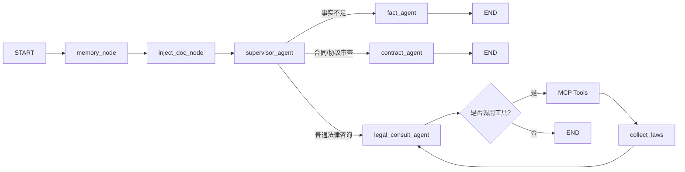
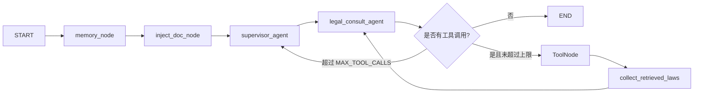
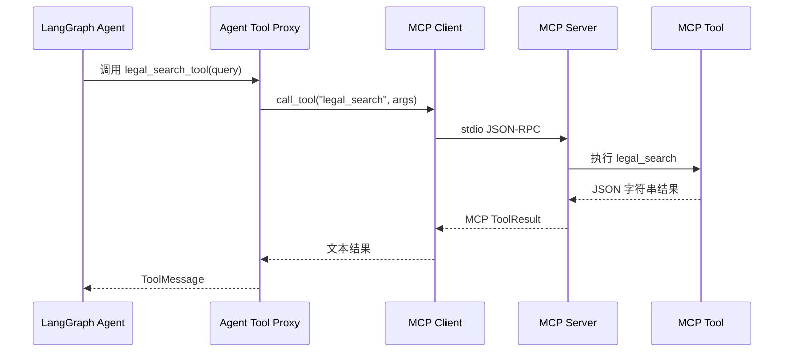
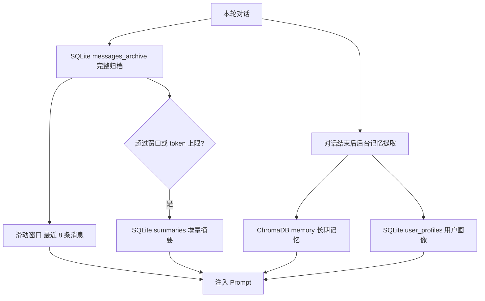
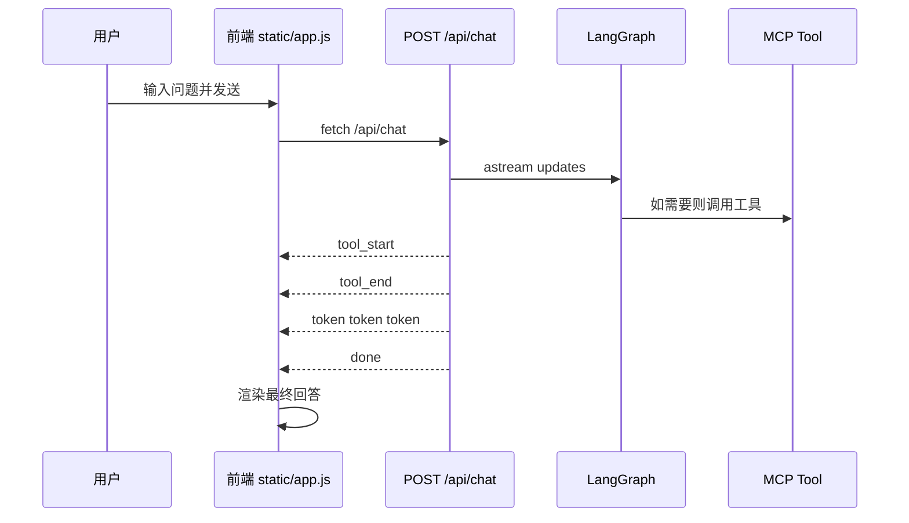

# 法智项目介绍报告

法智是一个面向普通用户的中国法律咨询智能助手。项目以 FastAPI 为服务入口，以 LangGraph 实现 Supervisor 多智能体流程，以本地 DOC RAG 和得理 OpenAPI 提供可信法律数据，并通过 LLM Gateway、Agent Trace、记忆系统、文档上传和自动评测体系逐步提升回答的稳定性与可信度。

这份报告基于当前代码仓库整理，覆盖项目定位、系统架构、模块划分、RAG 流程、MCP 工具体系、记忆系统、API、前端、评测、部署与后续优化方向。

## 一、项目定位

### 1.1 一句话概括

法智是一个“先判断事实是否足够、再检索法条、最后给出保守法律分析”的中国法律 AI 助手。

它不是单纯的大模型聊天页，而是一个由检索、工具、记忆、评测和前端流式交互共同组成的法律问答系统。

当前项目采用“中控智能体 + 业务智能体 + 确定性服务”的架构。中控智能体只负责路由，不直接解决问题；事实审查、合同审查和法律咨询分别由不同业务智能体处理；法条检索、引用校验、缓存、配额、报告生成和评测继续作为可测试服务实现。

### 1.2 目标用户

项目当前更适合以下用户场景：

| 用户类型 | 典型问题 | 系统价值 |
| --- | --- | --- |
| 普通个人用户 | 校园霸凌、租房押金、劳动纠纷、消费维权、借贷、婚姻家事 | 用通俗语言解释法律性质、风险和下一步行动 |
| 小微企业或个体经营者 | 合同审查、用工风险、欠款追讨、合作协议 | 快速定位风险点并提示需要补充的事实 |
| 法律学习者或开发者 | RAG、MCP、LangGraph、评测体系学习 | 作为完整法律 RAG Agent 工程样例 |
| 内部测试人员 | 检索准确率、回答忠实度、工具链稳定性验证 | 通过 eval 数据集持续量化系统质量 |

### 1.3 当前能力边界

当前项目可以做：

- 判断用户输入属于日常问题还是法律问题。
- 对法律问题先判断事实是否足够，不足时追问关键事实。
- 通过 Supervisor Agent 将请求路由到事实审查智能体、合同审查智能体或法律咨询智能体。
- 使用本地法律条文库进行 RAG 检索。
- 通过 MCP 调用本地法律检索及其他确定性法律工具，通过统一 Service Layer 调用得理法规与类案检索。
- 对上传文档进行解析，并把文档内容注入对话上下文。
- 对检索到的法条进行引用收集，最终回答后附简洁法条出处。
- 使用短期摘要、长期向量记忆和用户画像增强多轮对话。
- 使用评测数据集评估检索命中率、MRR、Precision、Recall。
- 通过 LLM Gateway 记录模型调用、耗时、失败原因和 fallback 情况。
- 通过 Agent Trace 追踪每次对话的节点、工具、检索、引用校验和最终回答。
- 通过后台 Dashboard 查看请求成功率、平均耗时、LLM 调用、评测历史和 trace 明细。

当前不应该承诺：

- 不应把回答视为律师正式法律意见。
- 不应在事实不足时直接下确定结论。
- 不允许使用 Web Search 或 Internet Search fallback 作为法律依据来源。
- 不应在检索不到相关法条时编造法条。

## 二、核心设计原则

### 2.1 法律回答必须可追溯

系统提示词明确要求：法律问题不得凭空引用法条，引用的法条必须来自本轮检索结果。Agent 节点还会在最终回答阶段对明确法条引用做校验，移除未被本轮检索结果支撑的法条引用。

相关代码：

- `/Users/didi/Desktop/Legal/agent/prompts.py`
- `/Users/didi/Desktop/Legal/agent/nodes.py`

### 2.2 事实不足时先追问

法律问题不是所有情况都能直接检索和回答。例如校园霸凌至少需要确认孩子年龄、行为方式、伤害后果、学校是否知情、证据情况。提示词要求事实不足时必须追问 1-3 个关键问题，不先检索、不引用法条、不强行下结论。

这是法律助手区别于普通问答机器人的关键点。系统需要先判断“缺事实”还是“缺法条”。缺事实时追问用户；缺法条时查询本地 DOC RAG 或得理 OpenAPI，可信来源仍无依据时返回证据不足。

### 2.3 工具逻辑集中在 MCP Server

Agent 侧工具只是代理函数，真正的工具实现集中在 MCP Server。这样做的好处是：

- 工具实现与 Agent 解耦。
- 以后可以让其他客户端复用同一组 MCP 工具。
- 工具能力可以独立演进，不必把全部逻辑塞进 LangGraph 节点。
- 更接近企业级 Agent 工具治理方式。

### 2.4 检索质量优先于工具数量

当前项目已经具备 7 个 MCP 工具，但法律助手的核心质量仍然取决于 RAG 检索。评测显示检索质量仍有优化空间，因此下一阶段重点应该放在检索召回、排序、数据集质量和查询理解上，而不是继续堆工具。

## 三、技术栈总览

| 层级 | 技术/组件 | 作用 |
| --- | --- | --- |
| Web 服务 | FastAPI | 提供首页、健康检查、聊天、上传、会话管理 API |
| 流式响应 | SSE / sse-starlette | 向前端流式推送 token、工具事件、错误和完成事件 |
| Agent 编排 | LangGraph | 构建 ReAct 状态机和工具循环 |
| LLM 接入 | LangChain ChatOpenAI | 通过 OpenAI-compatible 协议接入智谱、DeepSeek、通义、Ollama |
| 主模型 | glm-4.7 等 | 负责对话、工具选择、法律分析 |
| 查询增强模型 | Ollama qwen2.5:1.5b 或本地 Qwen LoRA | 负责问题重写和 HyDE 假设文档生成 |
| 工具协议 | MCP / FastMCP | 统一暴露法律工具 |
| 向量库 | ChromaDB | 存储法律条文向量和长期记忆向量 |
| Embedding | bge-small-zh-v1.5 | 法条和记忆向量化 |
| Reranker | bge-reranker-base | 对候选法条进行精排 |
| 关键词检索 | BM25 | 处理法条关键词、条号、法律概念匹配 |
| 数据库 | SQLite | 存储会话、文档、摘要、用户画像等结构化数据 |
| 可观测性 | SQLite Trace Tables | 存储 LLM 调用、Agent 事件、评测历史和 Dashboard 指标 |
| 前端 | Vanilla JS + HTML + CSS | 聊天界面、会话列表、文档上传、SSE 渲染 |
| 后台看板 | Vanilla JS + Admin API | 展示 Agent Trace、LLM Gateway、Eval History |
| 文档站 | VitePress + Mermaid | 项目文档、架构图、API 文档和报告网页 |
| 评测 | eval 脚本 + RAGAS 思路 | 检索和端到端质量评估 |

## 四、LLM Gateway 与 Agent 可观测性

项目新增了内部 LLM Gateway 和 Agent Trace 能力，使系统从“能回答问题”升级为“能解释每次回答如何产生”。

### 4.1 LLM Gateway

LLM Gateway 位于 `/Users/didi/Desktop/Legal/services/llm.py` 和 `/Users/didi/Desktop/Legal/services/gateway.py`。调用方仍然通过 `get_llm()` 获取模型，但返回对象会在 `ainvoke()` 外层记录：

- provider 和 model。
- base_url。
- 调用状态。
- 调用耗时。
- 错误信息。
- fallback 来源。
- prompt/completion/total token 字段。

Gateway 支持通过 `LLM_FALLBACK_PROVIDERS` 配置备用 provider。主模型失败后会按顺序尝试备用模型，并把失败与成功尝试都写入 `llm_call_logs` 表。

Gateway 还支持动态模型路由。系统会根据问题长度、法律风险、复杂关键词、上传文档长度和工具循环次数选择 `fast`、`strong` 或 `long` 路由：

- `fast`：低风险、短问题，适合轻量模型。
- `strong`：复杂法律分析、诉讼/仲裁/刑事/高风险问题，适合强模型。
- `long`：长合同、长文档审查，适合长上下文模型。

路由模型可通过 `LLM_ROUTE_FAST_PROVIDER`、`LLM_ROUTE_STRONG_PROVIDER`、`LLM_ROUTE_LONG_PROVIDER` 以及对应 `*_MODEL` 环境变量配置。每次路由决策都会写入 Agent Trace，LLM 调用日志也会记录 `model_route` 字段。

### 4.2 Agent Trace

每次 `/api/chat` 请求都会生成一个 `trace_id`，并写入 `agent_traces`。执行过程中会持续记录 `agent_events`：

- `chat_start`：用户问题和文档上下文。
- `graph_node`：LangGraph 节点输出。
- `agent_tool_request`：模型决定调用哪些工具。
- `tool_start` / `tool_end`：工具调用开始和结束。
- `retrieval_collect`：本轮收集到的法条。
- `citation_guard`：法条引用守门是否修改回答。
- `final_answer`：最终回答摘要。
- `chat_done`：请求完成耗时。

这让项目具备了可观测 Agent 系统的关键能力：失败可定位、工具链可复盘、检索依据可追踪。

### 4.3 后台 Dashboard

后台页面位于 `/admin`，由 `/api/admin/*` 提供数据：

- `/api/admin/summary`
- `/api/admin/traces`
- `/api/admin/traces/{trace_id}`
- `/api/admin/llm-calls`
- `/api/admin/eval-runs`

Dashboard 展示请求总数、成功率、平均耗时、LLM 调用数、失败调用数、fallback 次数、最近 trace、LLM 调用日志和评测历史。

Dashboard 第一版还加入了 trace 时间线回放、模型路由统计、每日配额使用和评测趋势展示。时间线把一次回答拆成用户提交、模型路由、节点执行、工具调用、检索收集、引用校验和最终回答等步骤，更适合排查 Agent 行为和面试演示。

项目新增 `/metrics` Prometheus 文本指标接口，记录聊天请求数、响应缓存命中/未命中、聊天延迟、LLM 调用次数和 LLM 延迟。第一版使用进程内轻量指标实现，不引入额外依赖，适合本地演示和后续迁移到 OpenTelemetry/Prometheus。

响应缓存由 `/Users/didi/Desktop/Legal/services/cache.py` 提供，默认只做精确问题缓存，避免法律问题因为语义相似但事实不同而误命中。缓存可通过 `RESPONSE_CACHE_ENABLED=false` 关闭，通过 `RESPONSE_CACHE_TTL_SECONDS` 调整过期时间。

后台 API 支持可选 `ADMIN_API_KEY` 鉴权。未配置时保持本地开发便利；配置后访问 `/api/admin/*` 需要请求头 `X-Admin-Key`，适合把项目部署到局域网或演示环境时保护 trace、调用日志和评测数据。

## 五、法律专业控制与评测闭环

项目新增 `/Users/didi/Desktop/Legal/services/legal_analysis.py`，提供一组不依赖 LLM 的确定性法律场景分析能力：

- 法律意图分类：识别劳动、租赁、债务、侵权、合同、婚姻家事等场景。
- 事实完整性检查：判断是否缺少主体、时间、金额、证据、合同约定等关键事实。
- 引用校验：检查回答中的明确法条引用是否来自本轮检索结果。
- 风险等级：根据刑事、仲裁、起诉、赔偿等关键词给出低/中/高风险标签。
- 证据清单：按场景生成合同、转账、聊天记录、报警回执、医院诊断等证据建议。
- 回答评分：检查回答是否包含事实分析、法条依据、风险提示、行动建议，以及是否过度承诺。

LangGraph 中新增了 `fact_check` 前置节点。对于“房东不退押金”“公司辞退我怎么办”这类事实明显不足的短法律问题，系统会先追问 1-3 个关键事实，而不是直接检索和下结论。这个节点让“事实不足先追问”的要求从 prompt 约束升级成了图结构约束。

项目还新增 `/Users/didi/Desktop/Legal/services/case_retrieval.py` 作为相似法律场景库。它不把结果伪装成真实裁判文书，而是提供“类似争议通常如何分析”的场景参考，例如拖欠工资、租房押金、微信借款、校园霸凌、合同违约、离婚抚养权等。Agent 会把相似场景注入系统提示词，并在 trace 中记录 `case_retrieval` 事件。

合同审查方面，项目新增 `/Users/didi/Desktop/Legal/services/contract_report.py` 和 `/api/reports/contract`。用户上传合同后，可以基于 `doc_id` 生成 Markdown 审查报告，报告包含风险条款、修改建议、补充材料清单和免责声明。报告文件保存在 `data/reports/`，可通过 `/api/reports/{report_id}` 下载。

对于长合同或后续批量任务，项目新增进程内异步任务队列 `/Users/didi/Desktop/Legal/services/task_queue.py`，并提供 `/api/reports/contract/tasks`、`/api/tasks`、`/api/tasks/{task_id}`。第一版任务状态保存在内存中，适合本地演示；如果要生产化，可替换为 SQLite 持久任务表、RQ 或 Celery。

评测脚本 `/Users/didi/Desktop/Legal/eval/run_eval.py` 保留 JSON 文件输出，同时把评测指标写入 `eval_runs` 表，便于在 Dashboard 中查看历史趋势。

## 六、系统总架构



这个架构的核心是：FastAPI 只负责 Web/API 生命周期，LangGraph 负责智能体流程，MCP Server 负责工具能力，RAG 检索器负责法条检索，ChromaDB 和 SQLite 分别承担向量数据和结构化数据存储。

## 七、目录与模块划分

当前仓库的主要目录如下：

```text
/Users/didi/Desktop/Legal
├── main.py                  # FastAPI 入口和应用生命周期
├── run_mcp.py               # MCP Server 启动入口
├── api/                     # HTTP API
├── agent/                   # LangGraph Agent、状态、节点、提示词、工具代理
├── mcp_server/              # MCP Server 和工具实现
├── services/                # LLM、RAG、记忆、向量库、文档解析等服务层
├── static/                  # 前端聊天页
├── data/laws/               # 法律文本语料
├── data/chroma_db/          # ChromaDB 持久化目录
├── models/                  # 本地 embedding、reranker、Qwen 模型
├── eval/                    # RAG 评测体系
├── docs/                    # VitePress 技术文档站
└── tests/                   # 测试代码
```

### 5.1 API 层

| 文件 | 职责 |
| --- | --- |
| `/Users/didi/Desktop/Legal/api/chat.py` | 聊天接口，负责 SSE 流式输出、调用 LangGraph、会话标题生成、后台记忆提取 |
| `/Users/didi/Desktop/Legal/api/upload.py` | 文件上传，解析 PDF/DOCX/TXT 并保存文档内容 |
| `/Users/didi/Desktop/Legal/api/threads.py` | 会话列表、历史消息读取、会话删除 |

### 5.2 Agent 层

| 文件 | 职责 |
| --- | --- |
| `/Users/didi/Desktop/Legal/agent/graph.py` | 定义 LangGraph 状态图 |
| `/Users/didi/Desktop/Legal/agent/state.py` | 定义 AgentState |
| `/Users/didi/Desktop/Legal/agent/nodes.py` | 记忆加载、文档注入、LLM 调用、法条收集、循环控制 |
| `/Users/didi/Desktop/Legal/agent/prompts.py` | 主系统提示词和记忆上下文模板 |
| `/Users/didi/Desktop/Legal/agent/tools/` | Agent 侧工具代理，异步转发到 MCP Client |

### 5.3 MCP 工具层

| 文件 | 职责 |
| --- | --- |
| `/Users/didi/Desktop/Legal/mcp_server/server.py` | 创建 FastMCP 实例并注册工具模块 |
| `/Users/didi/Desktop/Legal/mcp_server/startup.py` | MCP Server 启动时初始化 RAG |
| `/Users/didi/Desktop/Legal/mcp_server/tools/search.py` | 本地法律检索工具 |
| `services/delilegal/` | 得理法规与类案统一 Service Layer |
| `/Users/didi/Desktop/Legal/mcp_server/tools/compare.py` | 法律对比工具 |
| `/Users/didi/Desktop/Legal/mcp_server/tools/risk.py` | 法律风险评估工具 |
| `/Users/didi/Desktop/Legal/mcp_server/tools/review.py` | 合同审查工具 |
| `/Users/didi/Desktop/Legal/mcp_server/tools/limitations.py` | 诉讼时效计算工具 |
| `/Users/didi/Desktop/Legal/mcp_server/tools/draft.py` | 法律文书生成工具 |

### 5.4 服务层

| 模块 | 职责 |
| --- | --- |
| `/Users/didi/Desktop/Legal/services/llm.py` | 多 LLM Provider 抽象 |
| `/Users/didi/Desktop/Legal/services/mcp_client.py` | 通过 stdio 连接 MCP Server 子进程 |
| `/Users/didi/Desktop/Legal/services/retriever/` | 语义检索、BM25、HyDE、RRF、Reranker |
| `/Users/didi/Desktop/Legal/services/vectorstore/` | ChromaDB 法条向量存储 |
| `/Users/didi/Desktop/Legal/services/indexer/` | 法条分块、向量索引构建 |
| `/Users/didi/Desktop/Legal/services/memory.py` | SQLite 记忆结构化存储 |
| `/Users/didi/Desktop/Legal/services/memory_store.py` | ChromaDB 长期记忆向量存储 |
| `/Users/didi/Desktop/Legal/services/memory_extractor.py` | 对话结束后异步提取摘要、长期记忆、用户画像 |
| `/Users/didi/Desktop/Legal/services/doc_parser.py` | 上传文档解析 |
| `/Users/didi/Desktop/Legal/services/checkpoint.py` | LangGraph checkpoint 与元数据连接 |

## 八、Supervisor 多智能体执行流程

LangGraph 图已升级为 Supervisor 多智能体范式：



### 8.1 Supervisor Agent

`supervisor_agent` 负责选择业务 Agent。它不直接生成法律建议，而是输出路由决策：

- `fact_agent`：用户问题明显缺少关键事实，需要先追问。
- `contract_agent`：用户上传合同/协议，或明确要求审查合同。
- `legal_consult_agent`：普通法律咨询、概念解释、流程问题和事实相对充分的问题。

这样设计避免“为了多智能体而多智能体”。法条检索仍是 RAG 服务，引用校验仍是 guardrail，合同报告仍是报告服务。

当前中控智能体是真正的大模型 Agent，默认使用 `SUPERVISOR_PROVIDER=zhipu` 和 `SUPERVISOR_MODEL=GLM-4.6V`。它只输出结构化 JSON 路由结果，因此 token 消耗较低；如果模型输出异常或 API 失败，系统会退回规则路由，保证主流程可用。

### 8.2 Fact Agent

`fact_agent` 只负责事实审查和追问。它适合处理“房东不退押金怎么办”“公司辞退我合法吗”这类事实不足的问题，先追问合同、金额、时间、证据等核心事实，再进入下一轮分析。

事实审查智能体默认使用 `FACT_AGENT_MODEL=GLM-4.6V`。它只生成 1-3 个追问问题，不引用法条、不下结论，适合用轻量模型控制成本。

### 8.3 Contract Agent

`contract_agent` 负责合同/协议场景。没有文档时提示用户上传；有文档时生成合同审查报告入口，复用合同报告服务输出风险条款、修改建议和补充材料清单。

合同审查智能体默认使用 `CONTRACT_AGENT_MODEL=glm-4.7`。结构化报告仍由规则服务生成，大模型负责摘要和用户可读说明。

### 8.4 Legal Consult Agent

`legal_consult_agent` 复用原有 ReAct 能力，负责普通法律咨询。它可以调用 MCP 工具和 RAG 检索服务，最终回答仍经过引用守门、回答评分和 Trace 记录。

法律咨询智能体默认通过动态模型路由使用智谱 `glm-4.7`，因为它需要绑定工具并生成最终法律解决方案。当前推荐配置是：`LLM_ROUTE_FAST_MODEL=glm-4.7`、`LLM_ROUTE_STRONG_MODEL=glm-4.7`、`LLM_ROUTE_LONG_MODEL=glm-4.7`。如果后续要进一步省成本，可以把低风险 fast 路由换成更便宜且支持工具调用的模型。

## 九、法律咨询智能体的 ReAct 工具循环

`legal_consult_agent` 内部保留原有 ReAct 工具循环，主要流程如下：



### 9.1 状态结构

AgentState 当前包含：

| 字段 | 含义 |
| --- | --- |
| `messages` | LangChain 消息列表 |
| `uploaded_doc_text` | 上传文档内容 |
| `uploaded_doc_name` | 上传文档名称 |
| `retrieved_laws` | 本轮工具返回的法条 |
| `thread_id` | 当前会话 ID |
| `supervisor_route` | 中控智能体选择的业务 Agent |
| `supervisor_reason` | 中控智能体路由原因 |
| `memory_profile` | 用户画像 |
| `memory_longterm` | 长期记忆检索结果 |
| `memory_summary` | 历史摘要 |
| `tool_call_count` | 工具调用轮次计数 |

### 9.2 最大循环次数

`MAX_TOOL_CALLS` 默认值为 5。每个 Specialist 任务达到上限后仍可基于已有 Observation 形成报告；若继续请求工具，则记录失败原因并返回 Supervisor，避免 ReAct 循环失控。

相关代码：

- `/Users/didi/Desktop/Legal/agent/nodes.py`

### 9.3 最终回答的法条出处

当最终回答没有新的工具调用，且本轮存在工具结果时，Agent 会：

1. 从状态中的 `retrieved_laws` 读取本轮检索到的法条。
2. 用 `_guard_law_citations()` 删除未被检索结果支撑的明确法条引用。
3. 用 `_format_law_sources()` 在回答末尾追加简洁出处列表。

这让输出更可追溯，但也带来一个需要持续优化的问题：如果检索结果相关性不足，附上的法条出处也会影响用户信任。因此 RAG 评测和阈值过滤非常关键。

## 十、RAG 检索架构

当前项目的 RAG 不是简单向量检索，而是混合检索和精排流程。

```mermaid
flowchart TB
  Q["用户原始问题"] --> Normalize["条号归一化 第10条 -> 第十条"]
  Normalize --> Enhance{"HYDE_ENABLED?"}

  Enhance -->|是| Rewrite["问题重写"]
  Enhance -->|是| Hyde["HyDE 假设文档生成"]
  Enhance -->|否| Raw1["原始 Query"]

  Rewrite --> BM25Rewrite["BM25 关键词检索"]
  Normalize --> BM25Raw["原始 Query BM25 兜底"]

  Hyde --> SemanticHyde["语义向量检索"]
  Normalize --> SemanticRaw["原始 Query 语义兜底"]

  BM25Rewrite --> MergeKW["关键词结果合并去重"]
  BM25Raw --> MergeKW
  SemanticHyde --> MergeSemantic["语义结果合并去重"]
  SemanticRaw --> MergeSemantic

  MergeKW --> RRF["RRF 融合"]
  MergeSemantic --> RRF
  RRF --> Rerank["Reranker 使用原始 Query 精排"]
  Rerank --> Threshold["分数阈值过滤"]
  Threshold --> Results["返回 Top K 法条"]
```



### 7.1 法条分块

法条分块由 `/Users/didi/Desktop/Legal/services/indexer/chunker.py` 实现：

- 按“第X条”切分，每个条款是一个 LawChunk。
- 支持“第X条之一”等增补条款。
- 自动提取编、分编、章、节层级作为 metadata。
- `chunk_id` 格式为 `{law_name}_{article_no}`，例如 `民法典_第七百一十四条`。

当前 `data/laws/` 中有 52 个法律文本文件。

### 7.2 向量检索

法条向量存储由 `/Users/didi/Desktop/Legal/services/vectorstore/chroma_store.py` 实现：

- 使用 ChromaDB PersistentClient。
- collection 名称为 `law_chunks`。
- 使用 cosine 距离。
- 持久化路径默认是 `data/chroma_db`。
- metadata 包含 `law_name`、`hierarchy`、`article_no`。

### 7.3 查询增强

查询增强由 `/Users/didi/Desktop/Legal/services/retriever/hyde.py` 实现，分为两个独立能力：

| 能力 | 用途 | 输入 | 输出 | 服务对象 |
| --- | --- | --- | --- | --- |
| 问题重写 | 将口语问题改写为法律检索 query | 原始问题 | 精炼法律关键词 | BM25 |
| HyDE | 生成假设性法律文本 | 原始问题 | 假设法条/法律文档 | 语义检索 |

当前支持两种 HyDE 后端：

- OpenAI-compatible 方式，默认通过 Ollama `qwen2.5:1.5b`。
- HuggingFace + LoRA 方式，使用本地 Qwen2.5 模型和 HyDE LoRA 适配器。

### 7.4 RRF 融合

语义检索和关键词检索的候选结果通过 RRF 融合。RRF 不直接相信某一路检索的分数，而是根据排名位置进行融合，适合把不同分数体系的结果合在一起。

配置项：

| 环境变量 | 默认值 | 作用 |
| --- | --- | --- |
| `RRF_K` | `60` | RRF 排名平滑参数 |
| `RETRIEVER_TOP_K` | `20` | 粗排候选数量 |
| `RERANKER_SCORE_THRESHOLD` | `0.3` | 精排后过滤阈值 |

### 7.5 Reranker 精排

Reranker 使用原始用户问题作为判断依据，对 RRF 候选重新排序。这一点很重要：重写 query 和 HyDE 是为了提高召回，但最终相关性仍然回到用户原始问题。

### 7.6 无结果处理

`legal_search` 如果没有命中相关法条，会返回：

```json
{
  "status": "no_relevant_result",
  "query": "...",
  "results": [],
  "hint": "本地法库未命中..."
}
```

Agent 应根据问题类型决定：

1. 如果是事实不足，追问用户。
2. 如果事实足够但本地库未覆盖，调用得理法规或类案检索工具。
3. 如果可信数据源仍无明确结果，返回 `evidence_insufficient=true`，不要编造。

## 十一、MCP 工具体系

当前 MCP Server 使用 FastMCP 创建，主进程通过 stdio 连接 MCP Server 子进程。



### 8.1 MCP 工具列表

| 工具名 | 作用 | 当前定位 |
| --- | --- | --- |
| `legal_search` | 本地法律条文检索 | RAG 核心工具 |
| `law_compare` | 两部法律或条款对比 | 辅助分析 |
| `risk_assess` | 法律风险评估 | 面向用户场景的风险总结 |
| `contract_review` | 合同审查 | 上传文档或合同场景 |
| `statute_of_limitations` | 诉讼时效计算 | 时效类问题 |
| `legal_document_draft` | 法律文书生成 | 起草类能力 |
| `search_law_tool` / `search_case_tool` | 得理法规与类案检索 | 通过统一 Service Layer 调用 |

### 8.2 为什么不是普通函数

普通函数只能在当前代码进程里被调用；MCP 工具是通过协议暴露出来的能力。对 Agent 来说，工具有名称、参数 schema、描述、调用协议和返回结果。这样模型可以基于工具描述选择是否调用，工程上也可以把工具服务独立出来。

本项目的 Agent 工具代理位于 `/Users/didi/Desktop/Legal/agent/tools/`，它们不直接实现业务逻辑，而是调用 `/Users/didi/Desktop/Legal/services/mcp_client.py` 转发到 MCP Server。

## 十二、记忆系统

项目实现了四层记忆结构，不只是简单保留聊天历史。



### 9.1 短期记忆

短期记忆由最近消息滑动窗口构成：

- `SLIDING_WINDOW_SIZE = 8`
- `MAX_WINDOW_TOKENS = 3000`
- 中文 token 估算使用 `CHARS_PER_TOKEN = 1.5`

当历史超过窗口或 token 上限时，系统会对溢出部分生成增量摘要。

### 9.2 长期记忆

长期记忆由 `/Users/didi/Desktop/Legal/services/memory_store.py` 实现：

- 使用 ChromaDB 的 `memory` collection。
- 与法条库共用 ChromaDB 持久化目录，但使用独立 collection。
- 记忆类型包括 `semantic`、`episodic`、`procedural`。
- 存储粒度是“一次完整交互”或“一个独立知识点”。

### 9.3 新鲜度权重

长期记忆检索时会结合语义相似度和时间新鲜度：

| 参数 | 当前值 | 含义 |
| --- | --- | --- |
| `SEMANTIC_WEIGHT` | `0.7` | 语义相似度权重 |
| `FRESHNESS_WEIGHT` | `0.3` | 新鲜度权重 |
| `DECAY_RATE` | `0.05` | 时间衰减系数 |

最终得分约等于：

```text
final_score = 0.7 * semantic_score + 0.3 * freshness_score
```

### 9.4 后台提取

记忆提取在聊天流结束后通过 FastAPI `BackgroundTasks` 异步执行，不阻塞用户当前回答。

提取内容包括：

1. 完整消息归档。
2. 历史摘要更新。
3. 长期记忆提取并写入 ChromaDB。
4. 用户画像提取并写入 SQLite。

## 十三、提示词与输出治理

主提示词位于 `/Users/didi/Desktop/Legal/agent/prompts.py`。

当前提示词的核心约束是：

- 先判断日常问题还是法律问题。
- 日常问题直接简短回答。
- 法律问题先判断关键事实是否足够。
- 事实不足时追问 1-3 个关键问题。
- 法律问题不得凭空引用法条。
- 检索结果无关时不得引用。
- 不展示内部推理过程。
- 对刑事、重大财产、婚姻财产、公司股权等事项提醒咨询执业律师。

### 10.1 当前输出治理链路


### 10.2 当前需要注意的问题

前端和 API 仍保留 `thought` 事件渲染逻辑，用于显示模型工具调用前的中间内容。用户体验上，如果希望“不要显示思维链/中间思考”，后续应把这类事件改成更克制的状态提示，例如“正在判断是否需要检索”“正在检索相关法条”，而不是展示模型自然语言中间内容。

相关代码：

- `/Users/didi/Desktop/Legal/api/chat.py`
- `/Users/didi/Desktop/Legal/static/app.js`

## 十四、API 文档概览

### 11.1 `GET /`

返回前端聊天页 `/static/index.html`。

### 11.2 `GET /api/health`

返回服务健康状态和当前 LLM Provider。

示例：

```json
{
  "status": "ok",
  "provider": "zhipu"
}
```

### 11.3 `POST /api/chat`

聊天接口，使用 SSE 流式返回。

请求体：

```json
{
  "thread_id": "会话 ID",
  "message": "用户问题",
  "doc_id": "可选上传文档 ID"
}
```

主要 SSE 事件：

| 事件 | 含义 |
| --- | --- |
| `tool_start` | 工具调用开始 |
| `tool_end` | 工具调用结束 |
| `thought` | 当前代码中的中间内容事件 |
| `token` | 最终回答 token 片段 |
| `error` | 错误 |
| `done` | 流结束 |

### 11.4 `POST /api/upload`

上传 PDF、DOCX 或 TXT 文件，解析后保存文档内容。后续聊天可以通过 `doc_id` 将文档内容注入上下文。

返回字段包括：

- `doc_id`
- `filename`
- `char_count`
- `truncated`

### 11.5 会话接口

| 接口 | 作用 |
| --- | --- |
| `GET /api/threads` | 获取会话列表 |
| `GET /api/threads/{thread_id}/history` | 获取会话历史 |
| `DELETE /api/threads/{thread_id}` | 删除会话 |

## 十五、前端交互

前端位于 `/Users/didi/Desktop/Legal/static/`，当前是一个轻量级 Vanilla JS 单页应用。

### 12.1 页面结构

| 区域 | 功能 |
| --- | --- |
| 侧边栏 | 新建对话、会话列表、删除会话、显示 LLM Provider |
| 顶部栏 | 标题、上传文档状态 |
| 消息区 | 用户消息、助手消息、工具卡片、错误提示 |
| 输入区 | 文档上传、文本输入、发送按钮 |

### 12.2 SSE 渲染流程



### 12.3 当前前端优点

- 无复杂构建链，FastAPI 可直接托管。
- 支持流式输出，用户不用等待完整回答。
- 支持上传文档并显示文档 chip。
- 支持多会话管理。

### 12.4 当前前端改进点

- 去掉或改造 `thought` 事件展示，避免 AI 味过重。
- 工具卡片可以更克制，只显示“检索中/已检索到法条”，不要把大段原文直接打断回答。
- 移动端布局需要加强。
- 法条出处可以做成可折叠引用区，减少回答末尾压迫感。

## 十六、评测体系

项目已经建立 `eval/` 目录，用于评估 RAG 质量。

```text
eval/
├── dataset.json
├── generate_prompt.md
├── metrics.py
├── run_eval.py
└── results/
```

### 13.1 数据集格式

每条评测数据包括：

```json
{
  "question": "用户法律问题",
  "ground_truth": "标准答案",
  "ground_truth_contexts": ["民法典_第七百一十四条"],
  "acceptable_contexts": ["民法典_第七百一十四条"],
  "corpus_status": "in_corpus"
}
```

### 13.2 检索指标

`/Users/didi/Desktop/Legal/eval/metrics.py` 当前实现了：

| 指标 | 含义 |
| --- | --- |
| Hit Rate | Top K 里是否至少命中一条可接受法条 |
| MRR | 第一条命中法条的排名倒数 |
| Precision | 返回结果里相关法条比例 |
| Recall | 标准法条中被召回的比例 |

### 13.3 最新读取到的检索结果

当前报告读取到 `/Users/didi/Desktop/Legal/eval/results/eval_retrieval_20260603_192734.json`：

| 指标 | 数值 |
| --- | --- |
| `num_queries` | `100` |
| `hit_rate` | `0.59` |
| `mrr` | `0.4428` |
| `precision` | `0.1408` |
| `recall` | `0.5717` |

这说明系统已经比早期结果有所提升，但对法律助手而言仍需继续优化。尤其是 precision 较低，代表返回的 Top K 中有不少不相关法条；hit_rate 也还没有达到可以放心使用的水平。

### 13.4 下一阶段评测建议

建议把评测分为三层：

1. 检索评测：只评估 chunk_id 是否命中。
2. 引用评测：评估最终回答引用的法条是否来自检索结果，并且是否与答案主张相关。
3. 端到端评测：评估回答正确性、忠实度、可读性和是否追问。

对法律助手来说，仅命中法条还不够，还要确保回答没有过度推断、没有引用无关法条、事实不足时会追问。

## 十七、部署与运行

### 14.1 本地启动依赖

本地运行通常需要：

- Python 虚拟环境。
- FastAPI 相关依赖。
- ChromaDB。
- sentence-transformers。
- 本地 embedding/reranker 模型。
- Ollama，用于 HyDE 和问题重写。
- 主 LLM Provider 的 API Key，例如智谱或其他 OpenAI-compatible 服务。

### 14.2 关键环境变量

| 环境变量 | 作用 |
| --- | --- |
| `LLM_PROVIDER` | 主模型供应商，如 `zhipu`、`deepseek`、`qwen`、`ollama` |
| `ZHIPU_API_KEY` | 智谱 API Key |
| `LLM_MODEL` | 主模型名称 |
| `LLM_BASE_URL_OVERRIDE` | 自定义 OpenAI-compatible base_url |
| `HYDE_ENABLED` | 是否启用查询增强 |
| `HYDE_MODEL` | HyDE/重写模型 |
| `HYDE_LLM_BASE_URL` | Ollama OpenAI-compatible 地址 |
| `HYDE_BACKEND` | HyDE 后端，可选 openai 或 hf_lora |
| `RETRIEVER_TOP_K` | 检索粗排候选数量 |
| `RERANKER_SCORE_THRESHOLD` | 精排阈值 |
| `RRF_K` | RRF 参数 |
| `MAX_TOOL_CALLS` | ReAct 最大工具循环次数 |
| `DELILEGAL_APP_ID` / `DELILEGAL_SECRET` | 得理 OpenAPI 凭据 |
| `DELILEGAL_LAW_SEARCH_PATH` | 法规检索路径，默认 `/api/qa/v3/search/queryListLaw` |
| `DELILEGAL_CASE_SEARCH_PATH` | 类案检索路径 |

### 14.3 启动流程

FastAPI 启动时，`main.py` 的 lifespan 会执行：

1. 加载 `.env`。
2. 初始化元数据库。
3. 初始化 LangGraph checkpointer。
4. 初始化记忆数据表。
5. 初始化长期记忆向量库。
6. 启动 MCP Client。
7. MCP Client 通过 stdio 启动 MCP Server 子进程。
8. MCP Server 初始化 RAG。
9. 构建 LangGraph。

### 14.4 免费部署现实判断

这个项目不适合直接部署到大多数免费 Serverless 平台，原因是：

- 本地模型和向量库占用磁盘与内存。
- ChromaDB 需要持久化目录。
- Reranker 和 embedding 模型加载较重。
- MCP Server 是子进程，部分 Serverless 平台不适合长期运行。
- SSE 流式响应需要稳定连接。

如果要低成本上线，比较现实的路径是：

1. 前端和文档站部署到 GitHub Pages 或 Vercel 免费层。
2. 后端部署到有免费额度或低成本的云服务器。
3. 法条向量库先保留 ChromaDB 本地持久化，后续再迁移到 Milvus、Qdrant 或云向量数据库。
4. 主 LLM 使用云 API，本地 Ollama 只适合开发环境。

## 十八、当前优势

### 15.1 架构不是玩具级

项目已经具备较完整的 Agent 工程结构：

- Web/API 层、Agent 层、MCP 工具层、RAG 服务层分开。
- 工具通过 MCP 集中管理。
- 检索不是单一路径，而是混合检索加 rerank。
- 记忆系统有结构化存储和向量存储。
- 有自动评测体系。
- 有技术文档站。

### 15.2 法律场景意识明确

提示词已经引入法律场景的基本判断：

- 事实不足要追问。
- 法条不能编造。
- 风险判断要保守。
- 重大事项提醒咨询律师。
- 检索无关时不能凑法条。

这比“直接让大模型回答法律问题”安全得多。

### 15.3 可演进空间清晰

项目现在的问题不是方向不清，而是每一层都可以继续打磨：

- RAG 数据质量。
- 检索召回和精排。
- 输出格式。
- 前端工具状态展示。
- 评测闭环。
- 线上部署方案。

## 十九、当前风险与问题

### 16.1 检索质量仍需提升

最新读取到的检索结果 hit_rate 为 0.59，precision 为 0.1408。对法律助手来说，这意味着用户看到的法条出处仍可能包含噪声。下一阶段应优先优化检索，而不是继续增加工具。

建议重点优化：

- 法条 chunk metadata。
- 问题重写 prompt。
- HyDE 生成质量。
- BM25 分词和法律同义词词表。
- Reranker 阈值和候选数量。
- 数据集标准答案和 acceptable_contexts 的覆盖。

### 16.2 输出风格还需要产品化

当前前端仍有 `thought` 事件展示，工具卡片也可能打断用户阅读。用户希望减少 AI 味，因此后续建议统一输出格式：

- 事实不足：简短说明 + 1-3 个追问。
- 事实足够：结论 + 分析 + 建议 + 引用法条。
- 无明确法条：明确说明未检索到，不凑法条。
- 紧急风险：先给安全提醒，再追问。

### 16.3 法条引用要继续收敛

当前系统会追加检索到的法条出处，但如果工具返回过多弱相关法条，末尾引用会显得不准确。后续可以改为：

- 只展示 reranker 分数最高且被回答实际使用的 3-5 条。
- 区分“核心依据”和“相关参考”。
- 对引用法条做二次相关性判断。
- 评测最终回答引用是否和主张一致。

### 16.4 可信数据源边界

运行时法律依据严格来自本地 DOC RAG 与得理 OpenAPI。两者都没有提供充分证据时，系统明确报告证据不足，不使用外部搜索兜底。

## 二十、路线图建议

### 第一阶段：修输出体验

目标：让用户感觉像在咨询一个克制、清楚的法律助手。

建议事项：

- 移除前端思考过程展示。
- 改为状态型工具提示。
- 统一回答格式。
- 事实不足时强制追问。
- 法条出处只显示简洁列表。

### 第二阶段：修 RAG 质量

目标：把检索结果提升到更可用的水平。

建议事项：

- 分析 eval 失败样本。
- 给法律文本增加主题、案由、关键词 metadata。
- 改进中文法律分词。
- 建立同义词和场景词映射。
- 调参 top_k、RRF_K、reranker threshold。
- 对 HyDE 和问题重写做专门评测。

### 第三阶段：建立端到端评测

目标：从“检索命中”升级到“回答可信”。

建议事项：

- 增加回答忠实度评测。
- 增加是否追问评测。
- 增加引用正确性评测。
- 对高风险法律场景单独建测试集。

### 第四阶段：准备上线

目标：从本地实验系统变成可运行服务。

建议事项：

- API Key 和密钥管理。
- 后端部署环境固定化。
- 日志、错误追踪、健康检查。
- 数据库和向量库备份。
- 用户输入和模型输出安全审计。
- 加入免责声明和人工律师提示。

## 二十一、结论

法智当前已经具备一个法律 RAG Agent 项目的完整骨架：FastAPI 提供 Web 服务，LangGraph 管理 ReAct 流程，MCP 管理工具，ChromaDB 存储法条和记忆，混合检索提升召回，评测系统量化质量，VitePress 承载技术文档。

它现在最重要的工作不是继续堆功能，而是把“检索准确、事实追问、引用克制、输出自然、评测闭环”打磨扎实。只要这几项继续推进，项目会从一个可运行 demo 逐步变成一个更接近生产级的法律智能助手。
