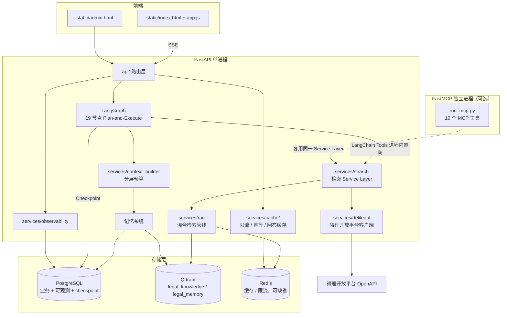
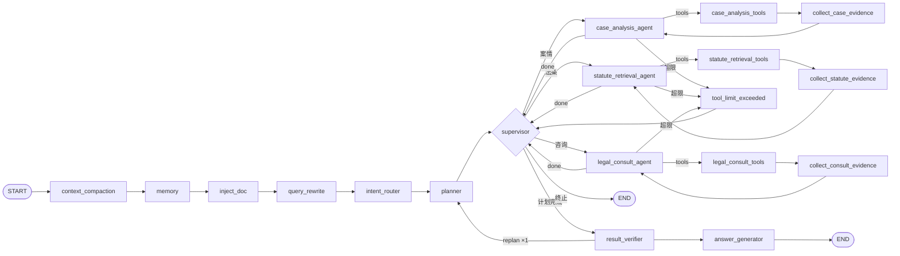
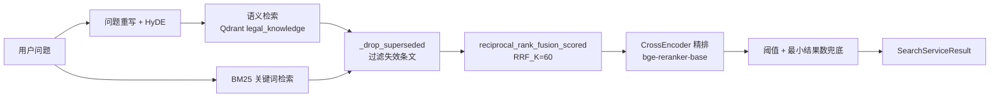
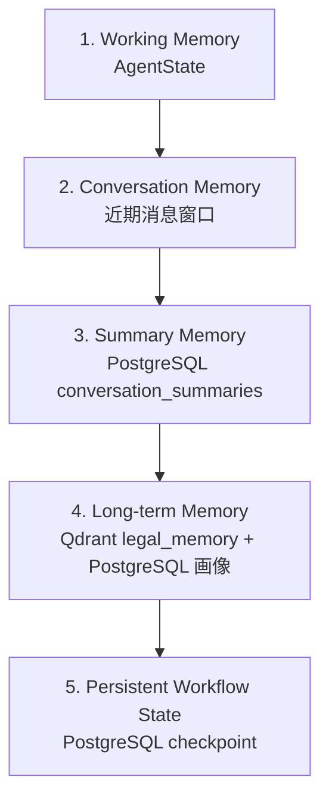
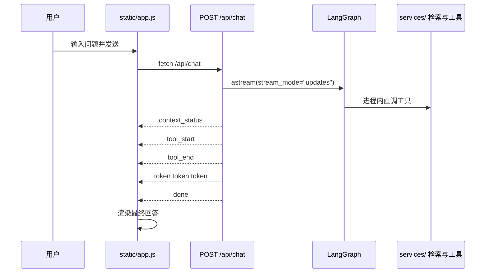

# 法智项目介绍报告

法智是一个面向普通用户的中国法律咨询智能助手。项目以 FastAPI 为服务入口，以 LangGraph 实现 Plan-and-Execute 多智能体流程，以本地法条 RAG 和得理开放平台 OpenAPI 提供可信法律数据，并通过 LLM Gateway、Agent Trace、五层记忆系统、文档上传和自动评测体系逐步提升回答的稳定性与可信度。

这份报告基于当前代码仓库整理（分支 `codex/refactor-legal-data-sources`，整理日期 2026-09-03），覆盖项目定位、系统架构、模块划分、执行流程、RAG 流程、工具体系、记忆系统、可观测性、API、前端、评测、部署与后续优化方向。文中出现的常量、默认值与文件路径均以当前代码为准。

## 一、项目定位

### 1.1 一句话概括

法智是一个"先判断事实是否足够、再检索法条、最后给出保守法律分析"的中国法律 AI 助手。

它不是单纯的大模型聊天页，而是一个由检索、工具、记忆、评测和前端流式交互共同组成的法律问答系统。

当前项目采用"确定性编排 + 业务智能体 + 可测试服务"的架构。Intent Router 与 Planner 负责意图判定和计划生成，Supervisor 只负责逐步分派而不直接解决问题；案件分析、法规检索和法律咨询分别由不同 Specialist 处理；法条检索、引用校验、缓存、配额、报告生成和评测继续作为可测试服务实现。

### 1.2 目标用户

项目当前更适合以下用户场景：

| 用户类型 | 典型问题 | 系统价值 |
| --- | --- | --- |
| 普通个人用户 | 校园霸凌、租房押金、劳动纠纷、消费维权、借贷、婚姻家事 | 用通俗语言解释法律性质、风险和下一步行动 |
| 小微企业或个体经营者 | 合同审查、用工风险、欠款追讨、合作协议 | 快速定位风险点并提示需要补充的事实 |
| 法律学习者或开发者 | RAG、LangGraph、MCP、评测体系学习 | 作为完整法律 RAG Agent 工程样例 |
| 内部测试人员 | 检索准确率、回答忠实度、工具链稳定性验证 | 通过 eval 数据集持续量化系统质量 |

### 1.3 当前能力边界

当前项目可以做：

- 判断用户输入属于日常问题还是法律问题。
- 对法律问题先判断事实是否足够，不足时追问关键事实。
- 通过 Planner 生成结构化计划，由 Supervisor 逐步分派到案件分析、法规检索或法律咨询智能体。
- 使用本地法律条文库进行混合 RAG 检索（语义 + BM25 + RRF + Reranker）。
- 通过进程内 Service Layer 调用本地检索、得理法规检索与得理类案检索。
- 对上传文档进行解析，并把文档内容注入对话上下文。
- 对检索到的法条进行引用收集，由 Result Verifier 校验后附简洁法条出处。
- 使用近期消息窗口、滚动摘要、长期向量记忆和用户画像增强多轮对话。
- 使用评测数据集评估检索命中率、MRR、Precision、Recall。
- 通过 LLM Gateway 记录模型调用、耗时、失败原因和 fallback 情况。
- 通过 Agent Trace 追踪每次对话的节点、工具、检索、引用校验和最终回答。
- 通过后台 Dashboard 查看请求成功率、平均耗时、LLM 调用、配额、评测历史和 trace 时间线。

当前不应该承诺：

- 不应把回答视为律师正式法律意见。
- 不应在事实不足时直接下确定结论。
- 不允许使用 Web Search 或 Internet Search fallback 作为法律依据来源。
- 不应在检索不到相关法条时编造法条。

## 二、核心设计原则

### 2.1 法律回答必须可追溯

系统提示词明确要求：法律问题不得凭空引用法条，引用的法条必须来自本轮检索结果。`result_verifier` 节点还会在生成最终回答之前校验证据与引用，移除未被本轮检索结果支撑的法条引用，必要时触发一次重新规划。

相关代码：

- `agent/prompts.py`
- `agent/nodes/verifier.py`
- `agent/nodes/answer.py`
- `services/legal_analysis.py`

### 2.2 事实不足时先追问

法律问题不是所有情况都能直接检索和回答。例如校园霸凌至少需要确认孩子年龄、行为方式、伤害后果、学校是否知情、证据情况。提示词要求事实不足时必须追问 1-3 个关键问题，不先检索、不引用法条、不强行下结论。

这是法律助手区别于普通问答机器人的关键点。系统需要先判断"缺事实"还是"缺法条"。缺事实时追问用户；缺法条时查询本地法条 RAG 或得理 OpenAPI，可信来源仍无依据时返回证据不足。`services/legal_analysis.py` 提供不依赖 LLM 的事实完整性检查，`AgentState` 中的 `needs_follow_up` 与 `evidence_insufficient` 把这个判断显式化。

### 2.3 工具实现集中在 Service Layer

检索与法律工具的真实实现只写在 `services/`，`agent/tools/` 与 `mcp_server/tools/` 都是薄封装。这样做的好处是：

- 工具实现与调用协议解耦，同一份逻辑同时服务 Web 链路和外部 MCP 客户端。
- Web 请求链路进程内直调，不经过 MCP Client，因此 MCP 进程是否运行都不影响问答可用性。
- 工具能力可以独立演进，不必把全部逻辑塞进 LangGraph 节点。
- 服务函数返回结构化结果（`SearchServiceResult`），带 `status` 与 `evidence_insufficient` 标记，便于测试和上层决策。

需要强调一个容易误读的历史细节：早期版本确实由主进程通过 stdio 拉起 MCP Server 子进程，Agent 工具只是转发代理。当前代码已不再如此——`main.py` 的 lifespan 从不启动 MCP 进程，仓库里也不存在 `services/mcp_client.py`。FastMCP 现在是与 Web 链路平行的对外暴露层。

### 2.4 检索质量优先于工具数量

当前项目对外暴露 10 个 MCP 工具，Agent 侧只用 3 个工具，但法律助手的核心质量仍然取决于 RAG 检索。评测显示检索质量仍有优化空间，因此下一阶段重点应该放在检索召回、排序、数据集质量和查询理解上，而不是继续堆工具。

## 三、技术栈总览

| 层级 | 技术/组件 | 作用 |
| --- | --- | --- |
| Web 服务 | FastAPI | 提供首页、健康检查、聊天、上传、会话管理、报告、证据与后台 API |
| 流式响应 | SSE / sse-starlette | 向前端流式推送 token、工具事件、上下文状态、错误和完成事件 |
| Agent 编排 | LangGraph | StateGraph + Plan-and-Execute + 有界 ReAct 工具循环 |
| LLM 接入 | LangChain ChatOpenAI | 通过 OpenAI-compatible 协议接入 DeepSeek、智谱、通义、Ollama |
| 主模型 | `deepseek-v4-pro`（默认 provider `deepseek`） | 负责对话、工具选择、法律分析 |
| 查询增强模型 | `deepseek-v4-flash`（`HYDE_BACKEND=openai`，可切 `hf_lora` 本地 Qwen + LoRA） | 负责问题重写和 HyDE 假设文档生成 |
| 工具协议 | MCP / FastMCP | 面向外部客户端统一暴露法律工具（独立进程，不在 Web 链路上） |
| 向量库 | Qdrant | `legal_knowledge` 存法条向量，`legal_memory` 存长期记忆向量 |
| Embedding | bge-small-zh-v1.5 | 法条和记忆向量化 |
| Reranker | bge-reranker-base | 对候选法条进行 cross-encoder 精排 |
| 关键词检索 | BM25 | 处理法条关键词、条号、法律概念匹配 |
| 关系数据库 | PostgreSQL 17+ | 会话、文档、摘要、用户画像、配额、可观测与 LangGraph checkpoint，硬依赖 |
| 缓存 / 限流 | Redis | 检索缓存、得理缓存、回答缓存、限流、会话热层、幂等标记，可缺省降级 |
| 可观测性 | PostgreSQL Trace 表 + Prometheus `/metrics` | 存储 LLM 调用、Agent 事件、评测历史与 Dashboard 指标 |
| 前端 | Vanilla JS + HTML + CSS | 聊天界面、会话列表、文档上传、SSE 渲染 |
| 后台看板 | Vanilla JS + Admin API | 展示 Agent Trace、LLM Gateway、配额、Eval History |
| 文档站 | VitePress + Mermaid | 项目文档、架构图、API 文档和报告网页 |
| 评测 | `eval/` 脚本 + RAGAS 思路 | 检索、上下文与端到端质量评估 |

## 四、系统总架构

### 4.1 分层视图



虚线表示 FastMCP 是与 Web 链路平行的对外暴露层：`main.py` 的 lifespan 从不拉起 MCP 进程，Web 请求也从不经过 MCP，两者共享 `services/` 下同一套实现。

架构的核心是：FastAPI 只负责 Web/API 生命周期，LangGraph 负责智能体流程，`services/` 负责全部工具与检索能力，`infrastructure/` 负责存储访问，PostgreSQL 与 Qdrant 分别承担结构化数据与向量数据存储，Redis 只放可丢弃的热数据。

### 4.2 存储职责

| 存储 | 角色 | 缺失后果 |
| --- | --- | --- |
| PostgreSQL | 业务、可观测、配额与 LangGraph checkpoint 的权威记录 | 应用拒绝启动 |
| Qdrant | `legal_knowledge` 法条索引 + `legal_memory` 长期记忆 | 检索退化为纯 BM25，长期记忆不可用 |
| Redis | 检索/得理/回答缓存、限流、会话热层、幂等 | 全部 fail-open 降级，接口照常可用 |

所有 SQL DDL 只由 Alembic 负责。应用启动时校验迁移结果，绝不自己建表。

## 五、目录与模块划分

```text
Legal/
├── main.py                     # FastAPI 入口 + lifespan
├── run_mcp.py                  # FastMCP 入口（独立进程）
├── alembic.ini
├── docker-compose.yml          # postgres / redis / qdrant / migrate / app
├── api/                        # HTTP 路由层
├── agent/                      # LangGraph 智能体
│   ├── graph.py                # 19 节点拓扑
│   ├── graph_runtime.py        # 节点观测包装
│   ├── state.py                # AgentState 与 reducer
│   ├── nodes/                  # 确定性节点
│   ├── agents/                 # Specialist + 合同 Agent
│   ├── tools/                  # 3 个 Agent 工具
│   ├── tool_loop.py            # 工具调用预算
│   ├── replan.py               # replan 预算
│   ├── prompts.py
│   └── skills/                 # 可复用技能包
├── services/                   # 业务逻辑层（34 个模块 + 6 个子包）
├── infrastructure/             # 存储基础设施
│   ├── database.py             # 异步引擎与会话
│   ├── models/                 # SQLAlchemy ORM
│   ├── repositories/           # 仓储层
│   ├── operational_store.py
│   ├── redis.py                # 连接、熔断与降级入口
│   ├── sanitize.py             # 日志脱敏
│   └── migrations/             # Alembic 版本
├── mcp_server/                 # FastMCP 对外暴露层
├── static/                     # 前端 SPA + 后台页面
├── data/laws/                  # 70 部法律法规原文
├── eval/                       # 检索、上下文与 A/B 评测
├── docs/                       # VitePress 文档站
└── tests/                      # 82 个测试文件
```

### 5.1 API 层

| 文件 | 职责 |
| --- | --- |
| `api/chat.py` | `POST /api/chat`，SSE 流式问答主链路 |
| `api/upload.py` | `POST /api/upload`，PDF/DOCX/TXT 解析与文档登记 |
| `api/threads.py` | 会话列表、历史、上下文状态、手动压缩、删除 |
| `api/reports.py` | 合同审查报告与异步任务 |
| `api/evidence.py` | 视频证据提取与产物下载 |
| `api/admin.py` | 8 个 `/api/admin/*` 可观测接口 |

### 5.2 Agent 层

`agent/nodes/` 存放确定性节点：`context.py`（上下文压缩）、`memory.py`（记忆装载）、`document.py`（文档注入）、`query.py`（查询改写）、`routing.py`（意图路由）、`planner.py`、`supervisor.py`、`verifier.py`、`answer.py`。

`agent/agents/` 存放需要模型自主决策的智能体：`case_analysis_agent.py`、`statute_retrieval_agent.py`、`legal_consult_agent.py`、`contract_agent.py`。

`agent/tools/` 只有三个工具，全部直接调用进程内 Service：

```python
# agent/tools/rag_search.py 的模块文档字符串
"""直接调用进程内 RAG Service，不经过 MCP Client。"""
```

### 5.3 服务层

| 模块 | 职责 |
| --- | --- |
| `services/llm.py` | 多 Provider LLM 工厂与 fallback |
| `services/gateway.py` | LLM 调用记录、耗时、错误与 fallback 日志 |
| `services/model_routing.py` | `fast` / `strong` / `long` 动态模型路由 |
| `services/search.py` | 检索 Service Layer 统一入口，返回 `SearchServiceResult` |
| `services/rag/` | 混合检索管线与 VectorStore 抽象 |
| `services/retriever/hyde.py` | HyDE 与问题重写 |
| `services/indexer/` | 法条切块与索引构建 |
| `services/delilegal/` | 得理开放平台客户端、归一化与处理器 |
| `services/legal_tools.py` | 法律对比、风险、时效、文书模板 |
| `services/legal_analysis.py` | 不依赖 LLM 的确定性法律分析 |
| `services/case_retrieval.py` | 相似法律场景库 |
| `services/contract_agent/` | 合同审查确定性工作流 |
| `services/contract_report.py` | Markdown 审查报告生成 |
| `services/task_queue.py` | 进程内异步任务队列 |
| `services/evidence_video.py` | 视频证据抽帧与摘要 |
| `services/context_builder.py` | 分层预算构造模型输入 |
| `services/context_compaction.py` | 长会话压缩与 `context_status` |
| `services/memory.py` / `memory_extractor.py` / `memory_store.py` | 摘要、画像、后台提取与长期记忆 |
| `services/openviking_*.py` / `viking_context.py` | OpenViking 风格上下文层（尽力而为，可缺省） |
| `services/checkpoint.py` | LangGraph checkpoint 生命周期与 Memory fallback |
| `services/cache/` | 检索/得理/回答缓存、限流、会话元数据、幂等 |
| `services/quota.py` | 每日配额 |
| `services/observability.py` / `metrics.py` | trace、事件、LLM 日志与 Prometheus 指标 |

### 5.4 MCP 暴露层

`mcp_server/server.py` 创建 FastMCP 实例，`mcp_server/startup.py` 自行调用 `initialize_rag()`，`mcp_server/tools/` 下 7 个文件注册 10 个工具，全部薄封装 `services/`。

## 六、Plan-and-Execute 执行流程

### 6.1 图拓扑



图由 19 个节点、15 条静态边和 5 组条件边组成，编译时绑定 `AsyncPostgresSaver`。三个条件函数分别是 `should_execute_next`（supervisor 分派）、`should_continue`（Specialist 决定继续调工具、超限还是交回 supervisor）、`should_after_verifier`（决定 replan 还是生成回答）。

### 6.2 节点职责

| 节点 | 类型 | 职责 |
| --- | --- | --- |
| `context_compaction` | 确定性 | 超预算时压缩历史，写 `context_status` |
| `memory` | 确定性 | 装载画像、摘要、相关长期记忆与可选 OpenViking 上下文 |
| `inject_doc` | 确定性 | 注入上传文档或视频证据摘要 |
| `query_rewrite` | LLM | 生成检索友好的 `rewritten_query` |
| `intent_router` | 确定性 | 判定意图与复杂度，写 `intent_routed` |
| `planner` | LLM | 生成最多 `MAX_PLAN_STEPS` 步结构化计划 |
| `supervisor` | 确定性 | 取下一个 pending 步骤并分派 |
| `*_agent` | LLM + 工具 | 有界 ReAct 小环，产出 `AgentReport` |
| `collect_*_evidence` | 确定性 | 从工具结果提取并限制 Top-N 证据 |
| `tool_limit_exceeded` | 确定性 | 写入超限观察后回到 supervisor |
| `result_verifier` | LLM + 确定性校验 | 校验证据与引用，最多触发一次 replan |
| `answer_generator` | LLM | 生成最终回答与引用列表 |

Router、Planner、Verifier 与格式化步骤都保持确定性节点，不额外套一层 Agent。

### 6.3 三个 Specialist

| Specialist | 负责任务 | 可用工具 |
| --- | --- | --- |
| `case_analysis_agent` | 案情梳理、争议焦点、类案参考 | `retrieve_local_law_tool`、`search_law_tool`、`search_case_tool` |
| `statute_retrieval_agent` | 法条定位与条文比对 | `retrieve_local_law_tool`、`search_law_tool` |
| `legal_consult_agent` | 通俗解释、风险与行动建议 | `retrieve_local_law_tool`、`search_law_tool` |

`contract_agent` 不在问答主图上，服务于 `/api/reports/contract` 的确定性合同审查工作流。

### 6.4 有界执行预算

| 预算 | 默认值 | 位置 |
| --- | --- | --- |
| 计划步数 | `MAX_PLAN_STEPS = 6` | `agent/nodes/planner.py` |
| 单任务工具调用次数 | `MAX_TOOL_CALLS = 5`（环境变量可调） | `agent/tool_loop.py` |
| replan 次数 | `MAX_AGENT_REPLAN_RETRIES = 1` | `agent/replan.py` |
| 模型输入 token | 分层预算 | `services/context_builder.py` |

任何一层超限都不抛异常，而是写入显式状态后继续走图，最终仍会产出回答。

### 6.5 AgentState 结构

`AgentState` 是一个带 reducer 的 TypedDict，字段按用途分组：

| 分组 | 字段 |
| --- | --- |
| 会话与追踪 | `messages`、`user_id`、`thread_id`、`trace_id` |
| 查询 | `original_query`、`rewritten_query` |
| 意图 | `intent`、`intent_confidence`、`intent_routed`、`task_complexity` |
| 路由 | `supervisor_route`、`supervisor_reason`、`supervisor_finalized` |
| 计划 | `plan`、`current_step`、`completed_steps`、`remaining_steps` |
| 证据 | `retrieved_laws`、`retrieved_cases`、`evidence_insufficient` |
| 报告与校验 | `agent_reports`、`verification_result`、`citations` |
| 预算与保护 | `retry_count`、`replan_retry_count`、`tool_call_count`、`tool_loop_failure` |
| 记忆 | `memory_profile`、`memory_longterm`、`memory_summary` |
| 上传物 | `uploaded_doc_text`、`uploaded_doc_name`、`uploaded_evidence_id`、`uploaded_evidence_text` |
| 上下文 | `viking_context`、`viking_context_hits`、`context_status`、`context_compacted`、`context_build_status` |
| 交互 | `needs_follow_up` |

列表字段都带自定义 reducer（`merge_plan_steps`、`merge_retrieved_laws`、`merge_retrieved_cases`、`merge_agent_reports`、`merge_unique_items`），避免并行分支互相覆盖。`verifier_retry_count` 是旧 checkpoint 的兼容字段，新代码统一用 `replan_retry_count`。

## 七、RAG 检索架构



### 7.1 法条分块

`data/laws/` 当前有 70 个法律文本文件。`services/indexer/chunker.py` 按"法律名称 + 条文编号"切块，默认 `DEFAULT_MAX_CHUNK_SIZE = 2000`、`DEFAULT_CHUNK_OVERLAP = 100`，超长条文才继续二次切分。当前语料切出的 chunk 数量为 **8941**（`chunk_all_laws('data/laws')` 实测值）。

每个 chunk 保留法律名称、条号、生效状态等 metadata，因此检索结果能直接给出"《民法典》第七百一十四条"这样的可追溯出处。

### 7.2 向量检索

`services/rag/qdrant_store.py` 实现 `VectorStore` Protocol，写入 Qdrant `legal_knowledge` collection（`QDRANT_VECTOR_SIZE=512`）。Embedding 使用本地 `models/bge-small-zh-v1.5`，不走外部 API。

`services/rag/interfaces.py` 用 Python Protocol 定义 `Retriever` 与 `VectorStore`，`HybridRetriever` 通过构造函数注入各组件，因此替换向量库或召回器不需要改动上层节点。

### 7.3 查询增强

`services/retriever/hyde.py` 同时做问题重写和 HyDE 假设文档生成，默认 `HYDE_BACKEND=openai`，模型 `deepseek-v4-flash`；设为 `hf_lora` 时改用本地 Qwen + LoRA 权重。

语义召回不只用一个查询，而是把原始 query、重写 query 和 HyDE 假设文档都作为检索变体，BM25 侧使用原始 query 与重写 query，精排阶段回到原始 query 计算相关性。

### 7.4 RRF 融合

融合前先执行 `_drop_superseded()`，按 metadata 过滤已失效条文（`RETRIEVAL_INCLUDE_SUPERSEDED=false` 时生效）。随后 `reciprocal_rank_fusion_scored()` 以 `RRF_K=60` 融合语义与关键词两路排名。

融合结果带降级标记，共四种模式：

| 模式 | 含义 |
| --- | --- |
| `rrf` | 两路都有结果，正常融合 |
| `vector_fallback` | BM25 无结果，只用语义排名 |
| `bm25_fallback` | 向量库不可用，只用关键词排名 |
| `empty` | 两路都无结果 |

### 7.5 Reranker 精排

`services/rag/reranker.py` 使用本地 `models/bge-reranker-base` cross-encoder 精排，默认 `RERANKER_TOP_N=5`、`RERANKER_SCORE_THRESHOLD=0.3`，检索侧默认 `RETRIEVAL_VECTOR_TOP_K=10`、`RETRIEVAL_BM25_TOP_K=10`、`RETRIEVAL_FINAL_TOP_K=5`。Reranker 加载或推理失败时降级为直接沿用融合顺序，不让整条链路失败。

### 7.6 无结果与降级处理

`RETRIEVAL_MIN_RESULTS=1` 保证阈值过滤不会把结果清空到零；如果确实没有可用法条，`services/search.py` 返回带状态的结构化结果而不是空字符串：

```python
SearchServiceResult.status: Literal["found", "no_relevant_result", "low_quality", "error"]
```

配合 `evidence_insufficient` 标记，上层节点可以区分"检索到了但质量低"和"确实没有"，从而选择追问、说明证据不足或转向得理 OpenAPI，而不是让模型自行编造法条。

整条管线外包一层 Redis 检索缓存（`RETRIEVAL_CACHE_ENABLED=true`，`RETRIEVAL_CACHE_TTL_SECONDS=1800`），Redis 不可用时直接穿透到检索。检索过程会记录 `vector_hits`、`bm25_hits`、`fused_hits`、`reranker_hits` 四个 trace 事件，便于在 Dashboard 里逐级复盘召回质量。

## 八、工具体系

### 8.1 Agent 工具（3 个）

Specialist 在 ReAct 循环里直接调用进程内 Service Layer：

| 工具 | 功能 | 可用于 |
| --- | --- | --- |
| `retrieve_local_law_tool` | 混合检索本地法条（语义 + BM25 + RRF + Rerank） | 三个 Specialist |
| `search_law_tool` | 得理开放平台正式法规检索 | 三个 Specialist |
| `search_case_tool` | 得理开放平台类案检索 | `case_analysis_agent` |

### 8.2 MCP 工具（10 个）

`python run_mcp.py` 单独启动（默认 stdio，`MCP_TRANSPORT=sse` 可改为 SSE），面向 Claude Desktop 之类的外部 MCP 客户端：

| 工具 | 功能 |
| --- | --- |
| `legal_search` | 混合检索法条（本地语料） |
| `search_local_law` | 本地法库检索，返回结构化结果与质量标记 |
| `search_law` | 得理正式法规检索 |
| `search_case` | 得理类案检索 |
| `law_compare` | 对比两部法律在某主题上的规定 |
| `risk_assess` | 根据事实情况评估法律风险 |
| `contract_review` | 审查合同文本的法律合规性 |
| `statute_of_limitations` | 计算诉讼时效 |
| `jurisdiction_route` | 判定管辖法院与立案路径 |
| `legal_document_draft` | 起草法律文书（起诉状、仲裁申请书、合同） |

### 8.3 为什么保留 MCP

Web 链路已经不需要 MCP，但 MCP 层仍有价值：

- 让同一套法律能力可以被外部客户端复用，而不必嵌入本项目的 FastAPI。
- 作为工具契约的公开描述，工具入参与返回结构必须显式声明。
- 提供一个与 Web 链路隔离的验证面：MCP 侧调用异常不会影响线上问答。

代价是需要单独维护一层薄封装，并保证它与 `services/` 的签名不漂移，这部分由 `tests/` 中的 MCP 工具测试覆盖。

## 九、记忆系统

### 9.1 五层结构



记忆和持久化明确分层：checkpoint 只负责工作流恢复，不等同于长期记忆；长期记忆使用独立且隔离的 `legal_memory` collection，不与法条索引混用。

### 9.2 短期记忆与摘要边界

这里有两个容易混淆的常量：

- `SLIDING_WINDOW_SIZE = 8` 与 `MAX_WINDOW_TOKENS = 3000`（`services/memory.py`）是**摘要与压缩的边界**，决定保留多少条近期消息不做摘要，溢出部分由 LLM 压缩成滚动摘要写入 `conversation_summaries`。
- 真正注入模型的近期消息条数是 `CONTEXT_RECENT_MESSAGE_COUNT = 12`（`services/context_builder.py`），并另受 recent-message token 预算限制。

长会话还有一层自动压缩：`CONTEXT_WINDOW_TOKEN_BUDGET=12000`、`CONTEXT_AUTO_COMPACT_RATIO=0.75`、`CONTEXT_AUTO_COMPACT_MESSAGES=16`，由 `context_compaction` 节点在入图第一步执行，并把结果写入 `context_status` 通过 SSE 告知前端。

### 9.3 长期记忆

`services/memory_store.py` 把值得跨轮保存的关键事实写入 Qdrant `legal_memory`（`QDRANT_MEMORY_VECTOR_SIZE=512`），按语义相似度检索，`memory` 节点默认取 `top_k=3`。用户画像存 PostgreSQL，与向量记忆分开管理。

`memory` 节点还会尽力而为地调用 `services/openviking_context.py` 检索 OpenViking 风格的 Resource/Memory/Skill 上下文，命中后写入 `viking_context` 并记录 `viking_context_retrieval` 事件。这一层整段包在 `try/except` 中，服务缺失只写 debug 日志，不影响主链路。

### 9.4 新鲜度权重

长期记忆检索不只看语义相似度，还叠加时间衰减，让近期事实优先于陈旧事实。这对法律咨询很重要：用户的诉讼阶段、证据情况、协商进展会随时间变化，旧记忆不该压过新事实。

### 9.5 后台提取

`services/memory_extractor.py` 在回答返回之后异步执行，不阻塞 SSE：抽取本轮值得长期保存的事实写入 `legal_memory`，更新用户画像，并通过 `save_case_workspace` 维护案件工作区。模型可通过 `MEMORY_EXTRACTOR_MODEL` 单独配置。

## 十、LLM Gateway 与可观测性

项目具备内部 LLM Gateway 和 Agent Trace 能力，使系统从"能回答问题"升级为"能解释每次回答如何产生"。

### 10.1 LLM Gateway

LLM Gateway 位于 `services/llm.py` 与 `services/gateway.py`。调用方仍然通过 `get_llm()` 获取模型，但返回对象会在 `ainvoke()` 外层记录 provider、model、base_url、调用状态、耗时、错误信息、fallback 来源以及 prompt/completion/total token 字段。

Gateway 支持通过 `LLM_FALLBACK_PROVIDERS` 配置备用 provider。主模型失败后按顺序尝试备用模型，失败与成功尝试都写入 `llm_call_logs` 表。

`services/llm.py` 的 `PROVIDERS` 是模型默认值的唯一来源：

| provider | 默认模型 | Base URL | API Key 环境变量 |
| --- | --- | --- | --- |
| `deepseek`（默认） | `deepseek-v4-pro` | `https://api.deepseek.com` | `DEEPSEEK_API_KEY` |
| `zhipu` | `glm-4.7` | `https://open.bigmodel.cn/api/paas/v4` | `ZHIPU_API_KEY` |
| `qwen` | `qwen-plus` | DashScope 兼容端点 | `DASHSCOPE_API_KEY` |
| `ollama` | `qwen2.5:7b` | `http://localhost:11434/v1` | 不需要 |

### 10.2 模型路由

`services/model_routing.py` 根据问题长度、法律风险、复杂关键词、上传文档长度和工具循环次数选择路由：

- `fast`：低风险、短问题，适合轻量模型。
- `strong`：复杂法律分析、诉讼/仲裁/刑事/高风险问题，适合强模型。
- `long`：长合同、长文档审查，适合长上下文模型。

路由模型通过 `LLM_ROUTE_FAST_PROVIDER`、`LLM_ROUTE_STRONG_PROVIDER`、`LLM_ROUTE_LONG_PROVIDER` 以及对应 `*_MODEL` 配置。每次路由决策写入 `model_route` trace 事件，LLM 调用日志同时记录 `model_route` 字段。

除全局路由外，各节点还可以单独指定模型，且带明确的回退链：

| 环境变量 | 回退链 |
| --- | --- |
| `SUPERVISOR_PROVIDER` / `SUPERVISOR_MODEL` | 默认 `deepseek` / `deepseek-v4-flash-vision-exp` |
| `PLANNER_*` | → `SUPERVISOR_*` |
| `VERIFIER_*` | → `SUPERVISOR_*` |
| `ANSWER_GENERATOR_*` | → `VERIFIER_*` → `SUPERVISOR_*` |
| `CASE_ANALYSIS_AGENT_*` | → 旧名 `FACT_AGENT_*` → `deepseek` |
| `STATUTE_RETRIEVAL_AGENT_*` | → `deepseek` |
| `CONTRACT_AGENT_*` | 默认 `deepseek` / `deepseek-v4-pro` |

### 10.3 Agent Trace

每次 `/api/chat` 请求都会生成 `trace_id` 并写入 `agent_traces`，HTTP 中间件同时把它放进响应头 `X-Trace-ID`。执行过程持续写入 `agent_events`，Dashboard 时间线目前识别以下事件类型：

`chat_start`、`supervisor_route`、`fact_check`、`contract_agent`、`case_analysis_agent`、`statute_retrieval_agent`、`legal_consult_agent`、`graph_node`、`model_route`、`case_retrieval`、`agent_tool_request`、`agent_report`、`tool_start`、`tool_end`、`retrieval_collect`、`vector_hits`、`bm25_hits`、`fused_hits`、`reranker_hits`、`rag_retrieval`、`cache_hit`、`cache_miss`、`citation_guard`、`llm_call`、`llm_error`、`llm_fallback`、`final_answer`、`chat_done`。

未登记的事件类型（例如 `viking_context_retrieval`）仍会记录，只是显示原始类型名。这让项目具备可观测 Agent 系统的关键能力：失败可定位、工具链可复盘、检索依据可追踪。

### 10.4 后台 Dashboard

后台页面位于 `/admin`，由 8 个 `/api/admin/*` 接口提供数据：

| 接口 | 内容 |
| --- | --- |
| `GET /api/admin/summary` | 请求总数、成功率、平均耗时、LLM 调用与 fallback 统计 |
| `GET /api/admin/traces` | 最近 trace 列表 |
| `GET /api/admin/traces/{trace_id}` | 单条 trace 明细 |
| `GET /api/admin/traces/{trace_id}/timeline` | trace 时间线回放 |
| `GET /api/admin/llm-calls` | LLM 调用日志 |
| `GET /api/admin/eval-runs` | 评测历史 |
| `GET /api/admin/eval-trends` | 评测趋势 |
| `GET /api/admin/quota` | 每日配额使用 |

时间线把一次回答拆成用户提交、模型路由、节点执行、工具调用、检索收集、引用校验和最终回答等步骤，适合排查 Agent 行为。

后台 API 支持可选 `ADMIN_API_KEY` 鉴权。未配置时保持本地开发便利；配置后访问 `/api/admin/*` 需要请求头 `X-Admin-Key`，适合把项目部署到局域网或演示环境时保护 trace、调用日志和评测数据。

### 10.5 Prometheus 指标与缓存

`/metrics` 导出 Prometheus 文本指标，记录聊天请求数、响应缓存命中/未命中、聊天延迟、LLM 调用次数和 LLM 延迟。当前使用 `services/metrics.py` 的进程内轻量实现，不引入额外依赖。

回答缓存由 `services/cache/response.py` 提供，默认只做精确问题缓存，避免法律问题因为语义相似但事实不同而误命中。命中缓存时 `/api/chat` 直接回放答案，完全跳过 LangGraph。可通过 `RESPONSE_CACHE_ENABLED=false` 关闭，通过 `RESPONSE_CACHE_TTL_SECONDS` 调整过期时间。

日志侧由 `infrastructure/sanitize.py` 的 `RedactingFormatter` 统一脱敏，请求日志只记录方法、路径、状态码和耗时，绝不记录请求体、提示词或上传文档正文。

## 十一、法律专业控制与评测闭环

### 11.1 确定性法律分析服务

`services/legal_analysis.py` 提供一组不依赖 LLM 的确定性能力，被 `planner`、`supervisor`、`answer` 节点与 `case_analysis_agent` 共同复用：

- 法律意图分类：识别劳动、租赁、债务、侵权、合同、婚姻家事等场景。
- 事实完整性检查：判断是否缺少主体、时间、金额、证据、合同约定等关键事实。
- 引用校验：检查回答中的明确法条引用是否来自本轮检索结果。
- 风险等级：根据刑事、仲裁、起诉、赔偿等关键词给出低/中/高风险标签。
- 证据清单：按场景生成合同、转账、聊天记录、报警回执、医院诊断等证据建议。
- 回答评分：检查回答是否包含事实分析、法条依据、风险提示、行动建议，以及是否过度承诺。

早期版本曾把"事实不足先追问"实现为图上的 `fact_check` 前置节点。当前拓扑已经没有这个节点：判断能力下沉到 `services/legal_analysis.py`，由 Planner 决定是否需要追问、由 Verifier 决定证据是否足够，`fact_check` 只作为 Dashboard 时间线的事件类型保留。

### 11.2 相似场景库

`services/case_retrieval.py` 是相似法律场景库。它不把结果伪装成真实裁判文书，而是提供"类似争议通常如何分析"的场景参考，例如拖欠工资、租房押金、微信借款、校园霸凌、合同违约、离婚抚养权等。命中结果会注入提示词，并在 trace 中记录 `case_retrieval` 事件。真实裁判文书由 `search_case_tool` 走得理开放平台获取，两者不混用。

### 11.3 合同审查报告与异步任务

`services/contract_agent/` 实现确定性合同审查工作流（分类 → checklist → 打分），`services/contract_report.py` 负责生成 Markdown 审查报告。用户上传合同后可基于 `doc_id` 调用 `/api/reports/contract` 生成报告，内容包含风险条款、修改建议、补充材料清单和免责声明；报告文件保存在 `data/reports/`，通过 `/api/reports/{report_id}` 下载。

长合同或批量任务走 `services/task_queue.py` 提供的进程内异步队列，对应 `/api/reports/contract/tasks`、`/api/tasks`、`/api/tasks/{task_id}`。当前任务状态保存在内存中，适合本地演示；生产化需要替换为 PostgreSQL 持久任务表、RQ 或 Celery。

### 11.4 视频证据提取

`services/evidence_video.py` 支持上传视频提取关键帧与摘要，对应 `/api/evidence/video/extract`、`/api/evidence/{id}`、`/api/evidence/{id}/files/{relative_path}`。提取结果可以通过 `evidence_id` 注入对话上下文，与文档上传走同一条 `inject_doc` 路径。

### 11.5 评测写回

`eval/run_eval.py` 保留 JSON 文件输出，同时把评测指标写入 `eval_runs` 表，便于在 Dashboard 中查看历史趋势。`eval/context_ab.py` 与 `eval/openviking_ab.py` 分别用于上下文策略和 OpenViking 上下文层的 A/B 实验。

## 十二、提示词与输出治理

主提示词位于 `agent/prompts.py`。核心约束是：

- 先判断日常问题还是法律问题。
- 日常问题直接简短回答。
- 法律问题先判断关键事实是否足够。
- 事实不足时追问 1-3 个关键问题。
- 法律问题不得凭空引用法条。
- 检索结果无关时不得引用。
- 不展示内部推理过程。
- 对刑事、重大财产、婚姻财产、公司股权等事项提醒咨询执业律师。

### 12.1 输出治理链路


与早期"生成后再守门"的做法相比，当前链路把校验放在生成最终回答之前：Verifier 先判断证据是否支撑主张，不通过时可以触发一次 replan，而不是事后删引用。

### 12.2 当前需要注意的问题

前端和 API 仍保留 `thought` 事件渲染逻辑，用于显示模型工具调用前的中间内容。用户体验上，如果希望"不要显示思维链/中间思考"，后续应把这类事件改成更克制的状态提示，例如"正在判断是否需要检索""正在检索相关法条"，而不是展示模型自然语言中间内容。

相关代码：

- `api/chat.py`
- `static/app.js`

## 十三、API 文档概览

### 13.1 页面与健康检查

| 接口 | 作用 |
| --- | --- |
| `GET /` | 返回前端聊天页 `static/index.html` |
| `GET /admin` | 返回后台看板页 `static/admin.html` |
| `GET /api/health` | 服务健康状态 |
| `GET /metrics` | Prometheus 文本指标 |

`/api/health` 示例：

```json
{
  "status": "ok",
  "provider": "deepseek",
  "database": "ok",
  "redis": "enabled"
}
```

`status` 只由 PostgreSQL 决定：数据库不可用时报 `degraded`。Redis 降级只体现在 `redis` 字段，不影响整体状态。

### 13.2 `POST /api/chat`

聊天接口，使用 SSE 流式返回。

请求体：

```json
{
  "thread_id": "会话 ID",
  "message": "用户问题",
  "doc_id": "可选上传文档 ID",
  "evidence_id": "可选视频证据 ID"
}
```

进入图之前依次执行：突发限流 → 每日配额 → 幂等标记 → trace 与会话元数据 → 文档/证据装载 → checkpoint 或历史消息回放 → 回答缓存查询（命中则完全跳过 Graph）→ `graph.astream(state_input, config, stream_mode="updates")`。

主要 SSE 事件：

| 事件 | 含义 |
| --- | --- |
| `thought` | 当前代码中的中间内容事件 |
| `context_status` | 上下文压缩与预算状态 |
| `tool_start` | 工具调用开始 |
| `tool_end` | 工具调用结束 |
| `token` | 最终回答 token 片段 |
| `error` | 错误 |
| `done` | 流结束 |

### 13.3 `POST /api/upload`

上传 PDF、DOCX 或 TXT 文件，解析后保存文档内容。后续聊天可以通过 `doc_id` 将文档内容注入上下文。

返回字段：`doc_id`、`filename`、`char_count`、`truncated`。

### 13.4 会话接口

| 接口 | 作用 |
| --- | --- |
| `GET /api/threads` | 获取会话列表 |
| `GET /api/threads/{thread_id}/history` | 获取会话历史 |
| `GET /api/threads/{thread_id}/context` | 查看上下文预算与压缩状态 |
| `POST /api/threads/{thread_id}/compact` | 手动触发上下文压缩 |
| `DELETE /api/threads/{thread_id}` | 删除会话 |

### 13.5 报告与任务接口

| 接口 | 作用 |
| --- | --- |
| `POST /api/reports/contract` | 同步生成合同审查报告 |
| `POST /api/reports/contract/tasks` | 提交异步审查任务 |
| `GET /api/reports/{report_id}` | 下载报告 |
| `GET /api/tasks` | 任务列表 |
| `GET /api/tasks/{task_id}` | 任务状态 |

### 13.6 证据接口

| 接口 | 作用 |
| --- | --- |
| `POST /api/evidence/video/extract` | 上传视频并提取关键帧与摘要 |
| `GET /api/evidence/{evidence_id}` | 查看证据处理报告 |
| `GET /api/evidence/{evidence_id}/files/{relative_path}` | 下载证据产物 |

### 13.7 后台接口

8 个 `/api/admin/*` 接口见 §10.4，可选 `X-Admin-Key` 鉴权。

## 十四、前端交互

前端位于 `static/`，是一个轻量级 Vanilla JS 单页应用，由 FastAPI 直接托管。

### 14.1 页面结构

| 区域 | 功能 |
| --- | --- |
| 侧边栏 | 新建对话、会话列表、删除会话、显示 LLM Provider |
| 顶部栏 | 标题、上传文档状态 |
| 消息区 | 用户消息、助手消息、工具卡片、错误提示 |
| 输入区 | 文档上传、文本输入、发送按钮 |

### 14.2 SSE 渲染流程



### 14.3 当前前端优点

- 无复杂构建链，FastAPI 可直接托管。
- 支持流式输出，用户不用等待完整回答。
- 支持上传文档并显示文档 chip。
- 支持多会话管理。

### 14.4 当前前端改进点

- 去掉或改造 `thought` 事件展示，避免 AI 味过重。
- 工具卡片可以更克制，只显示"检索中/已检索到法条"，不要把大段原文直接打断回答。
- 移动端布局需要加强。
- 法条出处可以做成可折叠引用区，减少回答末尾压迫感。

## 十五、评测体系

`eval/` 目录用于评估检索与上下文质量：

```text
eval/
├── README.md
├── dataset.json
├── generate_prompt.md
├── metrics.py
├── run_eval.py            # 检索评测
├── context_ab.py          # 上下文策略 A/B
├── openviking_ab.py       # OpenViking 上下文层 A/B
└── results/
```

### 15.1 数据集格式

每条评测数据包括：

```json
{
  "question": "用户法律问题",
  "ground_truth": "标准答案",
  "ground_truth_contexts": ["民法典_第七百一十四条"],
  "acceptable_contexts": ["民法典_第七百一十四条"],
  "corpus_status": "in_corpus"
}
```

### 15.2 检索指标

`eval/metrics.py` 当前实现了：

| 指标 | 含义 |
| --- | --- |
| Hit Rate | Top K 里是否至少命中一条可接受法条 |
| MRR | 第一条命中法条的排名倒数 |
| Precision | 返回结果里相关法条比例 |
| Recall | 标准法条中被召回的比例 |

### 15.3 最近一次检索评测快照

`eval/results/` 中最新的检索评测结果为 `eval_retrieval_20260603_192734.json`：

| 指标 | 数值 |
| --- | --- |
| `num_queries` | `100` |
| `hit_rate` | `0.59` |
| `mrr` | `0.4428` |
| `precision` | `0.1408` |
| `recall` | `0.5717` |

这是一次历史快照，记录的是 2026-06-03 的检索表现，不代表当前分支重跑后的结果。它说明系统已经比早期结果有所提升，但对法律助手而言仍需继续优化：precision 较低，代表返回的 Top K 中有不少不相关法条；hit_rate 也还没有达到可以放心使用的水平。

### 15.4 下一阶段评测建议

建议把评测分为三层：

1. 检索评测：只评估 chunk_id 是否命中。
2. 引用评测：评估最终回答引用的法条是否来自检索结果，并且是否与答案主张相关。
3. 端到端评测：评估回答正确性、忠实度、可读性和是否追问。

对法律助手来说，仅命中法条还不够，还要确保回答没有过度推断、没有引用无关法条、事实不足时会追问。

## 十六、部署与运行

### 16.1 本地启动依赖

| 依赖 | 是否必需 | 说明 |
| --- | --- | --- |
| Python 3.11+ | 必需 | 见 `requirements.txt` |
| PostgreSQL 17+ | 必需 | 缺失时应用直接拒绝启动 |
| Qdrant | 强烈建议 | 缺失时检索退化为纯 BM25，长期记忆不可用 |
| Redis | 可选 | 缺失时缓存与限流全部 fail-open 降级 |
| 本地模型权重 | 必需 | `models/bge-small-zh-v1.5`、`models/bge-reranker-base` |
| LLM API Key | 必需 | 默认 `DEEPSEEK_API_KEY` |

`docker-compose.yml` 已经定义 `postgres`、`redis`、`qdrant`、`migrate`、`app` 五个服务，本地只拉起依赖服务也可以：

```powershell
docker compose up -d postgres redis qdrant
```

### 16.2 关键环境变量

完整清单见 `.env.example`（当前项目的环境变量口径以该文件为准）。最常用的一批：

| 变量 | 默认值 | 说明 |
| --- | --- | --- |
| `LLM_PROVIDER` | `deepseek` | 主 LLM provider，可切 `zhipu` / `qwen` / `ollama` |
| `DEEPSEEK_API_KEY` | — | 默认 provider 的密钥 |
| `LLM_FALLBACK_PROVIDERS` | 空 | 逗号分隔的备用 provider |
| `HYDE_BACKEND` | `openai` | 查询增强后端，可切 `hf_lora` |
| `HYDE_MODEL` | `deepseek-v4-flash` | 查询增强模型 |
| `DATABASE_URL` | — | PostgreSQL 连接串，必填 |
| `QDRANT_URL` | `http://localhost:6333` | 向量库地址 |
| `QDRANT_COLLECTION` | `legal_knowledge` | 法条 collection |
| `QDRANT_MEMORY_COLLECTION` | `legal_memory` | 长期记忆 collection |
| `REDIS_URL` | 空 | 未配置即视为未启用 Redis |
| `MAX_TOOL_CALLS` | `5` | 单任务工具调用上限 |
| `MAX_STEP_RETRIES` | `1` | Supervisor 判定步骤失败后的重试次数 |
| `RRF_K` | `60` | RRF 融合常数 |
| `RETRIEVAL_FINAL_TOP_K` | `5` | 最终返回法条数 |
| `RERANKER_SCORE_THRESHOLD` | `0.3` | 精排分数阈值 |
| `RATE_LIMIT_REQUESTS` / `RATE_LIMIT_WINDOW_SECONDS` | `30` / `60` | 突发限流 |
| `LEGAL_DAILY_REQUEST_LIMIT` / `LEGAL_DAILY_TOKEN_LIMIT` | `200` / `200000` | 每日配额 |
| `RESPONSE_CACHE_ENABLED` / `RESPONSE_CACHE_TTL_SECONDS` | `true` / `3600` | 回答缓存 |
| `ADMIN_API_KEY` | 未配置 | 配置后 `/api/admin/*` 需要 `X-Admin-Key` |
| `MCP_TRANSPORT` | `stdio` | FastMCP 传输方式，可设 `sse` |

密钥只从环境变量读取，`.env.example` 里只放占位符，`.env` 不入库。

### 16.3 启动流程

```powershell
# 1. 依赖服务
docker compose up -d postgres redis qdrant

# 2. 数据库迁移（所有 DDL 只由 Alembic 负责）
alembic upgrade head

# 3. 启动 Web 服务（Windows 下 PostgreSQL checkpointer 需要 SelectorEventLoop）
uvicorn main:app --reload --loop services.checkpoint:selector_event_loop_factory

# 4. 可选：单独启动 FastMCP 对外暴露层
python run_mcp.py
```

`main.py` 的 lifespan 顺序是固定的：

1. `init_database()` 绑定异步引擎。
2. `ping_database()` 探活，失败直接抛 `RuntimeError`，提示配置 `DATABASE_URL` 并执行 `alembic upgrade head`。
3. `init_operational_store()` 绑定可观测存储。
4. `init_redis()` 并探活，不可用只告警不阻塞启动。
5. `init_memory_store()` 初始化 Qdrant 长期记忆 collection。
6. `initialize_rag()` 初始化混合检索管线。
7. `checkpoint_scope()` 打开 checkpointer，并在其作用域内 `build_graph(checkpointer)`。

lifespan **不会**拉起 MCP 进程，Web 请求也不经过 MCP。

### 16.4 部署现实判断

- PostgreSQL 是硬依赖，任何部署方案都要先解决托管数据库，免费层通常有连接数与存储限制。
- Qdrant 需要持久卷；只在评测或临时环境才建议 `QDRANT_PATH=:memory:`。
- Embedding 与 Reranker 是本地模型，镜像体积和内存占用比纯 API 方案高，小规格实例可能跑不动 cross-encoder。
- Redis 可以先不部署，代价只是缓存和限流失效。
- FastMCP 是独立进程，需要额外的进程管理；如果只提供 Web 问答，可以完全不部署它。

## 十七、当前优势

### 17.1 架构不是玩具级

项目已经具备较完整的 Agent 工程结构：

- Web/API 层、Agent 层、Service 层、基础设施层分开，MCP 只是可选的对外暴露层。
- 工具实现集中在 `services/`，调用协议与实现解耦。
- 检索不是单一路径，而是多变体混合检索加 rerank，并且逐级降级。
- 记忆系统分五层，关系库与向量库职责清晰。
- 执行有显式预算，超限走确定性兜底而不是抛异常。
- 有 trace、指标、配额与后台看板。
- 有自动评测体系和 82 个测试文件。
- 有技术文档站。

### 17.2 法律场景意识明确

提示词与确定性服务共同约束了法律场景的基本判断：

- 事实不足要追问。
- 法条不能编造。
- 风险判断要保守。
- 重大事项提醒咨询律师。
- 检索无关时不能凑法条。

这比"直接让大模型回答法律问题"安全得多。

### 17.3 可演进空间清晰

项目现在的问题不是方向不清，而是每一层都可以继续打磨：

- RAG 数据质量。
- 检索召回和精排。
- 输出格式。
- 前端工具状态展示。
- 评测闭环。
- 线上部署方案。

## 十八、当前风险与问题

### 18.1 检索质量仍需提升

最近一次检索评测快照 hit_rate 为 0.59，precision 为 0.1408。对法律助手来说，这意味着用户看到的法条出处仍可能包含噪声。下一阶段应优先优化检索，而不是继续增加工具。

建议重点优化：

- 法条 chunk metadata。
- 问题重写 prompt。
- HyDE 生成质量。
- BM25 分词和法律同义词词表。
- Reranker 阈值和候选数量。
- 数据集标准答案和 acceptable_contexts 的覆盖。

### 18.2 输出风格还需要产品化

当前前端仍有 `thought` 事件展示，工具卡片也可能打断用户阅读。用户希望减少 AI 味，因此后续建议统一输出格式：

- 事实不足：简短说明 + 1-3 个追问。
- 事实足够：结论 + 分析 + 建议 + 引用法条。
- 无明确法条：明确说明未检索到，不凑法条。
- 紧急风险：先给安全提醒，再追问。

### 18.3 法条引用要继续收敛

当前系统会追加检索到的法条出处，但如果工具返回过多弱相关法条，末尾引用会显得不准确。后续可以改为：

- 只展示 reranker 分数最高且被回答实际使用的 3-5 条。
- 区分"核心依据"和"相关参考"。
- 对引用法条做二次相关性判断。
- 评测最终回答引用是否和主张一致。

### 18.4 可信数据源边界

运行时法律依据严格来自本地法条 RAG 与得理 OpenAPI。两者都没有提供充分证据时，系统明确报告证据不足，不使用外部搜索兜底。

### 18.5 运维复杂度上升

相比早期的单机 SQLite + 本地向量目录，当前系统引入了 PostgreSQL 硬依赖、Qdrant、Alembic 迁移和 Redis 可选层。好处是权威记录清晰、并发安全、可观测数据可查询；代价是首次启动的前置条件变多，本地开发必须先跑迁移。这部分复杂度需要靠 `docker-compose.yml` 与文档来吸收。

## 十九、路线图建议

### 第一阶段：修输出体验

目标：让用户感觉像在咨询一个克制、清楚的法律助手。

建议事项：

- 移除前端思考过程展示。
- 改为状态型工具提示。
- 统一回答格式。
- 事实不足时强制追问。
- 法条出处只显示简洁列表。

### 第二阶段：修 RAG 质量

目标：把检索结果提升到更可用的水平。

建议事项：

- 分析 eval 失败样本。
- 给法律文本增加主题、案由、关键词 metadata。
- 改进中文法律分词。
- 建立同义词和场景词映射。
- 调参 `RETRIEVAL_*`、`RRF_K`、`RERANKER_SCORE_THRESHOLD`。
- 对 HyDE 和问题重写做专门评测。

### 第三阶段：建立端到端评测

目标：从"检索命中"升级到"回答可信"。

建议事项：

- 增加回答忠实度评测。
- 增加是否追问评测。
- 增加引用正确性评测。
- 对高风险法律场景单独建测试集。

### 第四阶段：准备上线

目标：从本地实验系统变成可运行服务。

建议事项：

- API Key 和密钥管理。
- 后端部署环境固定化。
- 日志、错误追踪、健康检查。
- PostgreSQL 和 Qdrant 备份策略。
- 用户输入和模型输出安全审计。
- 加入免责声明和人工律师提示。

## 二十、结论

法智当前已经具备一个法律 RAG Agent 项目的完整骨架：FastAPI 提供 Web 服务，LangGraph 以 19 节点 Plan-and-Execute 管理执行流程，`services/` 集中实现全部检索与法律工具，PostgreSQL 承担权威记录与 checkpoint，Qdrant 存储法条与长期记忆，Redis 提供可降级的缓存与限流，混合检索提升召回，评测系统量化质量，VitePress 承载技术文档，FastMCP 作为可选的对外暴露层。

它现在最重要的工作不是继续堆功能，而是把"检索准确、事实追问、引用克制、输出自然、评测闭环"打磨扎实。只要这几项继续推进，项目会从一个可运行 demo 逐步变成一个更接近生产级的法律智能助手。


