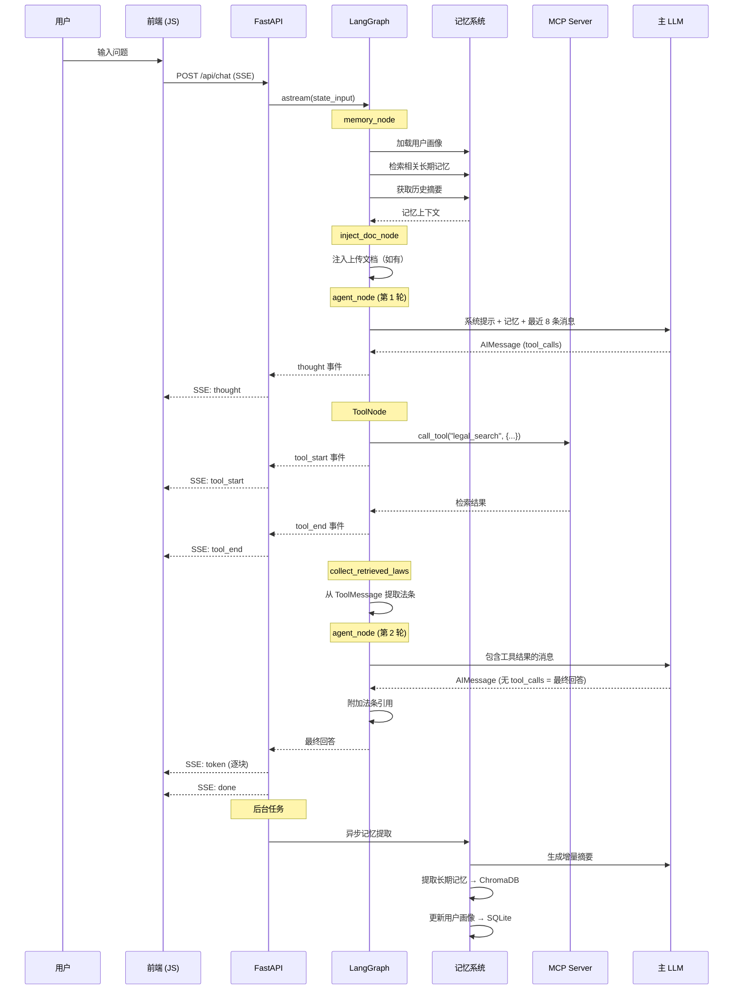

# 对话流程

## 完整时序图

## 流程说明

### 1. 记忆加载

每次对话开始时，`memory_node` 从三个来源加载上下文：
- **用户画像**：身份、关注领域（SQLite）
- **长期记忆**：语义检索最相关的 3 条历史记忆（ChromaDB）
- **历史摘要**：之前对话的压缩摘要（SQLite）

### 2. ReAct 循环

Agent 最多执行 6 轮工具调用。每轮：
1. LLM 分析问题，决定调用哪个工具
2. 通过 MCP Client 调用 MCP Server 上的工具
3. 收集工具返回的法条信息
4. LLM 根据工具结果继续推理或给出最终回答

### 3. 流式输出

最终回答按每 4 字符一块通过 SSE 推送，前端实时渲染。

### 4. 后台记忆提取

响应流结束后，`BackgroundTasks` 异步执行记忆提取，不阻塞用户体验。
