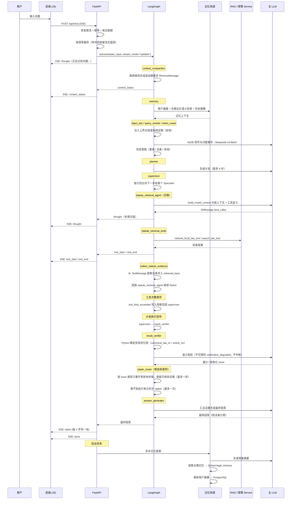

# 对话流程

## 完整时序图

## 流程说明

### 1. 进入图之前

`POST /api/chat` 在启动图之前先做四件事，任一环节拒绝都不会消耗模型额度：

1. Redis 突发限流（超限返回 `429` 并带 `Retry-After`）；
2. `Idempotency-Key` 幂等拦截（重复提交返回 `409`，不带该头则跳过）；
3. PostgreSQL 每日配额校验；
4. 精确回答缓存命中检查——命中则跳过整张图，直接按 4 字符一块流式返回。

### 2. 上下文压缩与记忆加载

`context_compaction` 是图的入口节点。消息数或估算 token 超过阈值时，它把较早消息压成滚动摘要，
再用 `RemoveMessage` 从 checkpoint state 中删除原消息；压缩失败时不删除，宁可继续带着长上下文。
每次都会输出 `context_status`，前端可据此显示当前窗口占用。

随后 `memory` 从三个来源加载上下文：

- **用户画像**：身份、关注领域（PostgreSQL）
- **长期记忆**：语义检索最相关的记忆（Qdrant `legal_memory`）
- **历史摘要**：`conversation_summaries` 中的滚动摘要（PostgreSQL）

### 3. Plan-and-Execute + 有界 ReAct

`intent_router` 判定意图后，`planner` 生成不超过 `MAX_PLAN_STEPS`（6）步的计划，
`supervisor` 逐步分派给三个 Specialist 之一：

| Specialist | 可用工具 |
|------------|----------|
| `statute_retrieval_agent` | `retrieve_local_law_tool`、`search_law_tool` |
| `case_analysis_agent` | `retrieve_local_law_tool`、`search_law_tool`、`search_case_tool` |
| `legal_consult_agent` | `retrieve_local_law_tool`、`search_law_tool` |

每个 Specialist 自成一个 `agent → *_tools → collect_*_evidence → agent` 的 ReAct 小环，
单个 Agent 任务最多调用 `MAX_TOOL_CALLS_PER_AGENT`（2）次工具；超限时走 `tool_limit_exceeded`
写入一条说明性观察，再回到 `supervisor` 继续下一步，而不是无限重试。证据已到量、重复同一
`query_signature`、上一轮 `evidence_gain` 为 0 属于软停止：不记步骤失败，Agent 直接用已有证据出报告。
一次请求累计还受 `MAX_TOOL_CALLS_PER_REQUEST`（3）约束——单任务计数每次分派步骤、每轮修复都会
归零，只有 `tool_call_total` 按请求存活；耗尽后同样按软停止处理，并且不再发起需要重新检索的局部修复。

工具由 Agent 直接调用进程内 Service Layer（RAG 检索、得理开放平台），**不经过 MCP Client**。

### 4. 校验与生成

计划执行完毕后 `supervisor` 转入 `result_verifier`。校验不通过时最多回退 `planner` 重规划一次，
之后无论结果如何都进入 `answer_generator` 生成最终回答并附加法条引用，然后 `END`。

### 5. 流式输出

最终回答按每 4 字符一块通过 SSE 推送，前端实时渲染。事件类型见
[`POST /api/chat`](../api/chat.md)。

### 6. 后台记忆提取

响应流结束后，`BackgroundTasks` 异步执行记忆提取，不阻塞用户体验。流正常结束才标记幂等
`completed`；异常结束会释放标记，让客户端可以重试。
