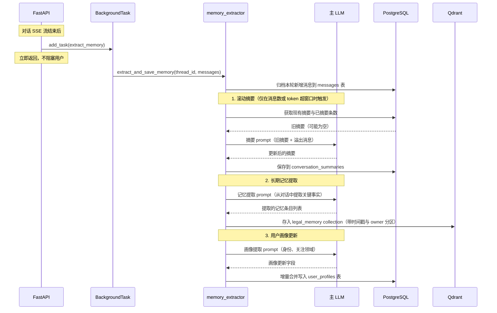
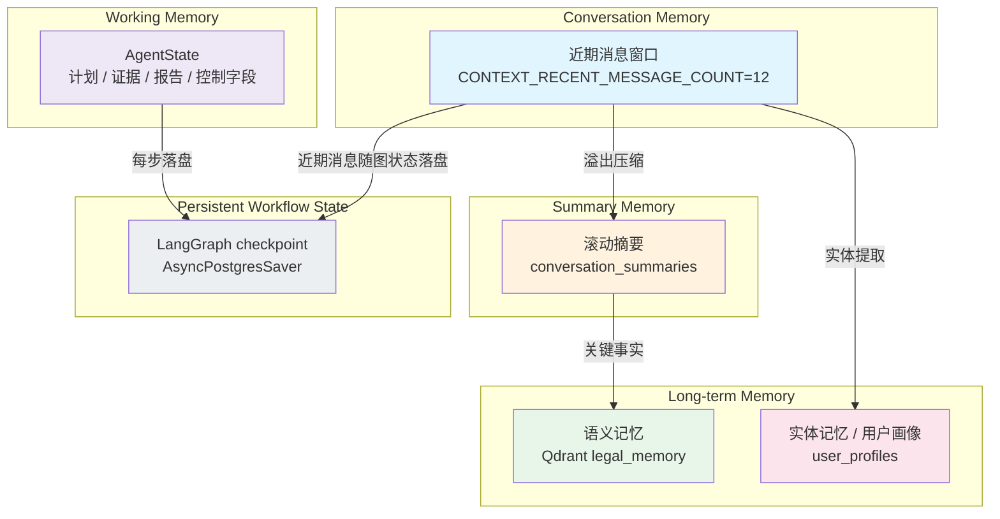

# 记忆提取流程

## 时序图

## 五层记忆架构

分层职责与注入策略见 [Context Engineering 与 Memory](../architecture/context-engineering-memory.md)。
关键区别：checkpoint 解决中断恢复与线程连续性，可以被压缩、过期或删除；长期 Memory 只保存
值得跨轮复用的用户相关信息，并按 `user_id` 做 namespace 隔离。两者不能互相替代。

## 各层详解

### Working Memory

- 载体：当前 `AgentState`（计划、检索证据、校验结论、报告、控制字段）
- 只有当前任务需要的字段会进入模型输入，由 `services.context_builder.build_model_context` 挑选

### 近期消息窗口（Conversation Memory）

- 注入模型的条数：`CONTEXT_RECENT_MESSAGE_COUNT`，默认 12，并受 recent-message token 预算双重限制
- 只注入协议完整的消息，不会把半截的 tool_call 序列送进模型
- 超阈值时在图入口 `context_compaction` 节点触发压缩：旧消息压成摘要后用 `RemoveMessage`
  从 checkpoint state 删除；压缩失败则不删除原消息
- 压缩时保留的最近条数为 `SLIDING_WINDOW_SIZE`（8），与注入条数是两个不同的量

### 滚动摘要（Summary Memory）

- 存储：PostgreSQL `conversation_summaries` 表
- 触发条件：消息数超过 `SLIDING_WINDOW_SIZE`（8），或窗口内 token 超过 `MAX_WINDOW_TOKENS`（3000）
- 每次只对「上次已摘要位置到当前窗口之前」的溢出消息做增量压缩，不重复摘要旧内容
- 注入方式：作为独立预算的上下文层，不与近期消息抢额度

### 长期语义记忆

- 存储：Qdrant `legal_memory` collection
- 内容：从对话中提取的关键事实、用户偏好、重要结论
- 检索：按用户最新问题做语义相似度检索，取 top 3
- 隔离：按 `user_id` namespace 分区；没有用户身份时退化为 thread 隔离
- 衰减：检索时考虑时间新鲜度权重

### 用户画像（实体记忆）

- 存储：PostgreSQL `user_profiles` 表
- 字段：`identity`（身份）、`focus_areas`（关注领域列表）
- 更新：每次对话后增量合并，不覆盖已有信息
- 注入方式：作为 relevant memory 层的用户背景部分

### Persistent Workflow State

- 存储：PostgreSQL，`AsyncPostgresSaver`（`CHECKPOINT_BACKEND=postgres`）
- 内容：可恢复的图状态、节点进度与近期消息
- 用途：断线重连、`GET /api/threads/{id}/history` 与 `/context`、手动压缩
- 不等于长期用户记忆：不能从 checkpoint 的存在推断某条信息值得长期保存
