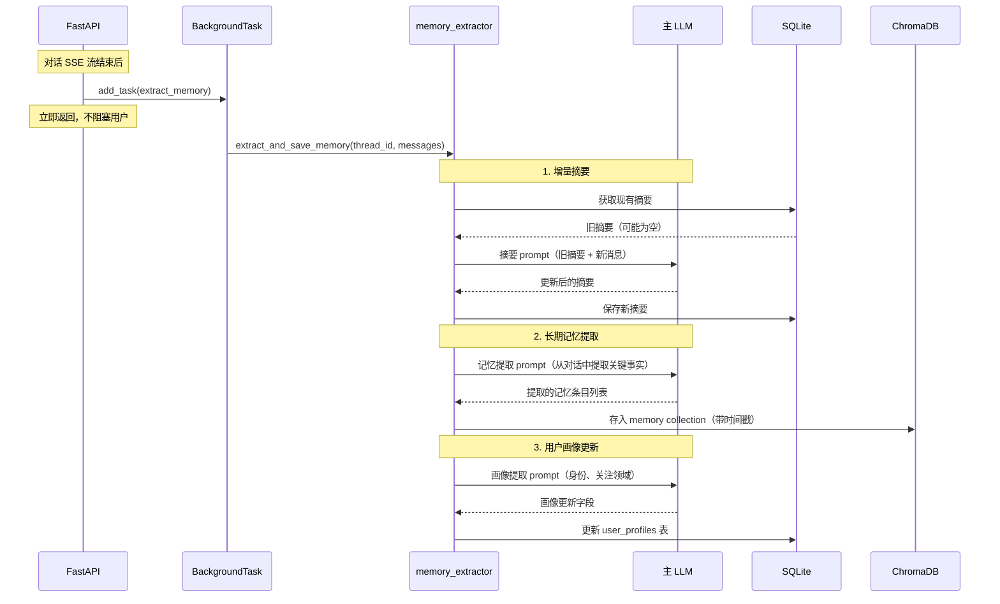
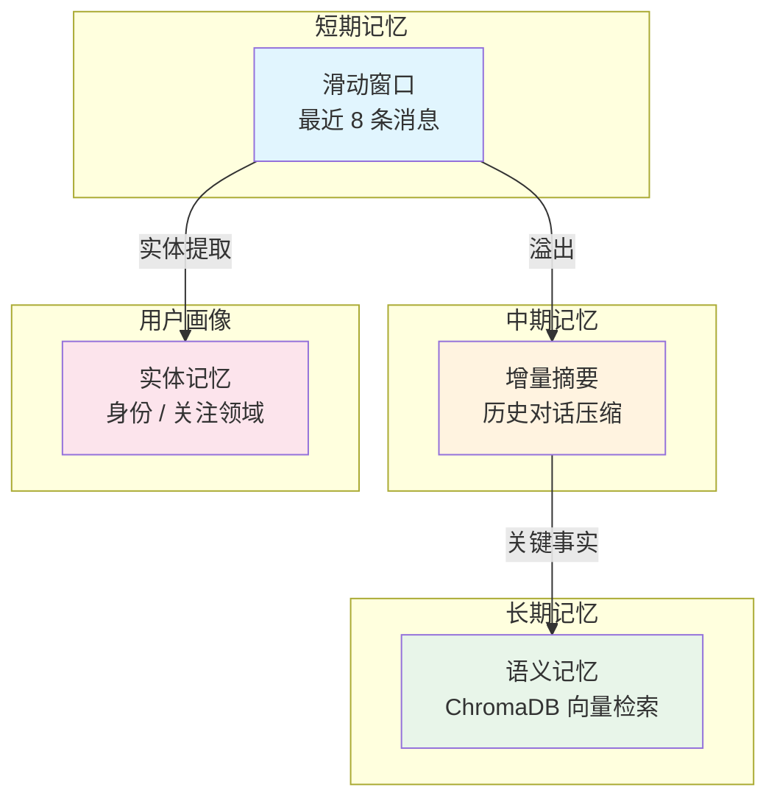

# 记忆提取流程

## 时序图

## 4 层记忆架构

## 各层详解

### 滑动窗口（短期）

- 容量：最近 8 条消息（`SLIDING_WINDOW_SIZE`）
- 直接发送给 LLM，无需额外处理
- 超出窗口的消息触发摘要生成

### 增量摘要（中期）

- 存储：SQLite `summaries` 表
- 每次对话结束后，LLM 将旧摘要 + 新消息压缩为更新的摘要
- 注入方式：作为系统提示词的一部分发送给 LLM

### 长期语义记忆

- 存储：ChromaDB `memory` collection
- 内容：从对话中提取的关键事实、用户偏好、重要结论
- 检索：按用户最新问题做语义相似度检索，取 top 3
- 衰减：检索时考虑时间新鲜度权重

### 用户画像（实体记忆）

- 存储：SQLite `user_profiles` 表
- 字段：`identity`（身份）、`focus_areas`（关注领域列表）
- 更新：每次对话后增量更新，不覆盖已有信息
- 注入方式：作为系统提示词的用户背景部分
