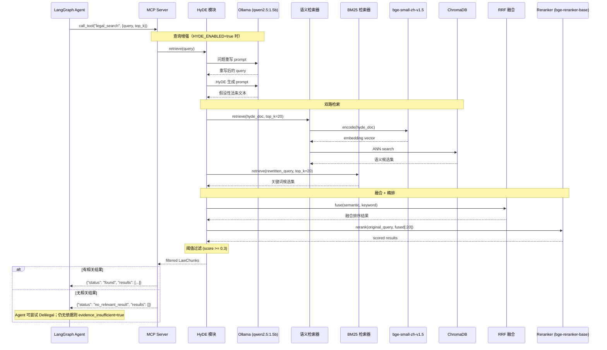

# RAG 检索流程

## 时序图



## 三路查询策略

| 检索路径 | 输入 | 目的 |
|----------|------|------|
| 语义检索 (ChromaDB) | HyDE 假设文档 | 缩小口语与法条的语义鸿沟 |
| 关键词检索 (BM25) | 重写后的 query | 精确匹配法律术语 |
| 精排 (Reranker) | 原始 query | 真实相关性判断 |

## 查询增强详解

### 问题重写

将用户口语化表达转换为精确的法律检索 query：

```
输入: "房东不退押金咋办"
输出: "如何处理房东不退还押金的情况"
```

### HyDE 假设文档

生成一段假设性法条文本，语义上接近真实法条：

```
输入: "房东不退押金咋办"
输出: "根据《中华人民共和国民法典》第九百七十八条：出租人应当按照约定将租赁物交付给承租人..."
```

## 无结果处理

当 Reranker 分数全部低于阈值（默认 0.3）时：
1. 返回 `{"status": "no_relevant_result"}`
2. Agent 根据 prompt 中的决策流程判断：
   - 用户问题信息不足 → 追问用户
   - 问题明确但本地库未覆盖 → 可调用 `search_law_tool` 或 `search_case_tool`
   - 可信来源均无结果 → 返回 `evidence_insufficient=true`，不得编造依据
