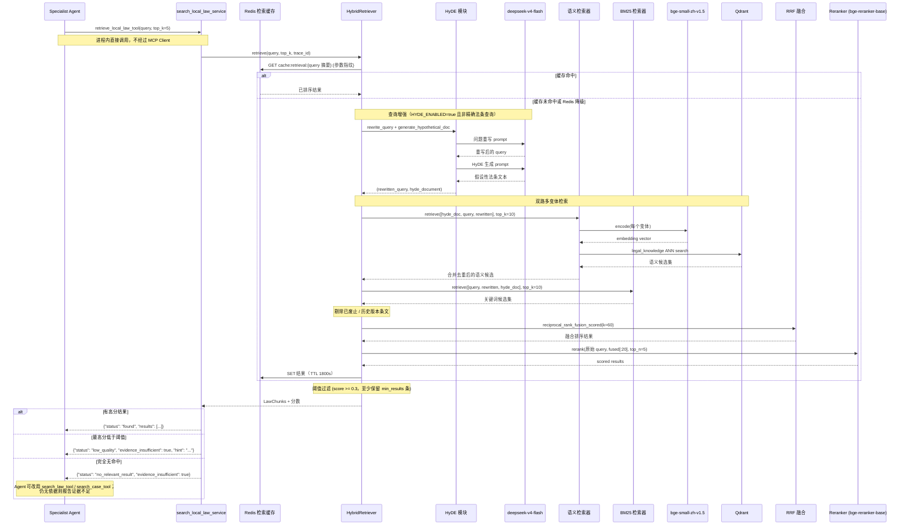

# RAG 检索流程

## 时序图



## 三路查询策略

| 检索路径 | 输入 | 目的 |
|----------|------|------|
| 语义检索 (Qdrant) | HyDE 假设文档 + 原始 query + 重写 query | 缩小口语与法条的语义鸿沟 |
| 关键词检索 (BM25) | 原始 query + 重写 query + HyDE 文档 | 精确匹配法律术语 |
| 精排 (Reranker) | 原始 query | 真实相关性判断 |

两路都对多个查询变体各跑一次并合并去重，因此口语化提问与法律术语提问都有机会命中同一条法条。
只有一路有结果时跳过融合直接降级（`vector_fallback` / `bm25_fallback`），Qdrant 不可用时整条链
退化为纯 BM25 而不是报错。

## 查询增强详解

HyDE 与问题重写共用一个轻量模型，默认 `deepseek-v4-flash`（`HYDE_MODEL`、`HYDE_LLM_BASE_URL`），
复用 `DEEPSEEK_API_KEY`。`HYDE_BACKEND=hf_lora` 可切到本地 Qwen + LoRA 权重。
命中「精确法条查询」（例如直接问某法第几条）时跳过增强，避免把确定的检索目标改写坏。

### 问题重写

将用户口语化表达转换为精确的法律检索 query：

```
输入: "房东不退押金咋办"
输出: "如何处理房东不退还押金的情况"
```

### HyDE 假设文档

生成一段假设性法条文本，语义上接近真实法条：

```
输入: "房东不退押金咋办"
输出: "根据《中华人民共和国民法典》第七百一十四条：承租人应当按照约定的方法妥善使用租赁物..."
```

## 缓存与可观测性

整条管线包在一层 Redis 缓存里，key 只含归一化 query 的摘要与检索参数指纹（`final_top_k`、
`vector_top_k`、`bm25_top_k`、`rrf_k`、reranker/BM25 是否可用、`include_superseded`），
所以调参后不会命中旧结果。Redis 不可用时缓存层返回未命中，检索照常执行。

每个阶段都会写 trace 事件：`vector_hits`、`bm25_hits`、`fused_hits`、`reranker_hits`，
外加一条 `rag_summary`（延迟、结果数、是否缓存命中）。因此
`/api/admin/traces/{trace_id}/timeline` 上可以逐段看到候选集怎么变化的。

## 无结果处理

Reranker 分数全部低于阈值（`RERANKER_SCORE_THRESHOLD`，默认 0.3）时，`retrieve()` 仍会保留
`RETRIEVAL_MIN_RESULTS`（默认 1）条，避免「候选存在却返回空」这种无法归因的结果，
但 Service 层会把 `status` 标为 `low_quality` 并置 `evidence_insufficient=true`。

Agent 据此按 prompt 中的决策流程判断：

- 用户问题信息不足 → 追问用户
- 问题明确但本地库未覆盖 → 调用 `search_law_tool` 或 `search_case_tool`（得理开放平台）
- 可信来源均无结果 → 返回 `evidence_insufficient=true`，不得编造依据
